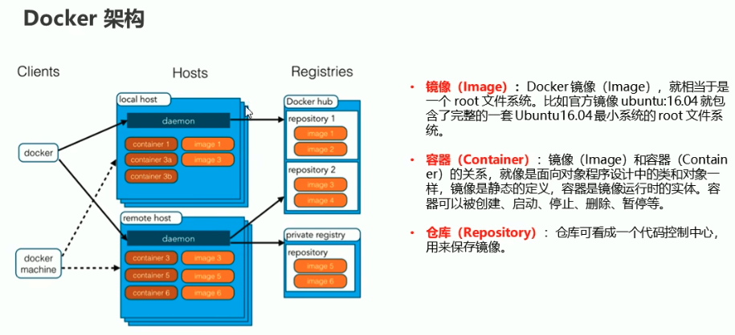
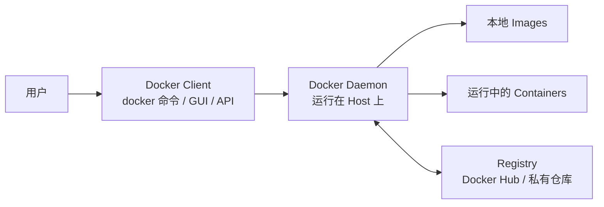
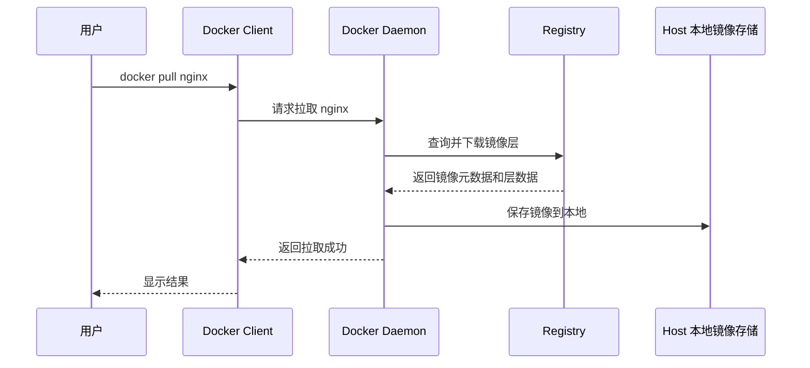
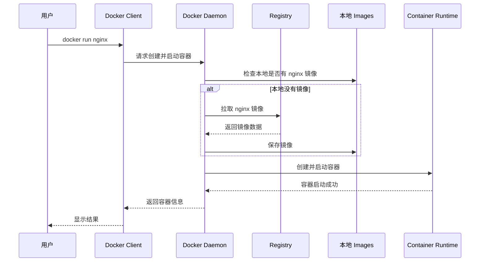
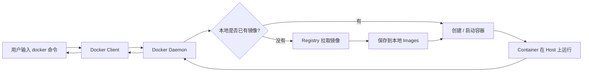

# 第二课：Docker 架构

## 1. 这节课学什么

这一节我们专门讲 Docker 的架构，也就是：

- Docker 里有哪些核心角色
- `client`、`host`、`registry` 分别是什么
- `local host` 和 `remote host` 的区别是什么
- 你执行一条 Docker 命令后，信息是怎么流动的
- 镜像、容器、仓库在整套体系里分别扮演什么角色

这一节很重要，因为后面你学：

- `docker pull`
- `docker run`
- `docker build`
- `docker push`
- `docker exec`

本质上都只是这套架构中的不同数据流动过程。

## 2. 先看原图

下面是这节课对应的 Docker 架构图：



你先不要急着记细节，先从整体上看这张图。

这张图大致可以分成三块：

- 左边：`Clients`，也就是客户端
- 中间：`Hosts`，也就是运行 Docker 服务的主机
- 右边：`Registries`，也就是镜像仓库

可以先把它记成一句话：

**客户端发命令，主机上的 Docker 服务负责执行，仓库负责存放和分发镜像。**

## 3. 先用最通俗的话理解整套架构

如果你完全站在小白角度，可以先把 Docker 架构理解成一个“远程仓储 + 调度中心 + 操作员”的系统。

- 你自己输入 `docker run nginx`
- 你就是“发命令的人”
- Docker Client 就像“操作台”
- Docker Daemon 就像“真正干活的后台服务”
- Host 就像“工作现场”
- Registry 就像“镜像仓库”
- Image 就像“标准模板”
- Container 就像“真正跑起来的实例”

所以整套系统其实是在做这件事：

1. 你发出命令
2. 客户端把命令交给 Docker 后台服务
3. 后台服务检查本地有没有镜像
4. 如果没有，就去仓库拉取镜像
5. 拉到本机后，创建并启动容器
6. 容器在某台主机上真正运行起来

## 4. Docker 架构中的核心角色

这一节我们从专业角度，把图上的每个角色讲清楚。

## 5. Clients：客户端

### 5.1 什么是客户端

客户端就是你和 Docker 系统交互的入口。图里左侧的 `docker` 和 `docker machine` 都属于客户端工具。

现代学习中最常见的客户端是：

- `docker` 命令行工具
- Docker Desktop 提供的图形界面和 CLI
- 各种调用 Docker API 的程序

### 5.2 它的职责是什么

客户端本身通常不直接创建容器，而是负责：

- 接收用户输入
- 解析命令参数
- 把请求发送给 Docker daemon
- 把结果展示给用户

比如你执行：

```bash
docker ps
docker pull nginx
docker run -d nginx
```

真正完成这些动作的，不是 CLI 这个壳子，而是 Docker 后台服务。

### 5.3 通俗理解

客户端就像“前台接待”或者“遥控器”。

- 你按下按钮
- 它把你的意图传给真正执行任务的人
- 最后再把结果告诉你

所以你不要把 `docker` 命令本身理解成“Docker 的全部”，它只是入口。

## 6. Hosts：主机

图中中间部分是 `Hosts`，也就是安装并运行 Docker 引擎的主机。

图里有两类：

- `local host`
- `remote host`

### 6.1 Host 是什么

Host 指的是运行 Docker daemon 的那台机器。它可能是：

- 你的本地电脑
- 一台云服务器
- 一台测试机
- 一台生产环境主机

只要这台机器上运行着 Docker 后台服务，它就可以成为 Docker Host。

### 6.2 local host 是什么

`local host` 指本地主机，也就是你当前正在操作的机器。

例如：

- 你在自己的 Mac 上装了 Docker Desktop
- 你在自己的 Linux 服务器上直接敲命令

这时命令可能发给本机上的 Docker daemon，所以图里它叫 `local host`。

### 6.3 remote host 是什么

`remote host` 指远程主机，也就是不在你眼前这台机器上的 Docker 主机。

例如：

- 你在自己电脑上写命令
- 但真正运行容器的是远程 Linux 服务器

这时客户端通过网络把请求发给远程主机上的 Docker daemon，由远程主机来执行。

### 6.4 local host 和 remote host 的本质区别

它们本质上不是“功能不同”，而是“位置不同”。

- `local host`：Docker daemon 跑在你当前机器上
- `remote host`：Docker daemon 跑在别的机器上

两者都能：

- 拉取镜像
- 创建容器
- 运行容器
- 删除容器
- 管理网络和存储

### 6.5 通俗理解

你可以把 host 理解成“施工现场”。

- local host：你在自己家里施工
- remote host：你远程指挥另一处工地施工

## 7. Docker Daemon：后台守护进程

### 7.1 什么是 daemon

图中每个 host 里都有一个 `daemon`。它就是 Docker 的后台守护进程，通常叫 `dockerd`。

它是 Docker 架构里的核心执行者。

### 7.2 它负责什么

Docker daemon 负责接收客户端请求，并真正执行容器相关操作，例如：

- 构建镜像
- 拉取镜像
- 推送镜像
- 创建容器
- 启动和停止容器
- 管理网络
- 管理卷
- 管理镜像缓存和本地存储

你可以理解为：

**客户端负责“说”，daemon 负责“做”。**

### 7.3 从专业角度看 daemon 的角色

从架构职责上说，Docker daemon 是 Docker Engine 的核心服务进程，它对外提供 API，内部协调：

- 镜像管理
- 容器生命周期管理
- 网络管理
- 存储驱动
- 与 registry 的镜像通信
- 与底层容器运行时的交互

在现代 Docker 实现里，Docker Engine 往往会与 `containerd`、`runc` 等组件协作，由这些更底层组件去完成容器创建和运行。

### 7.4 通俗理解

daemon 就像“总调度员 + 执行负责人”。

- 客户端告诉它要干什么
- 它决定先做哪一步
- 缺镜像就去仓库拉
- 要启动容器就调用底层运行能力
- 最后把结果返回给客户端

## 8. Containers：容器

### 8.1 容器在图里是什么位置

图中 host 里面那些 `container 1`、`container 3a`、`container 3b` 等，就是运行中的容器。

### 8.2 容器的本质

容器是镜像启动后的运行实例。

这句话要牢牢记住：

- 镜像是静态模板
- 容器是动态运行实例

例如：

- 你有一个 `nginx` 镜像
- 你可以基于这个镜像启动多个容器

它们共享相同镜像模板，但各自有自己的运行状态。

### 8.3 图里为什么一个 host 可以有多个 container

因为一台 Docker 主机本来就可以同时运行多个容器。

这也是 Docker 很重要的价值之一：

- 在同一台主机上运行多个服务
- 各个服务之间相对隔离
- 资源使用更高效

### 8.4 通俗理解

容器就像“已经住了人的房间”。

- 镜像是户型图
- 容器是真正住进去后的房间

同一个户型图可以建出很多房间，所以一个镜像可以启动多个容器。

## 9. Images：镜像

### 9.1 图中的 image 是什么

图中 host 里、registry 里都画了 `image 1`、`image 2`、`image 3` 等。

这表示镜像既可能存在于仓库中，也可能已经被拉到某台主机本地。

### 9.2 镜像的专业定义

镜像是一个只读的、分层的模板，用来描述应用运行所需的文件系统内容和元数据。

里面通常包括：

- 应用代码
- 依赖包
- 运行时
- 环境配置
- 默认启动命令

### 9.3 为什么镜像同时会出现在仓库和主机中

因为镜像的生命周期通常是：

1. 先存放在仓库中
2. 被某台 host 拉取到本地
3. 再由本地主机基于镜像创建容器

也就是说：

- 仓库负责“存”
- 主机负责“用”

### 9.4 通俗理解

镜像就像“标准模具”。

- 仓库里存着模具
- 主机把模具拿回来
- 再根据模具生产出真正运行中的容器

## 10. Registries：镜像仓库

图右侧是 `Registries`，也就是镜像仓库。

图中画了两类：

- `Docker Hub`
- `private registry`

### 10.1 仓库是什么

Registry 是用来存储、管理、分发 Docker 镜像的服务。

你可以把它理解为 Docker 世界里的“镜像服务器”。

### 10.2 Repository 是什么

图里仓库内部还有 `repository 1`、`repository 2` 等。

这说明要区分两个概念：

- `Registry`：整体仓库服务
- `Repository`：仓库中的某个镜像项目或命名空间

例如：

- Docker Hub 是一个 registry
- `library/nginx` 可以理解为其中的一个 repository

一个 repository 下面通常还会有不同 tag，例如：

- `nginx:latest`
- `nginx:1.25`
- `nginx:alpine`

### 10.3 Docker Hub 是什么

Docker Hub 是官方公共镜像仓库，也是初学者最常接触的 registry。

它的特点：

- 公网可访问
- 有大量官方镜像
- 适合学习、测试、公开分发

### 10.4 private registry 是什么

Private Registry 就是私有仓库。

企业常用私有仓库的原因包括：

- 不想把内部镜像放到公网
- 需要权限控制
- 需要更快的内网分发
- 需要镜像审核和治理

### 10.5 通俗理解

Registry 像“大仓库中心”，Repository 像“仓库里的某一类货架”。

- registry：整个仓库园区
- repository：某一类商品的专区
- image tag：同类商品的具体版本

## 11. 一张更清晰的理解图

下面这张图是我按学习顺序重画的，目的是让你更容易看懂角色关系。



这张图要记住两件事：

- 你不是直接操作容器，而是先操作 Client
- Client 也不是直接操纵容器，而是通过 Daemon 去调度一切

## 12. 一条命令发出后，信息是怎么流动的

这一节是本课重点。

你学 Docker，不能只背“有哪些组件”，更要知道：

**当我敲下一条命令后，到底是谁和谁在通信，数据去哪了，结果又怎么回来。**

## 13. 典型流程一：`docker pull nginx`

### 13.1 专业流程

当你执行：

```bash
docker pull nginx
```

大致发生下面这些事情：

1. Docker Client 读取你的命令
2. Client 把“拉取 nginx 镜像”的请求发送给 Docker daemon
3. Docker daemon 解析镜像名，确定要从哪个 registry 获取
4. daemon 连接远程 registry，例如 Docker Hub
5. registry 返回镜像元数据和各层信息
6. daemon 按层下载镜像内容到本地主机
7. 本地主机把这些镜像层保存到本地镜像存储中
8. daemon 把执行结果返回给 client
9. client 再把结果显示给你

### 13.2 信息流图



### 13.3 通俗理解

就像你在电商平台下单买一个标准商品：

1. 你下单
2. 平台把订单发给仓库
3. 仓库把货发到你所在城市
4. 货到本地后，你以后就能直接用了

这里：

- 你是用户
- client 是下单界面
- daemon 是调度中心
- registry 是总仓库
- host 是你本地收货地点

## 14. 典型流程二：`docker run nginx`

这是最经典的流程，因为它同时涉及镜像和容器。

### 14.1 专业流程

当你执行：

```bash
docker run nginx
```

通常会发生下面这些步骤：

1. Client 把创建并启动容器的请求发送给 daemon
2. daemon 检查本地是否已有 `nginx` 镜像
3. 如果本地没有镜像，daemon 会先执行拉取流程
4. daemon 基于镜像创建容器的可写层
5. daemon 配置容器运行参数，例如网络、挂载、环境变量、资源限制
6. daemon 调用底层容器运行时创建并启动容器进程
7. 容器在 host 上真正运行起来
8. daemon 把容器 ID、状态等结果返回给 client
9. client 把结果展示给用户

### 14.2 信息流图



### 14.3 通俗理解

你可以把 `docker run nginx` 理解成：

**“如果模具没有，就先去仓库拿模具；拿到后立刻按模具造一个成品并开机运行。”**

这里有两个动作：

- `pull`：拿到镜像
- `run`：基于镜像把容器跑起来

所以很多初学者会觉得 `docker run` 很神奇，其实它只是把多个动作串起来了。

## 15. 典型流程三：`docker push`

### 15.1 专业流程

当你执行：

```bash
docker push myapp:1.0
```

流程大致是：

1. Client 把推送请求交给 daemon
2. daemon 检查本地镜像是否存在
3. daemon 与目标 registry 建立通信并认证
4. daemon 将镜像层按需上传到 registry
5. registry 保存镜像及元数据
6. daemon 把结果返回 client

### 15.2 通俗理解

这相当于：

- 你先在本地做好一个镜像
- 再把它上传到仓库
- 别的主机就能从仓库拉取它

这就是 Docker 镜像分发能力的核心。

## 16. local host 和 remote host 时，信息流有什么区别

### 16.1 local host 场景

当你在自己机器上操作本机 Docker：

- client 和 daemon 通常在同一台机器上
- 请求通过本地 socket 或本地接口通信
- 容器也运行在本机

这时候链路比较短：

`你 -> 本机 client -> 本机 daemon -> 本机镜像/本机容器`

### 16.2 remote host 场景

当你在本地电脑控制远程服务器时：

- client 在你电脑上
- daemon 在远程主机上
- client 通过网络请求远程 daemon
- 镜像和容器实际存在于远程主机

这时候链路会变成：

`你 -> 本地 client -> 远程 daemon -> 远程镜像/远程容器`

### 16.3 最容易弄错的一点

很多初学者会误以为：

“我在自己电脑敲了命令，所以容器一定运行在自己电脑上。”

这不一定。

关键不是你在哪敲命令，而是：

**你的 client 当前连接的是哪一个 daemon。**

如果 client 连的是远程 daemon，那么容器就跑在远程机器上。

## 17. 为什么说 Docker 是 C/S 架构

Docker 从架构上看，本质上是一个客户端-服务端模型，也就是 C/S 架构。

### Client 端

- 接收用户命令
- 发请求
- 展示结果

### Server 端

- 也就是 Docker daemon
- 真正管理镜像、容器、网络、卷
- 与 registry 和底层运行时交互

所以别看你平时只是在命令行敲 `docker`，其实它背后已经是一套典型的服务架构。

## 18. Docker 为什么需要仓库

这一点你要从“软件分发”角度理解。

如果没有 registry，会出现这些问题：

- 镜像难以共享
- 多台主机无法统一拉取同一版本
- CI/CD 流程难以标准化
- 团队协作难以统一部署基线

所以 registry 的作用不仅是“存镜像”，更是整个软件交付链路里的分发中心。

从专业角度说，registry 提供的是镜像的：

- 存储能力
- 版本管理能力
- 分发能力
- 权限与访问控制能力

## 19. Docker 架构为什么高效

Docker 架构之所以实用，不只是因为命令简单，而是因为职责分层清晰。

### 职责划分很清楚

- Client 负责交互
- Daemon 负责调度和执行
- Host 负责提供运行环境
- Registry 负责镜像分发
- Image 负责提供模板
- Container 负责承载运行实例

### 带来的好处

- 用户操作简单
- 系统容易自动化
- 支持本地和远程统一管理
- 镜像可以复用和分发
- 容器可以快速创建和销毁

## 20. 初学者常见误区

### 误区一：Docker 命令就是 Docker 本身

不是。

`docker` 只是客户端入口，真正执行的是后台 daemon。

### 误区二：镜像等于容器

不是。

- 镜像是模板
- 容器是运行实例

### 误区三：仓库等于仓库里的某个镜像

不是。

- registry 是大仓库服务
- repository 是其中某类镜像集合
- image tag 才是某个具体版本

### 误区四：在本地敲命令，容器就一定在本地运行

也不是。

要看 client 连接的是本地 daemon 还是远程 daemon。

## 21. 一张总流程图，帮助你把整课串起来



这张图你如果看懂了，后面很多命令都会变得很顺。

## 22. 从专业角度总结 Docker 架构

Docker 架构本质上是一套围绕“镜像分发”和“容器运行”构建的客户端-服务端系统。客户端负责发起请求，Docker daemon 负责在主机上执行镜像、容器、网络、卷等资源管理动作，registry 负责镜像的远程存储与分发，host 则提供真实的运行环境。`local host` 和 `remote host` 的区别，主要在于 daemon 所处的位置不同，而不是功能模型不同。

从系统设计上看，这种架构把“交互入口”“执行核心”“运行载体”“分发中心”分离开了，因此既适合单机开发，也适合远程服务器和大规模交付场景。

## 23. 用大白话总结整节课

你可以先把 Docker 架构记成下面这几句话：

- `docker` 命令只是前台入口
- 真正干活的是 Docker daemon
- host 是 Docker 真正运行的机器
- local host 是本机，remote host 是远程机器
- registry 是放镜像的大仓库
- image 是模板，container 是跑起来的实例
- 你执行命令后，通常是 client 先找 daemon，daemon 再决定是去本地找镜像，还是去仓库拿镜像，然后在 host 上启动容器

## 24. 本节课你必须记住的重点

- Docker 架构主要分为 `Client`、`Host`、`Registry` 三大块
- `docker` 命令本身是客户端，不是最终执行者
- Docker daemon 是真正的后台执行核心
- `local host` 和 `remote host` 的核心区别是 daemon 所在位置不同
- `Registry` 是仓库服务，`Repository` 是仓库中的镜像项目
- `docker pull` 的本质是从 registry 拉镜像到 host
- `docker run` 的本质是“必要时先 pull，再基于 image 创建并启动 container”

## 25. 本节课课后理解题

你可以试着回答下面几个问题：

1. Docker 客户端和 Docker daemon 的职责分别是什么？
2. local host 和 remote host 有什么区别？
3. registry、repository、image tag 三者是什么关系？
4. 执行 `docker pull nginx` 时，数据大致怎么流动？
5. 执行 `docker run nginx` 时，为什么有时会先去远程仓库？

如果你能把这 5 个问题讲清楚，第二节课就真的吃透了。

## 26. 本节课一句话收尾

**Docker 架构的核心就是：客户端发请求，daemon 负责调度，host 负责运行，registry 负责分发镜像。**
