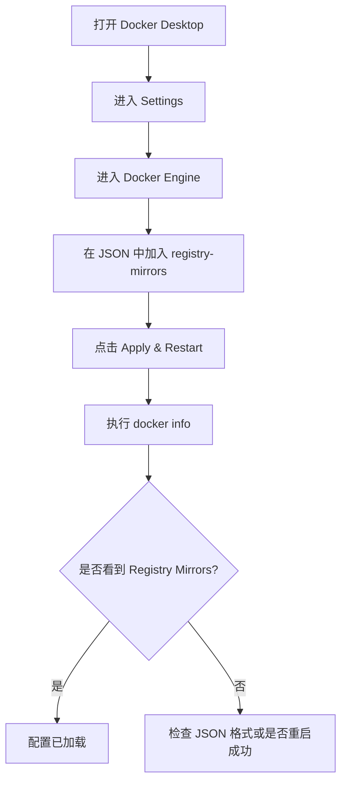
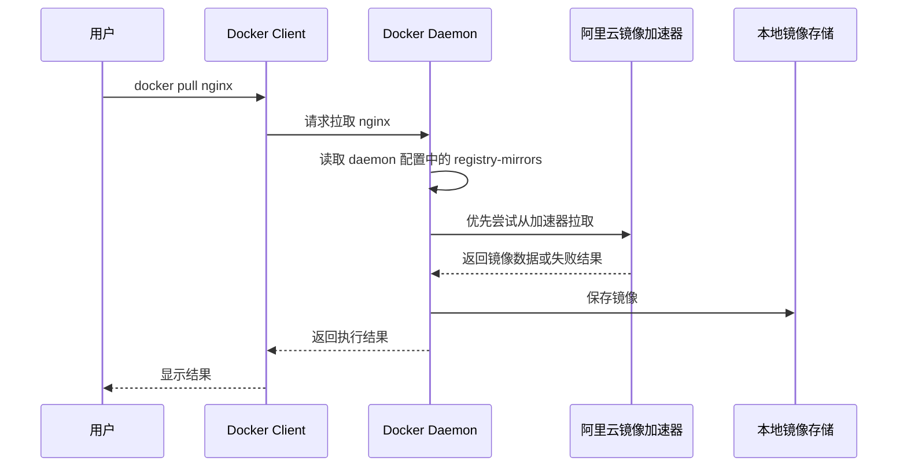

# 第三课：在 macOS 上配置阿里云 Docker 镜像加速器

## 1. 这节课学什么

这一节我们不讲抽象概念，直接解决一个很实际的问题：

**在 macOS 上，怎么给 Docker Desktop 配置阿里云镜像加速器。**

但在正式操作前，我要先把一个很重要的现实情况讲清楚。

## 2. 先说结论：现在阿里云镜像加速器和很多旧教程不完全一样了

根据阿里云官方文档，镜像加速器能力后续有过调整：

- 阿里云在公告中说明，自 **2024 年 7 月 2 日** 起，对镜像加速器功能的使用范围进行了调整
- 官方镜像加速文档还特别提示：**ACR 镜像加速目前已停止同步最新镜像**

这意味着两件事：

1. 很多视频里的配置步骤“技术上怎么填”依然能看懂，但**不代表今天在所有环境都还能像以前那样稳定可用**
2. 你在本机 macOS 上配置后，即使格式完全正确，也可能遇到：
   - 某些镜像拉不到
   - `latest` 不是最新
   - 某些标签不存在
   - 实际加速效果不稳定

所以这节课我会分成两条线来教你：

- 第一条线：**从操作角度，macOS 上怎么配置**
- 第二条线：**从专业角度，为什么现在配置了也不一定像旧教程那样稳定**

## 3. 这节课适用的环境

本节默认你的环境是：

- 操作系统：macOS
- Docker：Docker Desktop
- 目标：在 Docker Desktop 中配置 `registry-mirrors`

这一节**不使用**旧时代的 `Docker Toolbox` 方案。

原因很简单：

- `Docker Toolbox` 是老方案
- 现代 macOS 学 Docker，主流做法是用 **Docker Desktop**

所以你现在记住：

**macOS 新手学习 Docker，优先按 Docker Desktop 的方式配置。**

## 4. 什么是镜像加速器

### 4.1 专业解释

Docker 拉取镜像时，默认通常会访问远程镜像仓库，例如 Docker Hub。由于网络链路、地区、出口质量等因素，访问远程镜像仓库可能较慢，甚至失败。

镜像加速器本质上是一个：

- 面向镜像拉取场景的中转访问入口
- 用于改善访问链路、缓存分发或提高镜像获取成功率的加速地址

在 Docker 中，这类能力通常通过配置：

```json
"registry-mirrors"
```

来告诉 Docker daemon：

“以后你拉镜像时，优先尝试这些镜像加速地址。”

### 4.2 通俗理解

你可以把 Docker Hub 理解成“海外总仓库”。

如果你直接去总仓库取货：

- 路远
- 可能堵车
- 可能超时

镜像加速器就像一个“更顺路的中转仓”或者“国内中转点”。

这样 Docker 在拉镜像时，就不一定非得直接绕远路去总仓库。

## 5. 在 macOS 上，镜像加速器到底配置到哪里

这个问题初学者非常容易混。

### 正确答案

在 macOS 的 Docker Desktop 里，镜像加速器不是配置到某个 shell 命令里，而是配置到：

- Docker Desktop 的 **Docker Engine** 配置
- 本质上对应 Docker daemon 的 JSON 配置

Docker 官方文档说明，在 Docker Desktop 的设置页中，可以通过 JSON 配置 Docker daemon；文档还说明该配置文件位置为：

`$HOME/.docker/daemon.json`

所以你要理解一件事：

**镜像加速器配置的对象，不是 docker 客户端，而是 Docker daemon。**

这是专业上非常关键的一点。

## 6. 配置前先拿到你的阿里云加速器地址

你给我的页面是：

[阿里云容器镜像服务镜像加速器页面](https://cr.console.aliyun.com/cn-hangzhou/instances/mirrors)

一般流程是：

1. 登录阿里云账号
2. 进入容器镜像服务 ACR 控制台
3. 找到“镜像工具”或“镜像加速器”
4. 复制你账号专属的加速器地址

例如你提供的示例地址是：

```text
https://err004vo.mirror.aliyuncs.com
```

注意：

- 这个地址通常是**每个账号专属**或与账号相关的
- 你应该以你控制台页面里显示的地址为准

## 7. 在 macOS 上配置阿里云镜像加速器的正确步骤

下面是当前 Docker Desktop 的主流配置方式。

## 8. 步骤一：打开 Docker Desktop

确保 Docker Desktop 已经启动。

你可以先在终端执行：

```bash
docker version
```

如果能看到 Client 和 Server 信息，说明 Docker Desktop 基本已经正常运行。

### 通俗理解

这一步就是先确认“Docker 这台机器已经开机”。

如果 Docker Desktop 没启动，后面的配置和验证都没意义。

## 9. 步骤二：打开 Docker Engine 配置页面

在 macOS 上，一般可以这样进入：

1. 打开 Docker Desktop
2. 点击右上角设置
3. 进入 `Settings`
4. 找到 `Docker Engine`

这个页面里会有一段 JSON 配置。

你要做的事情，就是把镜像加速器地址写进这个 JSON 里。

## 10. 步骤三：编辑 `registry-mirrors`

如果当前 JSON 里还没有 `registry-mirrors`，你可以加入下面这一段：

```json
{
  "registry-mirrors": [
    "https://err004vo.mirror.aliyuncs.com"
  ]
}
```

如果页面里本来已经有别的配置，例如：

```json
{
  "builder": {
    "gc": {
      "defaultKeepStorage": "20GB",
      "enabled": true
    }
  }
}
```

那就不要把原配置删掉，而是改成类似这样：

```json
{
  "builder": {
    "gc": {
      "defaultKeepStorage": "20GB",
      "enabled": true
    }
  },
  "registry-mirrors": [
    "https://err004vo.mirror.aliyuncs.com"
  ]
}
```

### 这里最容易犯的错误

- 忘记逗号
- 多写一个逗号
- 把 JSON 写成中文标点
- 把整个原配置覆盖掉
- 地址少写了 `https://`

### 通俗理解

这一步就是在告诉 Docker：

**“以后你拉镜像时，先试试这个阿里云加速入口。”**

## 11. 步骤四：点击 Apply & Restart

编辑完成后，点击：

`Apply & Restart`

这一步的作用是：

- 保存 daemon 配置
- 重启 Docker Desktop
- 让新的镜像加速配置真正生效

### 专业解释

因为 `registry-mirrors` 属于 Docker daemon 的运行配置。你改完 JSON 后，必须让 daemon 重新加载配置，否则运行中的 daemon 不会自动按新配置工作。

### 通俗理解

就像你改了系统设置后，需要“重启一下服务”，不然它还按旧规则运行。

## 12. 步骤五：验证配置是否生效

重启完成后，在终端执行：

```bash
docker info
```

你重点看输出中是否有类似：

```text
Registry Mirrors:
 https://err004vo.mirror.aliyuncs.com/
```

如果能看到这一项，说明：

- Docker daemon 已经读到了你的镜像加速配置

但这里要注意：

**“配置已生效”不等于“所有镜像都一定能成功拉取”。**

这是两个层面的事：

- 配置层面：daemon 确实加载了加速器地址
- 实际访问层面：镜像是否存在、是否受限制、是否还能同步到目标版本

## 13. 完整操作示意图



## 14. 这一套配置背后的信息流是怎么走的

这部分很重要，你不能只会点按钮，还要知道它为什么有效。

### 14.1 专业流程

当你在 Docker Desktop 中配置了：

```json
"registry-mirrors": [
  "https://err004vo.mirror.aliyuncs.com"
]
```

然后再执行：

```bash
docker pull nginx
```

大致流程是：

1. 你在终端执行 `docker pull nginx`
2. Docker Client 将请求发给 Docker daemon
3. Docker daemon 读取自己的配置，发现设置了 `registry-mirrors`
4. daemon 优先尝试使用镜像加速器地址进行镜像获取
5. 如果加速器可用且目标镜像在可服务范围内，则镜像层会被拉到本地
6. 下载完成后，镜像保存到本地镜像存储
7. 结果返回给客户端

### 14.2 信息流图



### 14.3 通俗理解

以前 Docker 是“直接去总仓库取货”，现在是：

- 先看你有没有指定中转仓
- 如果有，就先去中转仓拿
- 中转仓拿不到，再看其他情况

## 15. 为什么很多旧教程会提到 Docker Toolbox

因为过去的 macOS Docker 生态和现在不一样。

旧教程里经常出现：

```bash
docker-machine create --engine-registry-mirror=...
docker-machine env default
eval "$(docker-machine env default)"
```

这是早期 `Docker Toolbox` / `docker-machine` 时代的配置方式。

### 但你现在学的时候要怎么理解

- 这是**历史方案**
- 了解即可
- 现在在 macOS 上学习 Docker，主流应该使用 **Docker Desktop**

所以如果你视频里看到了 `Docker Toolbox`，你要知道：

**它是在讲旧版本生态，不是今天最主流的 macOS 配置方式。**

## 16. 为什么你配好了，仍然可能拉取失败

这一节非常重要，因为很多新手会在这一步卡住。

### 原因一：阿里云官方限制发生了变化

阿里云官方公告说明，自 **2024 年 7 月 2 日** 起，镜像加速器功能使用范围有调整。

你给我的原始说明里也有一句很关键的话：

**“当前仅支持阿里云用户使用具备公网访问能力的阿里云产品进行镜像加速，且仅限于特定范围内的容器镜像。”**

这说明从官方口径看：

- 它已经不是以前那种“任何本地机器都稳定通用”的宽松使用方式
- 在本地 macOS 上学习时，即使能配置，也不一定有稳定效果

### 原因二：官方镜像加速已不再同步最新镜像

阿里云官方“官方镜像加速”文档明确写到：

- **ACR 镜像加速目前已停止同步最新镜像**

这意味着：

- 你可能拉到旧镜像
- `latest` 可能不是最新
- 某些镜像根本不存在

### 原因三：目标镜像本身就不在支持范围内

即使加速器地址没问题，也不代表所有 Docker Hub 镜像都能通过它拉到。

## 17. 那我作为初学者，应该怎么理解这件事

你可以这样理解：

### 学习角度

配置 `registry-mirrors` 本身仍然是非常重要的 Docker 知识点，因为它能帮助你理解：

- Docker daemon 的配置入口在哪里
- 镜像拉取是怎么被重定向到加速地址的
- 本地配置和远程仓库访问之间的关系

### 实战角度

但从今天的实际环境看：

- 阿里云镜像加速器不应该再被你理解成“配置后一定万能提速”
- 它更像是“一个可能可用、但带限制的兼容性方案”

## 18. 如果加速器不稳定，还有哪些替代思路

阿里云官方文档给出的方向包括：

- 手动拉取镜像到本地节点
- 上传镜像到 ACR
- 使用订阅海外源镜像功能
- 再从 ACR 拉取对应镜像

对你这个学习阶段来说，可以先记住这三个实用思路：

1. 学习怎么配置镜像加速器
2. 学习怎么验证配置是否生效
3. 如果加速器拉取失败，要知道这不一定是你配置错了，也可能是服务范围和镜像同步策略变了

## 19. 给你一份适合 macOS 小白直接照抄的配置模板

如果你的 Docker Engine 里目前没有其他自定义内容，可以先尝试：

```json
{
  "registry-mirrors": [
    "https://err004vo.mirror.aliyuncs.com"
  ]
}
```

如果你使用的是你自己的阿里云专属地址，就把上面的地址替换掉。

## 20. 验证时你应该怎么做

推荐按这个顺序验证：

### 第一步：看配置有没有加载

```bash
docker info
```

如果出现：

```text
Registry Mirrors:
 https://你的加速器地址/
```

说明配置已经被 daemon 识别。

### 第二步：试拉一个常见镜像

```bash
docker pull nginx
```

或者：

```bash
docker pull redis
```

### 第三步：看结果怎么理解

- 能拉下来：说明当前这个镜像在当前时间点、当前网络环境下可用
- 拉不下来：不一定是你配置错了，也可能是镜像不在支持范围或加速器同步有限

## 21. 初学者最常见的错误

### 错误一：把加速器配到客户端而不是 daemon

错误理解：

- “我只要在终端里 export 一下就行了”

正确理解：

- 镜像加速器是 daemon 级配置

### 错误二：把旧版 Docker Toolbox 当成现代 macOS 标准方案

现在主流是 Docker Desktop，不是 Docker Toolbox。

### 错误三：看到 `docker info` 有镜像地址，就以为所有镜像都能拉

不是。

那只能说明：

- 配置被读取了

不代表：

- 所有镜像都可用
- 一定是最新
- 一定稳定加速

### 错误四：JSON 格式写错

这是最常见的实操错误。

## 22. 从专业角度总结这一课

在 macOS 上配置阿里云镜像加速器，本质上是在 Docker Desktop 的 Docker Engine 配置中为 Docker daemon 设置 `registry-mirrors` 参数。配置完成并重启 daemon 后，Docker 在执行镜像拉取时会优先尝试使用该加速入口。

但从当前官方信息看，阿里云镜像加速器的适用范围和同步策略已经和很多旧教程时代不同。特别是 **2024 年 7 月 2 日** 之后的范围调整，以及官方明确写出的“停止同步最新镜像”，都意味着你要把它理解成一种“受限的加速配置能力”，而不是无条件稳定的通用方案。

## 23. 用大白话总结这一课

你就记住下面几句话：

- macOS 上现在主流是用 Docker Desktop 配置
- 配置位置在 `Docker Engine` 的 JSON 里
- 核心字段叫 `registry-mirrors`
- 改完要点 `Apply & Restart`
- 用 `docker info` 看是否加载成功
- 就算配置成功，也不代表今天所有镜像都一定拉得下来
- 不是你一定配错了，也可能是阿里云现在的加速器规则变了

## 24. 本节课你必须记住的重点

- 镜像加速器配置的是 **Docker daemon**
- macOS 主流配置方式是 **Docker Desktop -> Settings -> Docker Engine**
- 核心配置格式是：

```json
{
  "registry-mirrors": [
    "https://你的加速器地址"
  ]
}
```

- 配置后必须重启 Docker Desktop
- 验证命令优先用 `docker info`
- 当前阿里云镜像加速器存在官方限制，不能按旧教程简单理解为“万能加速”

## 25. 本节课课后练习

你可以自己动手做这 4 步：

1. 登录阿里云控制台，复制你自己的镜像加速器地址
2. 在 Docker Desktop 的 `Docker Engine` 页面加入 `registry-mirrors`
3. 点击 `Apply & Restart`
4. 执行 `docker info` 和 `docker pull nginx` 验证

## 26. 本节课一句话收尾

**在 macOS 上配置阿里云镜像加速器，本质上就是给 Docker daemon 设置 `registry-mirrors`，但要清楚当前阿里云官方已经对该能力做了范围和同步限制。**

## 27. 参考资料

- [阿里云 ACR 镜像加速器控制台](https://cr.console.aliyun.com/cn-hangzhou/instances/mirrors)
- [阿里云：配置官方镜像加速器加速拉取 Docker Hub 镜像](https://help.aliyun.com/zh/acr/user-guide/accelerate-the-pulls-of-docker-official-images)
- [阿里云：ACR 镜像加速器功能调整公告](https://help.aliyun.com/zh/acr/product-overview/product-change-acr-mirror-accelerator-function-adjustment-announcement)
- [Docker Docs：Docker Desktop Settings](https://docs.docker.com/desktop/settings-and-maintenance/settings/)
