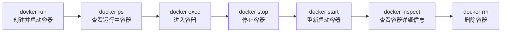
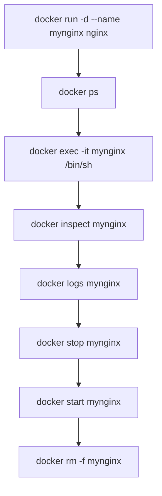

# 第四课：Docker 容器命令下半节

## 1. 这节课学什么

这一节开始进入 Docker 的另一个核心主题：

**容器相关命令。**

如果说上一节的重点是“镜像”，那这一节的重点就是：

- 怎么看容器
- 怎么创建和启动容器
- 怎么进入容器
- 怎么停止和启动容器
- 怎么删除容器
- 怎么查看容器详细信息

这部分是 Docker 真正开始“跑起来”的地方，非常重要。

## 2. 先看本节配图

### 2.1 Docker 容器相关命令图一


### 2.2 Docker 容器相关命令图二


## 3. 先建立一个核心认知

你一定要先把这句话记住：

- 镜像是模板
- 容器是镜像运行后的实例

也就是说：

- `docker pull nginx`：是把模板下载到本地
- `docker run nginx`：是把这个模板真正跑起来

所以从这一节开始，你接触的是：

**运行中的东西。**

## 4. 容器命令到底在管什么

容器命令主要是在管理容器的生命周期。

你可以把它理解成一条完整流程：



这条线就是这节课的主线。

## 5. `docker ps`

### 作用

查看当前正在运行的容器。

### 命令

```bash
docker ps
```

### 专业解释

`ps` 来源于进程查看的概念，在 Docker 里它用于查看当前运行状态中的容器列表。

你通常会看到这些字段：

- `CONTAINER ID`
- `IMAGE`
- `COMMAND`
- `CREATED`
- `STATUS`
- `PORTS`
- `NAMES`

### 通俗理解

这条命令就是：

**看看现在有哪些容器正在工作。**

### 最常见的用途

- 检查容器有没有成功启动
- 看容器名字是什么
- 看端口映射是否存在

## 6. `docker ps -a`

### 作用

查看所有容器，包括：

- 正在运行的
- 已经停止的

### 命令

```bash
docker ps -a
```

### 为什么它很重要

因为很多初学者执行了 `docker run` 之后，发现 `docker ps` 没东西，就以为容器没创建成功。

其实很可能是：

- 容器创建成功了
- 但启动后很快退出了

这时用 `docker ps -a` 才能看到它。

### 通俗理解

- `docker ps`：只看“正在上班的”
- `docker ps -a`：看“所有员工”，包括已经下班的

## 7. `docker run`

### 作用

创建并启动一个新容器。

### 基本命令

```bash
docker run 镜像名
```

例如：

```bash
docker run nginx
```

### 专业解释

`docker run` 是一个组合命令，它通常包含多个动作：

1. 如果本地没有镜像，先尝试拉取镜像
2. 基于镜像创建容器
3. 为容器分配运行参数
4. 启动容器

所以你可以把它理解成：

**创建 + 启动** 一步完成。

### 通俗理解

这条命令相当于：

**拿一个镜像模板，立刻生成一个容器并运行起来。**

## 8. `docker run` 常见参数

你图里已经给了几个最常用参数，这里我帮你系统整理一下。

## 9. `-i`

### 作用

让容器保持标准输入打开。

### 常见搭配

通常和 `-t` 一起用：

```bash
docker run -it ubuntu /bin/bash
```

### 通俗理解

`-i` 的意思可以先简单理解为：

**让你能继续和容器交互。**

## 10. `-t`

### 作用

为容器分配一个伪终端。

### 为什么经常和 `-i` 一起出现

因为很多交互式操作需要：

- 保持输入
- 有一个终端界面

所以常见写法是：

```bash
docker run -it ubuntu /bin/bash
```

### 通俗理解

`-t` 可以理解成：

**给容器开一个像终端一样的窗口环境。**

## 11. `-it`

### 作用

交互式运行容器。

### 典型命令

```bash
docker run -it ubuntu /bin/bash
```

### 这种方式通常适合什么场景

- 你想临时进入一个 Linux 环境看看
- 你想在容器内手工执行命令
- 你在学习和调试阶段想观察容器内部

### 通俗理解

`-it` 就像：

**“把容器开在你面前，并且允许你当场操作它。”**

## 12. `-d`

### 作用

让容器以后台模式运行。

### 命令示例

```bash
docker run -d nginx
```

### 专业解释

后台运行意味着容器启动后不会占用你当前终端界面，而是直接在后台持续运行。你可以通过 `docker ps` 再去查看它。

### 通俗理解

这相当于：

**容器在后台悄悄运行，你终端立刻还给你。**

### 初学者要注意

- `-it` 常用于交互式学习
- `-d` 常用于后台服务运行

所以：

- `-it` 更像“我进去操作”
- `-d` 更像“你自己后台跑着”

## 13. `--name`

### 作用

为容器指定名字。

### 命令示例

```bash
docker run -d --name mynginx nginx
```

### 为什么推荐你尽量写

因为如果不写，Docker 会随机生成一个容器名。

随机名虽然也能用，但不利于学习和管理。

### 通俗理解

这就像给容器起一个你自己看得懂的名字。

## 14. 建议你顺手记住的额外参数：`-p`

虽然你图里没有单独展开，但这也是 `docker run` 中极常用的参数，值得你现在就认识。

### 作用

做端口映射。

### 命令示例

```bash
docker run -d -p 8080:80 --name mynginx nginx
```

### 专业解释

它的格式通常是：

```bash
主机端口:容器端口
```

例如 `8080:80` 表示：

- 宿主机访问 `8080`
- 转发到容器内部的 `80`

### 通俗理解

这相当于给容器开一个“对外窗口”。

如果不做端口映射，很多服务虽然在容器里运行了，但你在宿主机上不一定方便直接访问。

## 15. `docker exec`

### 作用

进入一个**已经在运行中的容器**执行命令。

### 常见命令

```bash
docker exec 参数 容器名 命令
```

最常见写法：

```bash
docker exec -it 容器名 /bin/bash
```

或者某些轻量镜像里没有 `bash`，要用：

```bash
docker exec -it 容器名 /bin/sh
```

### 专业解释

`docker exec` 是在一个已经存在且正在运行的容器里，再启动一个新的进程。例如你执行 `/bin/bash`，本质上是在这个容器里新开了一个 shell 进程。

### 通俗理解

这就像：

**容器已经在后台运行了，你现在临时走进去看看。**

### 图里的重点

图里强调了一点：

**退出容器后，容器不会关闭。**

这点很重要。

因为你只是退出了你开的那个 shell，不是把整个容器停掉。

## 16. `docker exec` 和 `docker run -it` 的区别

这是初学者特别容易混淆的一个点。

### `docker run -it`

- 创建一个新容器
- 并立刻进入

### `docker exec -it`

- 容器已经存在并且正在运行
- 你只是进去执行命令

### 一句话区分

- `run`：新建并启动
- `exec`：进入已运行容器

## 17. `docker stop`

### 作用

停止一个正在运行的容器。

### 命令

```bash
docker stop 容器名
```

例如：

```bash
docker stop mynginx
```

### 专业解释

`docker stop` 会尝试优雅停止容器里的主进程。如果主进程在规定时间内没有退出，再进行更强制的终止处理。

### 通俗理解

这相当于：

**让这个容器先正常下班。**

## 18. `docker start`

### 作用

启动一个已经存在但当前处于停止状态的容器。

### 命令

```bash
docker start 容器名
```

### 和 `docker run` 的区别

这个区别一定要分清。

### `docker run`

- 没有这个容器时，创建并启动新容器

### `docker start`

- 容器已经存在，只是把它重新启动

### 通俗理解

- `run`：新建一辆车并发动
- `start`：之前那辆车还在，只是重新点火

## 19. `docker rm`

### 作用

删除容器。

### 命令

```bash
docker rm 容器名
```

### 图里的重点

如果容器还在运行，直接删除通常会失败。

所以常见顺序是：

1. 先 `docker stop 容器名`
2. 再 `docker rm 容器名`

### 通俗理解

删除容器之前，要先让它停下来。

### 建议你再认识一个参数：`-f`

```bash
docker rm -f 容器名
```

它表示强制删除。

但在学习阶段，我更建议你先养成：

- 先停
- 再删

这个更容易理解整个生命周期。

## 20. `docker inspect`

### 作用

查看容器的详细信息。

### 命令

```bash
docker inspect 容器名
```

### 专业解释

它会返回容器的详细元数据，通常是 JSON 格式，里面包含：

- 容器 ID
- 创建时间
- 启动命令
- 网络配置
- 挂载信息
- 环境变量
- 状态信息
- 端口映射

### 通俗理解

这相当于查看容器的“完整档案”。

### 什么时候用

- 想确认端口映射
- 想确认容器真实名称
- 想看挂载目录
- 想排查容器配置问题

## 21. 再补一个非常常用的容器命令：`docker logs`

你图里没有写这个，但从实用角度，我强烈建议你现在就先认识它。

### 作用

查看容器日志。

### 命令

```bash
docker logs 容器名
```

实时跟日志常见写法：

```bash
docker logs -f 容器名
```

### 为什么很重要

因为初学者最常见的问题就是：

- 容器为什么一启动就退出
- 容器为什么访问不了
- 容器里程序报了什么错

这时 `docker logs` 往往是第一排查入口。

### 通俗理解

它就是查看容器“刚才到底发生了什么”。

## 22. 容器命令的典型学习流程

如果你刚开始学，推荐按下面这个顺序练习：

```bash
docker pull nginx
docker run -d --name mynginx -p 8080:80 nginx
docker ps
docker exec -it mynginx /bin/sh
docker inspect mynginx
docker logs mynginx
docker stop mynginx
docker start mynginx
docker rm -f mynginx
```

这套流程能把这节课的大多数命令串起来。

## 23. 关于退出容器，你一定要分清两种情况

这是一个非常高频的易错点。

### 情况一：`docker run -it`

你是直接以前台交互方式启动容器。

有些场景下，你退出交互界面后，容器就结束了。

### 情况二：`docker exec -it`

你进入的是一个本来就在运行的容器。

你退出 shell 后，容器通常还在继续运行。

### 一句话先记住

- `run -it` 更像“我直接前台开着这个容器”
- `exec -it` 更像“我临时进入一个正在运行的容器”

## 24. `-it` 和 `-d` 为什么经常被一起讲

因为它们分别代表两种典型运行模式。

### 交互式容器

常见写法：

```bash
docker run -it ubuntu /bin/bash
```

特点：

- 适合学习、调试
- 你会直接进入容器

### 后台守护式容器

常见写法：

```bash
docker run -d nginx
```

特点：

- 适合服务型程序
- 容器在后台运行
- 一般再配合 `docker exec`、`docker logs` 去观察

## 25. 初学者最容易犯的错误

### 错误一：把 `run` 和 `start` 当成一样

不是。

- `run`：创建并启动
- `start`：启动已存在容器

### 错误二：只看 `docker ps`

如果容器刚启动就退出，你用 `docker ps` 看不到。

这时要用：

```bash
docker ps -a
```

### 错误三：进入容器时默认就写 `/bin/bash`

有些轻量镜像没有 `bash`，这时用：

```bash
/bin/sh
```

### 错误四：容器删不掉就慌

先看是不是容器还在运行。

通常顺序是：

```bash
docker stop 容器名
docker rm 容器名
```

### 错误五：容器启动失败却不知道看日志

要优先想到：

```bash
docker logs 容器名
```

## 26. 这一课的命令关系图



## 27. 从专业角度总结这一课

Docker 容器相关命令，本质上是在管理容器生命周期和运行状态。`docker run` 负责基于镜像创建并启动容器，`docker ps` 和 `docker ps -a` 负责查看容器状态，`docker exec` 用于在已运行容器中启动额外进程，`docker stop` 与 `docker start` 用于控制容器运行状态，`docker rm` 负责删除容器，`docker inspect` 和 `docker logs` 则提供容器配置与运行诊断能力。

从工程角度看，真正掌握 Docker 容器命令，不是背下单个命令，而是理解容器从“创建、运行、进入、检查、停止、删除”的完整链路。

## 28. 用大白话总结这一课

你可以把这节课记成下面几句话：

- `docker run`：创建并启动容器
- `docker ps`：看正在运行的容器
- `docker ps -a`：看所有容器
- `docker exec`：进入已经在运行的容器
- `docker stop`：停止容器
- `docker start`：重新启动已存在容器
- `docker rm`：删除容器
- `docker inspect`：看容器完整信息
- `docker logs`：看容器日志

## 29. 本节课你必须记住的重点

- 容器是镜像运行后的实例
- `docker run` 不只是启动，还包含创建
- `docker start` 不是新建容器，而是重启已有容器
- `docker ps` 和 `docker ps -a` 的范围不同
- `docker exec` 是进入已运行容器，不会因为退出 shell 就自动关闭整个容器
- `-it` 常用于交互式学习
- `-d` 常用于后台运行服务
- `--name` 能帮助你更清楚地管理容器
- `docker logs` 和 `docker inspect` 是很重要的排查命令

## 30. 本节课课后练习

建议你自己动手按顺序练一次：

```bash
docker pull nginx
docker run -d --name mynginx -p 8080:80 nginx
docker ps
docker exec -it mynginx /bin/sh
docker inspect mynginx
docker logs mynginx
docker stop mynginx
docker start mynginx
docker rm -f mynginx
```

## 31. 本节课一句话收尾

**第四课下半节的核心，就是掌握容器从创建、查看、进入、启停到删除这一整套生命周期命令。**
