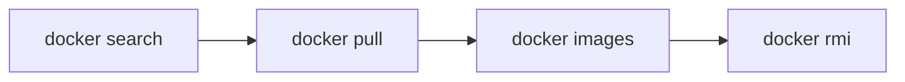
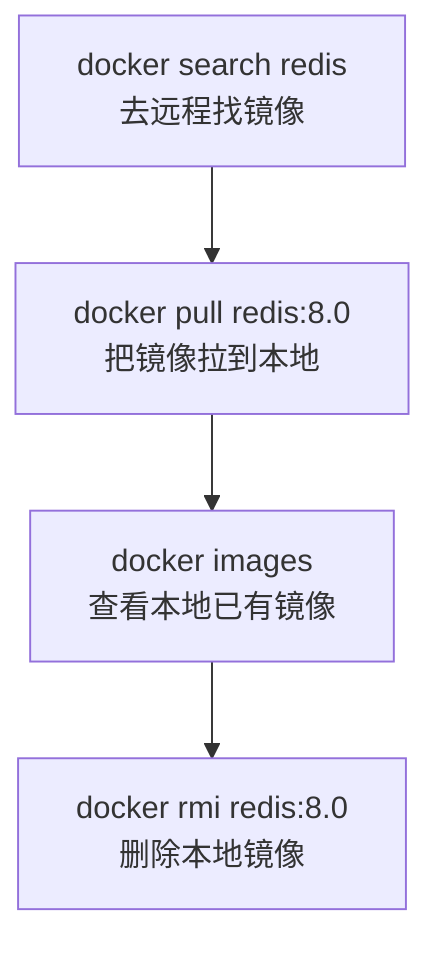

# 第四课：Docker 镜像命令上半节

## 1. 这节课学什么

这一节主要讲两部分内容：

- Docker 服务相关命令
- Docker 镜像相关命令

注意，这一课我们**暂时不展开讲容器命令**，例如：

- `docker run`
- `docker ps`
- `docker stop`
- `docker exec`

这些都属于后面的内容。

这一课你先把“服务”和“镜像”这两个层面学扎实。

## 2. 先看本节配图

### 2.1 Docker 服务相关命令


### 2.2 Docker Hub 镜像页面示例


### 2.3 Docker 镜像相关命令


## 3. 先把“服务”和“镜像”分开理解

很多初学者一上来会把 Docker 命令混成一团，其实先分层理解会轻松很多。

### 服务相关命令在管什么

服务相关命令主要是在管：

- Docker daemon 有没有启动
- Docker 服务是否正常
- Docker 是否设置为开机自启

也就是说，它管的是：

**Docker 这套后台服务本身。**

### 镜像相关命令在管什么

镜像相关命令主要是在管：

- 本地有哪些镜像
- 如何从远程仓库找镜像
- 如何把镜像下载到本地
- 如何删除本地镜像

也就是说，它管的是：

**镜像这种“模板资源”。**

### 一句话先记住

- 服务命令：管理 Docker 后台
- 镜像命令：管理 Docker 镜像资源

## 4. Docker 服务相关命令到底是什么

你给的第一张图里出现了这些命令：

```bash
systemctl start docker
systemctl stop docker
systemctl restart docker
systemctl status docker
systemctl enable docker
```

这些命令本质上不是“Docker CLI 命令”，而是：

**Linux 的 systemd 服务管理命令，用来管理 Docker 服务。**

这点非常关键。

## 5. 为什么图里是 `systemctl`，而不是 `docker start`

因为它们管的对象根本不是一回事。

### `systemctl start docker`

它的意思是：

- 启动 Docker 这个系统服务
- 启动的是 Docker daemon，也就是 `dockerd`

### `docker start`

这个命令虽然名字也叫 start，但它管理的是：

- 已经存在的某个容器

所以：

- `systemctl start docker`：启动 Docker 服务
- `docker start 容器名`：启动某个容器

这一课我们只讲前者，不展开后者。

## 6. Linux 上常见的 Docker 服务命令

下面这些命令主要适用于：

- CentOS
- Rocky Linux
- RHEL
- Ubuntu 中使用 systemd 的环境

## 7. `systemctl start docker`

### 作用

启动 Docker 服务。

### 命令

```bash
systemctl start docker
```

### 专业解释

这条命令会让操作系统启动 Docker daemon。Docker daemon 是 Docker 的后台守护进程，很多 Docker CLI 命令都依赖它存在。

如果 daemon 没启动，那么很多命令即使语法正确，也无法工作。

### 通俗理解

这相当于先把“Docker 引擎”通电开机。

### 什么时候用

- 刚装完 Docker 之后
- Docker 服务没启动时
- 系统重启后发现 Docker 没自动起来时

## 8. `systemctl stop docker`

### 作用

停止 Docker 服务。

### 命令

```bash
systemctl stop docker
```

### 专业解释

这会让 Docker daemon 停止工作。停止后，客户端再向 Docker daemon 发请求时通常会失败，因为后台服务已经不在响应。

### 通俗理解

这相当于把 Docker 整个后台系统关机。

### 注意

实际生产环境里不要随便停，因为它会影响 Docker 的整体可用性。

## 9. `systemctl restart docker`

### 作用

重启 Docker 服务。

### 命令

```bash
systemctl restart docker
```

### 专业解释

它通常用于：

- 修改了 Docker daemon 配置后重启服务
- Docker 服务异常时尝试恢复
- 刷新某些配置变更

### 通俗理解

这相当于“关一下再重新开机”。

### 典型场景

比如你改了 Linux 上的 Docker 配置文件后，经常需要重启服务使配置生效。

## 10. `systemctl status docker`

### 作用

查看 Docker 服务状态。

### 命令

```bash
systemctl status docker
```

### 你一般能看到什么

- 服务是否在运行
- 启动时间
- 主进程 PID
- 最近日志摘要
- 是否启动失败

### 通俗理解

就是查看 Docker 当前“活着没、状态好不好”。

## 11. `systemctl enable docker`

### 作用

设置 Docker 开机自启。

### 命令

```bash
systemctl enable docker
```

### 专业解释

这条命令不是“立刻启动 Docker”，而是设置系统在下次开机时自动启动 Docker 服务。

### 通俗理解

就是给 Docker 勾上“开机自动启动”。

### 容易混淆的点

- `start`：现在立刻启动
- `enable`：以后开机自动启动

有时会配合使用：

```bash
systemctl enable docker
systemctl start docker
```

## 12. 补充两个很常见的服务排查命令

虽然你图里没有写，但做笔记时我建议顺手记住这两个。

## 13. `docker version`

### 作用

查看 Docker 客户端和服务端版本。

### 命令

```bash
docker version
```

### 它为什么重要

它能帮助你判断：

- Docker CLI 是否安装成功
- Docker daemon 是否能连上
- Client 和 Server 版本分别是多少

### 通俗理解

这是一个很实用的“Docker 有没有基本正常工作”的检查命令。

## 14. `docker info`

### 作用

查看 Docker 当前运行环境的详细信息。

### 命令

```bash
docker info
```

### 你通常能看到什么

- 镜像数量
- 容器数量
- 存储驱动
- Cgroup 信息
- Registry Mirrors
- Docker Root Dir
- 操作系统和架构

### 为什么它也值得算进服务相关命令

因为它常用于排查：

- daemon 是否正常
- 配置是否生效
- 当前 Docker 环境到底长什么样

比如你上一节配置镜像加速器时，就用到了 `docker info`。

## 15. 对你当前 macOS 环境，要怎么理解这些服务命令

这一点很重要，因为你现在不是在 Linux 服务器上学，而是在 macOS 上学。

## 16. macOS 上不能简单照搬 `systemctl`

在 macOS + Docker Desktop 环境中，通常不是用：

```bash
systemctl start docker
```

来管理 Docker 的。

原因是：

- `systemctl` 是 Linux `systemd` 体系下的命令
- macOS 并不是 `systemd`
- 你当前使用的是 Docker Desktop

所以在你的环境里，更接近的做法是：

- 打开 Docker Desktop
- 让 Docker Desktop 启动内部的 Docker daemon

### 对照理解

- Linux：常见是 `systemctl start docker`
- macOS：常见是启动 Docker Desktop

### 你现在最该记住的一句话

**图里的服务命令主要是 Linux 服务器场景，不是 macOS 的原生命令方式。**

## 17. Docker 镜像相关命令概览

你给的第三张图里，核心镜像命令有：

```bash
docker images
docker images -q
docker search 镜像名
docker pull 镜像名
docker rmi 镜像id
docker rmi `docker images -q`
```

这些命令我们一个个讲清楚。

## 18. 先理解镜像命令的整体流程

学习镜像命令时，最好的思路不是死背，而是按动作顺序理解：

1. 先去远程仓库查有没有想要的镜像
2. 找到后把镜像拉到本地
3. 查看本地已有镜像
4. 不需要时删除本地镜像

也就是这条线：



你把这条线记住，很多命令就自然顺了。

## 19. `docker images`

### 作用

查看本地已有的镜像。

### 命令

```bash
docker images
```

### 常见输出字段

- `REPOSITORY`
- `TAG`
- `IMAGE ID`
- `CREATED`
- `SIZE`

### 这些字段怎么理解

#### `REPOSITORY`

镜像仓库名或镜像名称。

例如：

- `nginx`
- `redis`
- `ubuntu`

#### `TAG`

镜像标签，通常表示版本。

例如：

- `latest`
- `8.0`
- `22.04`

#### `IMAGE ID`

镜像 ID，是镜像在本地的唯一标识之一。

#### `CREATED`

镜像创建时间。

#### `SIZE`

镜像体积大小。

### 通俗理解

`docker images` 就像在看：

**“我本地仓库里到底囤了哪些镜像模板。”**

## 20. `docker images -q`

### 作用

只查看本地镜像的 ID。

### 命令

```bash
docker images -q
```

### 为什么有用

因为很多批量脚本或清理命令只需要镜像 ID，不需要完整表格信息。

### 通俗理解

正常 `docker images` 是“带完整信息的清单”，而 `-q` 是“只看编号列表”。

这里的 `q` 是 `quiet`，表示简洁输出。

## 21. `docker search 镜像名`

### 作用

在远程镜像仓库中搜索镜像。

### 命令

```bash
docker search redis
```

### 专业解释

这条命令的主要用途是帮助你在远程仓库中查找公开镜像条目，尤其适合在你不确定具体镜像名时使用。

不过现代学习场景里，很多人也会直接去 Docker Hub 网站查看镜像详情，因为网页能看到更多信息。

### 通俗理解

这相当于在镜像市场里“搜索商品”。

## 22. 为什么还要去 Docker Hub 网站看

你给的第二张图就是一个很好的例子。


通过 Docker Hub 页面，你通常能看到比命令行更多的信息，例如：

- 镜像介绍
- 版本标签
- 支持的平台架构
- 使用说明
- 安全信息

### 初学者实战建议

如果你不知道镜像该拉哪个版本，不要只凭感觉写 `latest`，可以先去 Docker Hub 页面看清楚。

## 23. `docker pull 镜像名`

### 作用

从远程仓库拉取镜像到本地。

### 命令

```bash
docker pull redis
```

也可以指定版本：

```bash
docker pull redis:8.0
```

### 专业解释

`docker pull` 会让 Docker daemon 访问远程 registry，下载镜像的各个层，并保存到本地镜像存储中。

如果不写 tag，默认通常会按：

```text
latest
```

处理。

### 通俗理解

这就是把远程仓库里的镜像“下载到本地”。

### 为什么建议尽量写版本

因为：

- `latest` 不一定真的是你以为的“最新稳定版”
- 版本不固定会影响学习复现
- 以后排查问题时，不写版本会更难定位

所以初学者养成好习惯：

**能写版本就尽量写版本。**

## 24. `docker rmi 镜像id`

### 作用

删除本地镜像。

### 命令

```bash
docker rmi 镜像id
```

也可以按名称和标签删：

```bash
docker rmi redis:8.0
```

### 专业解释

`rmi` 是 `remove image` 的缩写，它删除的是本地镜像元数据及相关层引用。

如果某个镜像仍然被相关对象占用，删除时可能会失败或需要更明确地处理依赖关系。

这一课你先记住最基本的一层意思：

**它是删本地镜像，不是删远程仓库里的镜像。**

### 通俗理解

这就像把你本地下载好的“镜像模板”删掉。

## 25. `docker rmi \`docker images -q\``

你图里给的是这个写法：

```bash
docker rmi `docker images -q`
```

它的意思是：

- 先执行 `docker images -q`
- 得到所有本地镜像 ID
- 再把这些 ID 作为参数传给 `docker rmi`

所以它的效果通常是：

**尝试删除所有本地镜像。**

### 为什么初学者要谨慎

这条命令比较“猛”，不建议在你还没完全搞清楚本地环境之前随便执行。

因为它不是删一个镜像，而是想删全部。

### 更推荐你先这样理解

先学会：

- 看镜像：`docker images`
- 拉镜像：`docker pull`
- 删单个镜像：`docker rmi 镜像名:tag`

等你对本地环境有概念后，再考虑批量清理。

## 26. 镜像名称和版本要怎么写

这一点初学者经常糊涂。

### 标准写法

```bash
名称:标签
```

例如：

```bash
redis:8.0
nginx:1.27
ubuntu:22.04
```

### 如果不写标签

通常默认会使用：

```bash
latest
```

例如：

```bash
docker pull redis
```

很多情况下相当于：

```bash
docker pull redis:latest
```

但你要记住：

**`latest` 是默认标签，不是“最新版保证”。**

## 27. 镜像命令之间的关系图



这张图就是你现在最该建立起来的镜像操作脑图。

## 28. `images` 和 Docker Hub 页面的关系

很多初学者会把本地镜像和 Docker Hub 页面搞混。

### Docker Hub 页面代表什么

代表远程仓库中的镜像信息。

### `docker images` 代表什么

代表你本地机器上已经存在的镜像。

### 一句话区分

- Docker Hub：远程仓库视角
- `docker images`：本地机器视角

## 29. 你当前学习阶段的建议操作顺序

如果你正在学镜像命令，我建议你按下面顺序练习：

1. `docker info`
2. `docker search redis`
3. 去 Docker Hub 页面看镜像详情
4. `docker pull redis:8.0`
5. `docker images`
6. `docker rmi redis:8.0`

这样会比乱试命令更容易建立体系感。

## 30. 本节课的重点边界

这一课你只需要先建立两个认知：

### 第一层

Docker 服务命令是用来管 Docker 后台服务是否正常。

### 第二层

Docker 镜像命令是用来管镜像资源的查找、拉取、查看和删除。

只要你把这两层分清，后面再学容器命令时就不会混乱。

## 31. 初学者最常见的误区

### 误区一：把服务命令和容器命令混为一谈

不是一回事。

- 服务命令：管 Docker daemon
- 容器命令：管具体容器

### 误区二：把 `docker images` 当成“查看远程仓库”

不是。

它只看本地已有镜像。

### 误区三：觉得 `latest` 一定最安全

不一定。

学习时尽量写明确版本。

### 误区四：随手执行批量删除命令

像：

```bash
docker rmi `docker images -q`
```

这种命令要知道后果再用。

## 32. 从专业角度总结这一课

Docker 服务相关命令主要围绕 Docker daemon 的生命周期管理和状态检查展开。在 Linux 环境中，常通过 `systemctl` 管理 Docker 服务；在 macOS 的 Docker Desktop 环境中，则更常通过 Docker Desktop 图形界面完成等效操作。

Docker 镜像相关命令主要围绕镜像资源的检索、拉取、本地查看和删除展开。`docker search` 面向远程仓库查找，`docker pull` 负责把镜像下载到本地，`docker images` 用于查看本地镜像库存，`docker rmi` 用于删除本地镜像。

## 33. 用大白话总结这一课

你现在可以把这一课记成下面几句话：

- Docker 先得“服务开着”，很多命令才能正常工作
- Linux 上常用 `systemctl` 管 Docker 服务
- macOS 上你更常接触的是 Docker Desktop
- `docker search` 是去远程找镜像
- `docker pull` 是把镜像拉到本地
- `docker images` 是看本地有哪些镜像
- `docker rmi` 是删本地镜像

## 34. 本节课你必须记住的重点

- `systemctl start docker` 管的是 Docker 服务，不是容器
- `systemctl enable docker` 是开机自启，不是立刻启动
- `docker version` 和 `docker info` 是很实用的服务检查命令
- `docker images` 查看的是本地镜像
- `docker search` 查看的是远程可搜索镜像
- `docker pull` 是拉取镜像到本地
- `docker rmi` 删除的是本地镜像
- `latest` 是默认标签，不等于你业务上真正想要的版本

## 35. 本节课课后练习

你可以自己按顺序练习下面这些命令：

```bash
docker version
docker info
docker search redis
docker pull redis:8.0
docker images
docker rmi redis:8.0
```

## 36. 本节课一句话收尾

**第四课的核心就是先分清两件事：一类命令是在管理 Docker 服务，另一类命令是在管理 Docker 镜像。**
