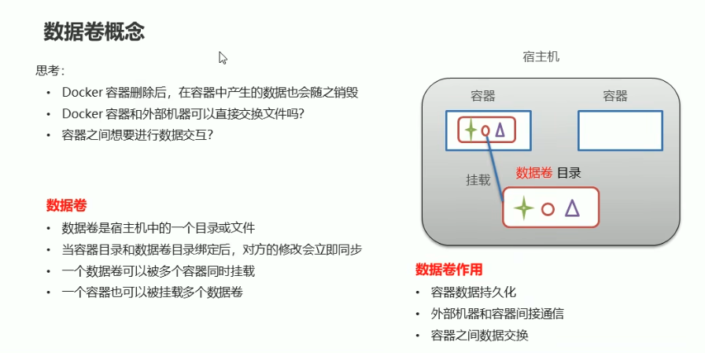

# 第五课：Docker 数据卷基础概念

## 1. 这节课学什么

这一节我们开始学习 Docker 里的一个非常重要的概念：

**数据卷（Volume）。**

这一课暂时不讲实操命令，先只讲基础概念，重点回答下面几个问题：

- 为什么会出现数据卷
- 数据卷到底是什么
- 数据卷有什么作用
- 它大致依赖了什么底层实现思路
- 为什么说它是 Docker 持久化和数据共享的重要机制

这一节学明白以后，后面你再学挂载命令、目录映射、容器数据持久化，就会轻松很多。

## 2. 先看本节配图

## 3. 先从问题出发：为什么会出现数据卷

你给的图里前面列了三个思考问题，这三个问题其实就是数据卷出现的根本原因：

1. Docker 容器删除后，容器中的数据也会随之销毁
2. Docker 容器和外部机器怎么交换文件
3. 容器之间如果要共享数据，该怎么办

这三个问题，本质上都指向一个核心矛盾：

**容器本身是轻量、可快速创建和删除的，但数据往往希望稳定、可保留、可共享。**

也就是说：

- 容器强调“可快速销毁和重建”
- 数据强调“可长期保存和复用”

这两者天然有冲突。

Docker 数据卷就是为了解决这个冲突而出现的。

## 4. 如果没有数据卷，会发生什么

为了让你真正理解数据卷的意义，我们先想象一下“没有数据卷”的情况。

### 4.1 容器内数据容易丢失

如果应用把数据直接写在容器内部文件系统里，那么：

- 容器被删除
- 容器被重新创建
- 容器被替换

这些情况下，原来的数据往往也就跟着消失了。

这对于以下场景是不可接受的：

- 数据库数据
- 上传文件
- 日志文件
- 配置文件
- 业务运行过程中产生的持久化数据

### 4.2 宿主机和容器交换数据不方便

如果宿主机无法和容器很自然地共享目录或文件，那么：

- 主机上的文件不好给容器使用
- 容器里生成的数据不好拿出来
- 配置和内容更新会变得麻烦

### 4.3 多个容器的数据协作会变复杂

如果两个容器要访问同一份数据，例如：

- 一个容器负责写入
- 另一个容器负责读取

那就需要一种双方都能访问的持久化空间。

## 5. 数据卷到底是什么

### 专业解释

Docker 数据卷本质上是：

**由 Docker 管理的一种持久化存储机制，用于将容器中的数据与容器生命周期解耦。**

这句话你可以慢慢拆开看：

- “持久化存储机制”：
  说明它的核心目标是让数据不跟着容器一起消失
- “与容器生命周期解耦”：
  说明数据和容器不再绑定成一个整体

在工程实践里，数据卷通常体现为：

- 宿主机上的某个目录或文件
- 被 Docker 以挂载的方式提供给容器使用

### 通俗理解

你可以把数据卷理解成：

**给容器外挂了一个“独立的数据存储空间”。**

这样一来：

- 容器负责跑程序
- 数据卷负责存数据

就算容器没了，数据卷里的内容通常还在。

## 6. 数据卷和容器内部文件有什么本质区别

这个区别一定要理解清楚。

### 容器内部文件

- 更像容器自己随身带的内容
- 生命周期更容易跟着容器走
- 适合临时性、运行态文件

### 数据卷中的文件

- 更像挂在容器外面的独立存储空间
- 生命周期不完全依赖容器
- 更适合需要保留、共享、迁移的数据

### 一句话区分

- 容器内部文件：更偏“容器自己的东西”
- 数据卷：更偏“容器借用的外部存储”

## 7. 数据卷有什么用

这部分是核心。

## 8. 作用一：数据持久化

这是数据卷最经典、最重要的作用。

### 专业解释

当容器删除、重建、升级时，如果应用数据写在数据卷里，那么这些数据通常不会随着容器一起被删掉。

这使得：

- 应用镜像可以频繁替换
- 容器可以频繁重建
- 数据仍然可以稳定保留

这是现代容器化部署非常关键的一种能力。

### 通俗理解

你可以把容器理解成“临时工位”，把数据卷理解成“固定档案柜”。

- 工位拆了可以重建
- 档案柜里的资料还在

## 9. 作用二：宿主机和容器之间交换数据

### 专业解释

数据卷让容器和宿主机之间形成一个可共享的文件通道。宿主机修改文件后，容器通常可以看到变化；容器写入数据后，宿主机也可以读取。

这对于下面这些场景非常有用：

- 配置文件注入
- 日志收集
- 开发环境下代码同步
- 容器输出文件回传给主机

### 通俗理解

数据卷就像宿主机和容器之间开了一扇门，双方可以通过这扇门访问同一批数据。

## 10. 作用三：容器之间共享数据

### 专业解释

如果多个容器挂载同一个数据卷，那么它们就可以访问同一份数据。这为多容器协作提供了很重要的基础。

例如：

- 一个容器负责生成文件
- 另一个容器负责消费文件

### 通俗理解

这就像多个房间都能使用同一个公共储物柜。

## 11. 作用四：让应用和数据职责分离

这是从架构角度非常重要的一点。

### 专业解释

容器化设计里，一个重要原则是：

**应用运行环境和业务数据最好分离。**

容器更适合承载：

- 应用程序
- 运行环境
- 启动逻辑

数据卷更适合承载：

- 持久化数据
- 共享数据
- 可迁移数据

这使系统更容易：

- 升级
- 回滚
- 迁移
- 备份

### 通俗理解

程序是程序，数据是数据，不要把它们死死捆在一起。

## 12. 数据卷为什么是 Docker 中非常重要的能力

如果没有数据卷，容器会更像一次性进程。

而有了数据卷后，Docker 才真正适合承载很多真实业务场景，例如：

- 数据库
- 日志系统
- 文件处理服务
- 配置驱动型应用
- 多容器协作应用

所以你可以这样理解：

**数据卷让 Docker 从“只会跑程序”，变成“更适合跑真正有状态的应用”。**

## 13. 数据卷大致的底层实现思路是什么

这一节我不讲太深的源码层细节，但要把大体原理讲清楚。

## 14. 核心思想：挂载

Docker 数据卷最关键的底层思想就是：

**挂载（mount）。**

也就是说，容器中的某个目录，并不是完全只存在于容器自己的可写层里，而是可以映射到外部存储位置上。

从效果上看，相当于：

- 容器中的一个目录
- 对应到了宿主机中的一个真实目录或由 Docker 管理的存储位置

### 通俗理解

这不是把数据“复制一份”到容器里，而更像是：

**把外面的一个存储空间接到了容器内部某个路径上。**

## 15. 从 Linux 角度看，它依赖什么能力

从专业角度看，Docker 数据卷并不是完全重新发明了一套新的文件系统，而是建立在操作系统已有文件系统和挂载机制之上的。

可以粗略理解为依赖下面这些基础能力：

- Linux 文件系统
- 挂载机制
- 目录映射能力
- 容器文件系统命名空间

Docker 在这些基础上进行了统一抽象和管理，使用户可以用更标准化的方式去声明和使用卷。

## 16. 为什么说数据卷和容器可写层不是一回事

学习数据卷时，很容易把它和容器自己的可写层混掉。

### 容器可写层

每个容器启动后，通常会有一个属于自己的可写层，用来承接运行过程中产生的改动。

但这个可写层有几个特点：

- 更依赖容器本身
- 不适合作为长期稳定的数据存储
- 管理和迁移都不如独立数据卷清晰

### 数据卷

数据卷是独立于容器可写层的一种持久化存储抽象。

它的重点是：

- 生命周期相对独立
- 便于共享
- 便于保留
- 更适合真实业务数据

### 一句话理解

- 可写层：容器运行时顺手写进去的地方
- 数据卷：专门给“该保留的数据”准备的地方

## 17. 数据卷和宿主机目录的关系

在概念上，你可以先把数据卷理解成“宿主机上的存储被挂载给容器使用”。

从学习角度可以先掌握这一层：

- 数据卷最终还是要落在宿主机某个真实存储位置上
- 容器只是通过挂载使用它

后面你学实操时会进一步区分：

- Docker 管理的卷
- 直接绑定宿主机目录的方式

但这一节先不用展开命令和细节。

## 18. 数据卷带来的工程价值

从专业角度看，数据卷的价值不只是“存东西”，而是它让系统具备了更好的工程可维护性。

### 备份更方便

因为数据和容器本身分离，所以备份思路会更清晰。

### 升级更安全

升级容器镜像时，不一定要把数据一起重建。

### 迁移更灵活

应用迁移到别的机器时，数据可以作为独立对象处理。

### 协作更清晰

多个容器读写同一份数据时，架构职责更明确。

## 19. 从你这张图可以怎么理解数据卷

你给的图里，右侧画的是：

- 宿主机
- 容器
- 数据卷目录

这张图的核心意思不是“数据卷在容器里面”，而是：

**容器通过挂载使用一个独立的数据目录。**

图里列出的三个作用也非常典型：

- 容器数据持久化
- 外部机器和容器间通信
- 容器之间数据交换

这三个作用基本就是数据卷最核心的三个学习抓手。

## 20. 初学者最容易误解的点

### 误区一：数据卷就是容器里的普通目录

不是。

它虽然在容器内部表现为一个目录，但它背后代表的是一个挂载进来的外部存储位置。

### 误区二：容器删了，数据一定也删了

不一定。

如果数据在数据卷里，那么数据和容器生命周期不再完全绑定。

### 误区三：数据卷只是为了“方便拷文件”

不止。

它更重要的价值是：

- 数据持久化
- 架构解耦
- 多容器共享
- 便于迁移与维护

### 误区四：数据卷是 Docker 自创的一种神秘黑科技

也不是。

它本质上依赖操作系统已有的文件系统和挂载能力，只是 Docker 把它做成了更标准、易用的机制。

## 21. 从专业角度总结这一课

Docker 数据卷是 Docker 为了解决容器数据持久化、宿主机与容器的数据交换、多容器数据共享等问题而提供的一种存储抽象。它的核心价值在于将“数据生命周期”从“容器生命周期”中解耦，使容器更适合承载真实业务中的有状态数据。

从底层实现思路看，数据卷主要建立在宿主机文件系统和挂载机制之上，通过将宿主机上的存储位置挂载到容器内部路径，使容器能够访问独立于其自身可写层的数据空间。

## 22. 用大白话总结这一课

你可以先把数据卷记成下面几句话：

- 容器容易删，但数据不想跟着删
- 所以 Docker 需要一种把数据单独拿出来保存的方式
- 这个方式就是数据卷
- 数据卷像给容器外挂的独立硬盘空间
- 容器负责跑程序，数据卷负责存数据
- 它还能让宿主机和多个容器共享同一份数据

## 23. 本节课你必须记住的重点

- 数据卷出现的根本原因，是容器生命周期和数据生命周期的矛盾
- 数据卷的核心价值是数据持久化、宿主机通信、容器间数据共享
- 数据卷本质上是存储抽象，不是普通容器目录
- 它依赖的核心底层思路是挂载
- 数据卷和容器可写层不是一回事
- 应用和数据分离，是容器化设计中的重要思想

## 24. 本节课课后思考题

你可以试着用自己的话回答下面几个问题：

1. 如果没有数据卷，容器化应用最容易遇到什么问题？
2. 数据卷为什么能让容器删除后数据仍然保留？
3. 数据卷和容器内部普通目录有什么区别？
4. 为什么说数据卷的核心底层思想是挂载？
5. 为什么真实业务场景下，应用和数据最好分离？

如果你能把这 5 个问题讲清楚，第五课的核心概念就真的掌握了。

## 25. 本节课一句话收尾

**数据卷的本质，就是把“容器要使用的数据”从“容易变化和销毁的容器本身”中独立出来。**
