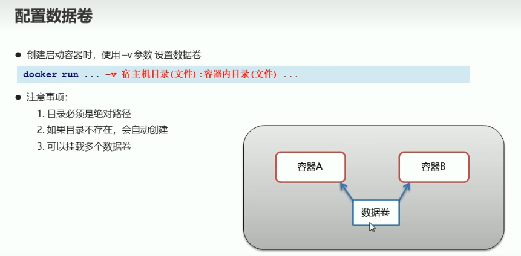

# 第五课：Docker 数据卷实操

## 1. 这节课学什么

这一节是第五课的数据卷实操部分。

上一节我们已经讲清楚了数据卷的基础概念，这一节开始进入实际操作，重点是：

- 数据卷相关命令怎么写
- `-v` 参数是什么意思
- 宿主机目录和容器目录是怎么挂载在一起的
- 一个容器能不能挂载多个数据卷
- 通过你自己的实操过程，验证数据卷到底起了什么作用

这一节非常重要，因为从这里开始，你会真正看到：

**容器里的目录，和宿主机目录之间是怎么“打通”的。**

## 2. 先看本节配图



这张图里最核心的一句命令是：

```bash
docker run ... -v 宿主机目录(文件):容器内目录(文件) ...
```

这就是本节课最核心的操作入口。

## 3. 先回顾：数据卷为什么值得实操

你前一节已经学过，数据卷的作用主要有三个：

- 容器数据持久化
- 宿主机和容器之间交换数据
- 容器之间共享数据

而这节实操，就是把这些抽象概念变成你看得见、摸得着的现象。

你这次操作，实际上已经验证了其中两个最重要的点：

1. 宿主机目录可以挂载到容器内部
2. 容器删除后，宿主机目录中的数据仍然保留

## 4. 配置数据卷的核心命令

### 基本语法

```bash
docker run -v 宿主机绝对路径:容器内路径 镜像名
```

例如你这次使用的是：

```bash
docker run -it --name=test -v /Users/apple/Desktop/data:/root/data_container centos:7
```

### 这条命令应该怎么拆开理解

- `docker run`
  创建并启动容器
- `-it`
  以交互式方式运行容器
- `--name=test`
  给容器起名为 `test`
- `-v /Users/apple/Desktop/data:/root/data_container`
  把宿主机目录挂载到容器内目录
- `centos:7`
  使用的镜像

### 通俗理解

这条命令的意思就是：

**启动一个 `centos:7` 容器，并且把你桌面上的 `data` 目录，接到容器里的 `/root/data_container` 目录上。**

## 5. `-v` 到底是什么意思

### 专业解释

`-v` 是 `volume` 的缩写，用于在运行容器时声明挂载关系。

它的核心格式是：

```bash
宿主机路径:容器路径
```

这表示：

- 左边是宿主机真实存在的目录或文件
- 右边是容器内你希望访问它的位置

容器运行起来后，对这个挂载点的读写，会反映到宿主机对应目录中。

### 通俗理解

你可以把 `-v` 理解成：

**拿一根数据线，把宿主机目录接到容器目录上。**

所以这两个路径，看起来像两个地方，实际上在挂载后，它们会指向同一份数据。

## 6. 配置数据卷时要注意什么

你给的图片里列了三个重点，这里我展开讲清楚。

## 7. 注意点一：宿主机目录要写绝对路径

### 为什么

因为 Docker 需要明确知道你想挂载宿主机上的哪个真实位置。

你这次用的是：

```bash
/Users/apple/Desktop/data
```

这就是一个标准的绝对路径。

### 为什么不建议初学者用相对路径

因为相对路径更容易让人混淆当前工作目录，学习阶段不利于你建立清晰认知。

### 建议

学习数据卷时，先统一使用：

- 清晰的绝对路径
- 自己看得懂的目录名

## 8. 注意点二：如果宿主机目录不存在，Docker 往往会自动创建

你给的图里也写到了这一点。

### 专业理解

当你挂载的是宿主机目录，而该目录还不存在时，Docker 通常会在宿主机上为你创建出来。

### 通俗理解

就是你指定了一个想挂载的目录，即使它原来没有，Docker 也可能帮你先建出来。

### 但你要注意

“会自动创建”不等于“可以随便写错路径”。

因为如果你路径写错了，Docker 也可能在错误位置给你创建一个新目录，导致你以为自己挂载成功了，其实挂错地方了。

## 9. 注意点三：一个容器可以挂载多个数据卷

这一点你后面也亲自验证了。

例如：

```bash
docker run -it --name=tese-3 \
  -v /Users/apple/Desktop/data:/root/data \
  -v /Users/apple/Desktop/data-2:/root/data-2 \
  centos:7
```

这说明：

- 一个容器里不止能挂一个目录
- 你可以根据需要，把多个宿主机目录接到容器内不同路径

### 通俗理解

一个容器不是只能接一根“数据线”，而是可以接很多根。

## 10. 你的第一段实操：挂载单个数据卷

你首先执行了这条关键命令：

```bash
docker run -it --name=test -v /Users/apple/Desktop/data:/root/data_container centos:7
```

进入容器后，你做了这些动作：

```bash
cd ~
ls
cd data_container/
ls
cat a.txt
```

你看到的结果是：

- 容器内存在 `data_container` 目录
- 目录中存在 `a.txt`
- `cat a.txt` 输出了：

```text
nihao
```

### 这个现象说明了什么

这说明宿主机目录：

```bash
/Users/apple/Desktop/data
```

中的文件，已经成功映射到了容器中的：

```bash
/root/data_container
```

这正是数据卷挂载成功的直接证据。

## 11. 为什么容器里能看到宿主机的 `a.txt`

### 专业解释

因为 `-v` 建立了宿主机目录与容器内部目录之间的挂载关系，所以容器访问 `/root/data_container/a.txt` 时，本质上访问到的是宿主机目录里对应的文件。

### 通俗理解

容器并不是自己“复制出了一份 `a.txt`”，而是通过挂载，直接看到了宿主机里的那份文件。

## 12. 你的第一次删除容器操作，验证了什么

你退出容器后执行了：

```bash
docker ps -a
docker rm test
docker ps -a
```

从结果看：

- `test` 容器已经退出
- `docker rm test` 删除成功
- 删除后 `docker ps -a` 中已经没有这个容器

### 这一步说明了什么

这一步本身说明：

- 容器可以被删除
- 容器生命周期结束了

但真正关键的是后面的第二次实验。

## 13. 你的第二段实操：删除旧容器后重新挂载同一目录

你又执行了：

```bash
docker run -it --name=test-2 -v /Users/apple/Desktop/data:/root/data centos:7
```

进入容器后，你执行：

```bash
cd ~
ls
cd data/
ls
cat a.txt
```

结果依然看到了：

```text
nihao
```

## 14. 这一步验证了数据卷最核心的价值

这一步非常关键，因为它证明了：

**你删掉的是容器，不是宿主机上的数据。**

也就是说：

- 第一个容器 `test` 没了
- 但宿主机 `/Users/apple/Desktop/data` 目录还在
- 所以第二个容器 `test-2` 重新挂载这个目录后，仍然能看到 `a.txt`

### 这说明什么

这正是“数据持久化”的体现。

### 通俗理解

容器像一个临时房间，删掉了就没了；但数据卷像外面的储物柜，房间没了，储物柜里的东西还在。

## 15. 你的实操已经证明了哪两个核心作用

根据你的实验结果，已经实际证明了两件事：

### 第一，宿主机和容器之间可以共享数据

宿主机里的 `a.txt`，容器里能直接看到。

### 第二，数据不跟着容器一起消失

删掉容器以后，再建新容器重新挂载同一目录，文件还在。

这就是数据卷最核心的价值。

## 16. 你的第三段实操：多个数据卷挂载

你最后执行的是：

```bash
docker run -it --name=tese-3 \
  -v /Users/apple/Desktop/data:/root/data \
  -v /Users/apple/Desktop/data-2:/root/data-2 \
  centos:7
```

进入容器后，你看到：

```bash
cd ~
ls
```

结果有：

- `data`
- `data-2`

随后你进入：

```bash
cd data
cat a.txt
```

依旧看到了：

```text
nihao
```

## 17. 这一步说明了什么

这说明：

**一个容器可以同时挂载多个宿主机目录。**

也就是说，容器不是只能和一个外部目录建立连接，而是可以同时接入多个数据卷。

这在真实业务中非常常见，例如：

- 一个目录放配置
- 一个目录放日志
- 一个目录放业务数据

## 18. 你这次实操里出现的几个小坑，很值得记下来

这些小坑非常有学习价值，我专门帮你整理出来。

## 19. 小坑一：`docker iamges` 拼写错误

你一开始输入的是：

```bash
docker iamges
```

系统返回：

```text
docker: unknown command: docker iamges
```

正确写法是：

```bash
docker images
```

### 这说明什么

Docker 命令对拼写非常敏感，写错一个字母就不会执行。

## 20. 小坑二：只写 `docker run -it --name=test` 是不完整的

你中间有一次输入：

```bash
docker run -it --name=test
```

这条命令缺少最关键的内容：

- 镜像名

`docker run` 至少要知道你想基于哪个镜像创建容器。

所以完整写法应该像这样：

```bash
docker run -it --name=test centos:7
```

或者带数据卷：

```bash
docker run -it --name=test -v /Users/apple/Desktop/data:/root/data_container centos:7
```

## 21. 小坑三：`test2` 和 `test-2` 不是同一个容器名

你执行过：

```bash
docker rm test2
```

系统提示：

```text
No such container: test2
```

因为你真正创建的容器名是：

```bash
test-2
```

中间有一个连字符 `-`。

所以正确删除命令是：

```bash
docker rm test-2
```

### 这说明什么

容器名必须完全匹配，少一个字符都不行。

## 22. 小坑四：`~` 不是命令

你在容器里输入过：

```bash
~
```

然后系统返回：

```text
bash: /root: Is a directory
```

这是因为：

- `~` 表示当前用户家目录
- 它不是一个可执行命令

正确用法通常是：

```bash
cd ~
```

或者直接：

```bash
cd
```

## 23. 小坑五：`ks` 不是命令

你在容器里输入过：

```bash
ks
```

系统提示：

```text
command not found
```

这里其实应该是：

```bash
ls
```

这是一个很典型的手误。

## 24. 小坑六：多行命令里的反斜杠写法

你最后用了这种写法：

```bash
docker run -it --name=tese-3 \
  -v /Users/apple/Desktop/data:/root/data \
  -v /Users/apple/Desktop/data-2:/root/data-2 \
  centos:7
```

这种写法是完全正确的。

### 它的作用

反斜杠 `\` 表示这一行命令还没结束，下一行继续。

### 为什么有用

因为 Docker 命令参数多时，一行太长不方便看。

所以换行写更清晰。

## 25. 实操中的命令清单

这节课你实际用到或应该掌握的核心命令有：

### 查看镜像

```bash
docker images
```

### 创建并启动带数据卷的容器

```bash
docker run -it --name=test -v /Users/apple/Desktop/data:/root/data_container centos:7
```

### 查看所有容器

```bash
docker ps -a
```

### 删除容器

```bash
docker rm test
```

### 再次创建新容器并挂载相同宿主机目录

```bash
docker run -it --name=test-2 -v /Users/apple/Desktop/data:/root/data centos:7
```

### 挂载多个数据卷

```bash
docker run -it --name=tese-3 \
  -v /Users/apple/Desktop/data:/root/data \
  -v /Users/apple/Desktop/data-2:/root/data-2 \
  centos:7
```

## 26. 这节实操从专业角度到底验证了什么

从专业角度看，你这次实验验证了下面几件事：

### 1. `-v` 建立了宿主机路径与容器路径的挂载关系

容器访问挂载点，本质上是在访问宿主机对应位置的数据。

### 2. 数据卷让数据生命周期与容器生命周期解耦

即使容器删除，宿主机上的数据仍然存在。

### 3. 容器可以重复挂载同一宿主机目录

这使得新容器可以继续使用旧数据。

### 4. 一个容器可以挂载多个数据卷

这为复杂应用的数据组织提供了基础。

## 27. 用大白话总结这次实验现象

你这次实验，本质上看到的是：

- 宿主机桌面的 `data` 文件夹里有 `a.txt`
- 容器里把它挂载成 `/root/data_container` 或 `/root/data`
- 所以容器里也能看到 `a.txt`
- 你把容器删掉了，但桌面的 `data` 文件夹没删
- 所以重新建一个容器再挂载这个目录，文件还在

这就是数据卷最朴素、最直接的意义。

## 28. 实操结论

通过这次实验，你已经验证了数据卷的几个核心结论：

- 数据卷可以让宿主机和容器共享文件
- 数据卷可以让数据在容器删除后继续保留
- 数据卷可以被新的容器继续复用
- 一个容器可以配置多个数据卷
- `-v` 是最核心的挂载参数

## 29. 初学者现阶段最该记住的规律

### 规律一

`-v 左边:右边`

表示：

- 左边是宿主机路径
- 右边是容器内路径

### 规律二

删容器，不等于删宿主机目录里的数据。

### 规律三

容器名字必须写对，命令拼写也必须写对。

### 规律四

多数据卷挂载时，可以写多个 `-v`。

## 30. 从专业角度总结这一课

本节实操通过 `docker run -v 宿主机目录:容器目录` 的方式，验证了 Docker 数据卷的核心工作机制：通过挂载让容器内部路径与宿主机真实存储位置建立映射关系。这样，容器便可以直接访问宿主机目录中的数据，而这些数据不会因为容器的删除而自动消失。

你的实验还进一步说明了，数据卷不仅支持单目录挂载，也支持一个容器同时挂载多个宿主机目录。这正是 Docker 在持久化数据、容器复用数据和组织复杂应用目录结构时的重要基础。

## 31. 用大白话总结这一课

你可以把这节课先记成下面几句话：

- `-v` 就是挂载数据卷
- 左边写宿主机目录，右边写容器目录
- 宿主机里有文件，容器里也能看到
- 删掉容器，宿主机数据还在
- 新容器重新挂载同一个目录，照样能看到旧数据
- 一个容器也可以挂多个数据卷

## 32. 本节课你必须记住的重点

- 数据卷实操最核心的命令是 `docker run -v`
- 宿主机目录建议使用绝对路径
- 容器删除不等于数据消失
- 数据卷是实现数据持久化的重要手段
- 多个 `-v` 表示挂载多个数据卷
- 学习阶段要特别注意命令拼写和容器命名

## 33. 本节课课后复盘题

你可以试着回答下面几个问题：

1. `-v /Users/apple/Desktop/data:/root/data` 这条挂载语句左边和右边分别表示什么？
2. 为什么删除 `test` 容器后，`test-2` 还能看到 `a.txt`？
3. 为什么 `docker rm test2` 会失败？
4. 多数据卷挂载时，为什么可以写多个 `-v`？
5. 为什么学习阶段建议始终使用宿主机绝对路径？

如果你能把这几个问题讲清楚，第五课的数据卷实操部分就真的学明白了。

## 34. 本节课一句话收尾

**数据卷实操的核心，就是用 `-v` 把宿主机目录挂到容器里，从而实现数据共享和持久化。**
