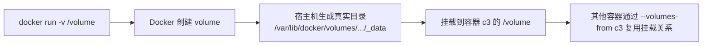

# 第五课：Docker 数据卷容器

## 1. 这节课学什么

这一节我们讲第五课的另一个重点：

**数据卷容器。**

这一节会重点回答下面几个问题：

- 什么是数据卷容器
- 为什么需要数据卷容器
- 它的作用是什么
- 它是怎么实现的
- `-v /volume` 这种写法到底发生了什么
- Docker 会在宿主机哪里生成什么数据
- `docker inspect` 里和数据卷相关的字段该怎么看

这一节我会结合你自己的真实实操过程来讲，这样你不只是“听懂”，而是真的能把现象和原理对应起来。

## 2. 先看本节配图

### 2.1 数据卷容器概念图


### 2.2 配置数据卷容器命令图


## 3. 先说结论：什么是数据卷容器

### 通俗定义

数据卷容器，就是：

**一个本身主要用来提供数据卷挂载信息、供其他容器复用的容器。**

### 专业定义

从传统 Docker 教程的语境里，“数据卷容器”通常指的是这样一种用法：

1. 先创建一个容器
2. 在这个容器上声明一个或多个数据卷
3. 再让其他容器通过：

```bash
--volumes-from
```

复用这个容器已经声明好的卷挂载关系

所以它重点不在“这个容器跑了什么业务”，而在于：

**它作为一个卷配置的承载体存在。**

## 4. 为什么会出现“数据卷容器”这个概念

你前面已经学过数据卷的核心目标：

- 数据持久化
- 宿主机和容器数据共享
- 容器和容器之间的数据共享

而“数据卷容器”这个概念，主要是为了解决第三类问题：

**多个容器怎么方便地共享同一组数据卷。**

### 如果没有数据卷容器

那就意味着：

- 每个容器都要自己写一遍卷挂载参数
- 管理起来不统一
- 复用起来不方便

### 有了数据卷容器

就可以先把卷挂载关系定义在一个容器上，再让别的容器复用这份配置。

### 通俗理解

你可以把数据卷容器理解成：

**一个专门“登记共享存储”的中间容器。**

其他容器不一定直接自己定义卷，而是“从它这里继承”卷配置。

## 5. 这节课里最容易混淆的两个概念

学习数据卷容器时，最容易把下面两个概念混掉：

### 概念一：数据卷

数据卷本身是 Docker 的存储机制。

### 概念二：数据卷容器

数据卷容器是一种“使用数据卷的组织方式”。

也就是说：

- 数据卷是底层存储对象或挂载抽象
- 数据卷容器是用来共享这些卷配置的一种用法

### 一句话区分

- 数据卷：存储
- 数据卷容器：组织和复用存储的一种方式

## 6. 你的实操命令：`docker run -it --name=c3 -v /volume centos:7`

你这次非常关键的一步操作是：

```bash
docker run -it --name=c3 -v /volume centos:7
```

这个命令一定要认真理解。

## 7. `-v /volume` 和之前的 `-v 宿主机路径:容器路径` 有什么不同

你前面学过的写法是：

```bash
-v /Users/apple/Desktop/data:/root/data
```

这叫：

**把宿主机目录显式绑定到容器目录。**

而你这次的写法是：

```bash
-v /volume
```

这时你没有写宿主机路径，只写了容器内路径。

这意味着 Docker 会：

**自动为这个容器内路径创建一个由 Docker 管理的数据卷。**

这类卷通常可以理解为：

**匿名卷（anonymous volume）**。

## 8. `-v /volume` 到底做了什么

### 专业解释

当你执行：

```bash
docker run -it --name=c3 -v /volume centos:7
```

Docker 会做这些事情：

1. 创建容器 `c3`
2. 发现你声明了一个卷目标路径 `/volume`
3. 因为没有显式指定宿主机路径，也没有指定卷名
4. 所以 Docker 自动创建一个由自己管理的卷
5. 把这个卷挂载到容器内的 `/volume`

### 通俗理解

你只告诉 Docker：

**“我想让容器里的 `/volume` 变成一个独立的数据卷目录。”**

至于宿主机实际存在哪、目录叫什么，你没指定，于是 Docker 自动帮你分配了一个。

## 9. 你的 `docker inspect c3` 已经把答案告诉我们了

你退出容器后执行了：

```bash
docker inspect c3
```

这份输出非常关键。

其中最重要的是这段：

```json
"Mounts": [
  {
    "Type": "volume",
    "Name": "03f239ec5b60d54702048be76ad079ccfc270622d8123283de43e0ba1c3df3cf",
    "Source": "/var/lib/docker/volumes/03f239ec5b60d54702048be76ad079ccfc270622d8123283de43e0ba1c3df3cf/_data",
    "Destination": "/volume",
    "Driver": "local",
    "RW": true
  }
]
```

这一段，其实就把“数据卷是怎么挂上的”说明白了。

## 10. 怎么读懂 `Mounts`

### `Type: "volume"`

表示这次挂载的类型是：

- Docker volume

不是普通 bind mount。

### `Name`

```text
03f239ec5b60d54702048be76ad079ccfc270622d8123283de43e0ba1c3df3cf
```

这是 Docker 自动生成的数据卷名称。

因为你没有自己命名，所以它给你创建了一个匿名卷。

### `Source`

```text
/var/lib/docker/volumes/03f239ec5b60d54702048be76ad079ccfc270622d8123283de43e0ba1c3df3cf/_data
```

这是这个数据卷在宿主机上的真实存储位置。

### `Destination`

```text
/volume
```

表示这个卷被挂载到了容器内部的 `/volume`。

### `Driver: "local"`

说明它使用的是 Docker 默认的本地卷驱动。

## 11. 所以 `-v /volume` 之后，宿主机到底发生了什么

你问的这个问题非常关键。

### 专业结论

当你执行：

```bash
docker run -it --name=c3 -v /volume centos:7
```

Docker 自动在宿主机上创建了一个 volume，名字是：

```text
03f239ec5b60d54702048be76ad079ccfc270622d8123283de43e0ba1c3df3cf
```

它的数据真实存放位置是：

```text
/var/lib/docker/volumes/03f239ec5b60d54702048be76ad079ccfc270622d8123283de43e0ba1c3df3cf/_data
```

然后 Docker 把这个宿主机上的卷目录挂载到了容器里的：

```text
/volume
```

### 通俗理解

你虽然只写了容器里的 `/volume`，但 Docker 在背后自动替你做了两件事：

1. 在宿主机上创建了一块专门存数据的地方
2. 把这块地方接到了容器里的 `/volume`

## 12. 为什么说这是“匿名卷”

因为你没有显式指定卷名，例如你没有写类似：

```bash
-v mydata:/volume
```

也没有写宿主机路径，例如：

```bash
-v /Users/apple/Desktop/data:/volume
```

你只写了：

```bash
-v /volume
```

于是 Docker 就自动生成了一个名字很长的卷名。

这类卷在学习语境里通常叫匿名卷。

## 13. `Config.Volumes` 这一段又是什么意思

你的 `inspect` 里还有这段：

```json
"Volumes": {
  "/volume": {}
}
```

这表示容器配置里声明了：

- `/volume` 是一个卷挂载点

它说明的是：

**容器内部哪个路径被定义成卷。**

而 `Mounts` 则说明：

**这个卷最终挂载到宿主机哪里。**

### 一句话区分

- `Config.Volumes`：声明“容器内哪里是卷”
- `Mounts`：说明“这个卷实际上挂到哪里了”

## 14. 你为什么在容器里执行 `docker inspect c3` 会失败

你在容器里执行了：

```bash
docker inspect c3
```

结果报错：

```text
bash: docker: command not found
```

### 原因是什么

因为你进入的是：

- `centos:7` 容器内部环境

而这个容器里默认并没有安装 Docker CLI。

更关键的是，即使装了 CLI，也未必就能直接控制宿主机 Docker daemon，除非你额外挂载 Docker socket 并做相关配置。

### 这说明什么

容器不是宿主机本身。

在容器里看到的命令环境，只是那个镜像提供的用户空间。

### 通俗理解

你进的是一间房间，不是整栋楼的机房控制室。

Docker daemon 在宿主机侧，不在这个普通 CentOS 容器里。

## 15. 数据卷容器在传统用法里怎么工作

你给的第二张图里，命令是：

```bash
docker run -it --name=c3 -v /volume centos:7 /bin/bash
docker run -it --name=c1 --volumes-from c3 centos:7 /bin/bash
docker run -it --name=c2 --volumes-from c3 centos:7 /bin/bash
```

这就是经典的“数据卷容器”教学写法。

### 工作逻辑

1. `c3` 先声明一个卷 `/volume`
2. Docker 自动为它准备一个真实 volume
3. `c1`、`c2` 通过 `--volumes-from c3`
4. 继承 `c3` 的卷挂载关系
5. 因此它们也能访问同一份数据

### 通俗理解

`c3` 像一个“共享存储的登记员”。

`c1` 和 `c2` 不需要自己重新写卷细节，它们只要说：

**“我用 c3 的卷配置。”**

## 16. 为什么需要数据卷容器

从传统 Docker 教学角度，这个模式主要是为了解决：

### 1. 多容器共享同一份数据

多个容器可以通过同一个数据卷容器共享存储。

### 2. 统一管理卷挂载关系

把卷配置集中定义在一个容器上，其他容器复用。

### 3. 弱化业务容器和存储定义的耦合

某些业务容器不必自己写所有卷细节，只需复用已有配置。

## 17. 从现代 Docker 角度，怎么理解“数据卷容器”

这一点我想帮你讲得更专业一些。

### 传统教学里

“数据卷容器”是很经典的概念和演示方法。

### 现代工程实践里

更多场景会直接使用：

- 命名卷
- bind mount
- Compose 里的 volumes 配置

也就是说，现代项目里“专门弄一个只用来共享卷的容器”并不是唯一主流方式。

但为什么你现在还要学它？

因为它非常有助于你理解两件事：

1. 卷挂载关系可以被复用
2. 数据和容器是可以解耦的

所以在教学上，它仍然非常有价值。

## 18. 数据卷容器的底层实现逻辑是什么

这部分我们讲得稍微专业一点。

## 19. 核心不是“容器存数据”，而是“容器声明挂载”

很多初学者会以为：

“数据卷容器是不是把数据存在它自己身体里？”

这不准确。

更准确地说：

- 数据卷容器声明了卷
- Docker 在宿主机侧创建或管理这个卷
- 其他容器复用这份挂载关系

所以底层关键点不是“这个容器本体”，而是：

- Docker volume 对象
- 宿主机侧真实存储路径
- 挂载关系的继承和复用

## 20. 大致底层链路

可以把它理解成这样：



## 21. 你这次实操，从底层角度到底验证了什么

你在容器里执行了：

```bash
cd /volume
touch a.txt
```

这说明容器内部 `/volume` 是可写的。

而根据 `inspect`：

```json
"Source": "/var/lib/docker/volumes/03f239.../_data",
"Destination": "/volume"
```

可以推出：

当你在容器里创建：

```bash
/volume/a.txt
```

本质上对应的是宿主机 volume 目录中的文件：

```text
/var/lib/docker/volumes/03f239.../_data/a.txt
```

这正是挂载机制在工作的直接表现。

## 22. 数据卷容器的作用到底是什么

这部分可以浓缩成三条。

### 作用一：为多容器共享数据提供统一入口

一个容器先声明卷，多个容器复用。

### 作用二：让卷配置可复用

避免每个容器都手工重复声明同样的挂载。

### 作用三：帮助理解数据与容器解耦

真正重要的是卷，而不是某个业务容器本身。

## 23. 数据卷容器和普通数据卷挂载的区别

### 普通挂载

例如：

```bash
-v /Users/apple/Desktop/data:/root/data
```

特点：

- 你明确指定宿主机路径
- 路径完全由你控制

### 数据卷容器风格

例如：

```bash
-v /volume
--volumes-from c3
```

特点：

- 卷由 Docker 自动管理
- 其他容器通过复用已有容器的卷配置来共享数据

## 24. 初学者最容易误解的点

### 误区一：`-v /volume` 表示挂载宿主机根目录下的 `/volume`

不一定。

在你这次命令里：

```bash
docker run -it --name=c3 -v /volume centos:7
```

因为没有写冒号，没有宿主机路径，所以它不是 bind mount。

它表示的是：

**为容器内 `/volume` 创建一个 Docker 管理的 volume。**

### 误区二：数据卷容器本身就是数据本体

不是。

真正的数据最终还是在宿主机 volume 的真实目录里。

### 误区三：在容器里就能直接用 Docker 命令管理宿主机容器

不是。

普通容器里通常没有 Docker CLI，也没有直接连接宿主机 Docker daemon 的能力。

### 误区四：数据卷容器删除后，数据一定立刻没了

不一定。

关键要看卷本身是否还存在、是否还有其他引用、以及你后续是否主动清理。

## 25. 结合你这次 `inspect`，最值得记住的字段

以后你再看 `docker inspect`，关于数据卷最值得优先看这几项：

### `Mounts`

看实际挂载结果。

### `Mounts[].Type`

看是 `volume` 还是别的挂载方式。

### `Mounts[].Source`

看宿主机真实路径。

### `Mounts[].Destination`

看容器内路径。

### `Mounts[].Name`

看 volume 的名字。

### `Config.Volumes`

看容器声明了哪些卷挂载点。

## 26. 从专业角度总结这一课

数据卷容器是 Docker 传统使用模式中的一个经典概念，指通过一个专门声明数据卷的容器，让其他容器通过 `--volumes-from` 继承并复用卷挂载关系。它的核心价值不在于这个容器本身，而在于它充当了“卷配置承载体”的角色，从而使多容器共享数据变得更方便。

从底层实现角度看，真正承载数据的不是容器，而是 Docker 在宿主机侧创建和管理的 volume。当你执行 `-v /volume` 时，Docker 会自动创建一个匿名卷，并在宿主机侧生成真实目录，例如你这次实验里显示的：

```text
/var/lib/docker/volumes/03f239ec5b60d54702048be76ad079ccfc270622d8123283de43e0ba1c3df3cf/_data
```

然后将其挂载到容器内部的 `/volume`。后续其他容器如果复用该卷配置，本质上也是共享同一个宿主机 volume。

## 27. 用大白话总结这一课

你可以把这节课记成下面几句话：

- 数据卷容器不是重点跑业务的，它更像“共享存储登记员”
- `-v /volume` 不是让你手写宿主机路径，而是让 Docker 自动帮你创建一个卷
- 这个卷最后会在宿主机上有一个真实目录
- 容器里的 `/volume` 只是这个真实目录在容器里的入口
- 其他容器可以通过 `--volumes-from` 用同一份卷配置
- 真正重要的是卷本身，不是那个“数据卷容器”名字听起来很特别

## 28. 本节课你必须记住的重点

- 数据卷容器是共享和复用卷配置的一种传统 Docker 用法
- `-v /volume` 会创建一个 Docker 管理的匿名卷
- 宿主机真实路径可以在 `docker inspect` 的 `Mounts[].Source` 中看到
- 容器内路径在 `Mounts[].Destination` 中看到
- `Config.Volumes` 表示容器声明了哪些卷挂载点
- 数据卷容器的核心是“卷复用”，不是“容器本体”
- 普通容器内部默认没有 Docker 命令环境

## 29. 本节课课后思考题

你可以试着回答下面几个问题：

1. `-v /volume` 和 `-v /Users/apple/Desktop/data:/root/data` 的本质区别是什么？
2. 为什么你的 `inspect` 里 `Type` 显示为 `volume`？
3. `Source` 和 `Destination` 分别表示什么？
4. 为什么说数据卷容器真正重要的是卷，而不是容器本身？
5. 为什么在容器里执行 `docker inspect` 会报 `docker: command not found`？

如果你能把这几个问题讲清楚，第五课的数据卷容器就真正吃透了。

## 30. 本节课一句话收尾

**数据卷容器的本质，就是让一个容器先声明好卷，再让其他容器复用这份卷挂载关系，而真正承载数据的是宿主机上的 Docker volume。**
