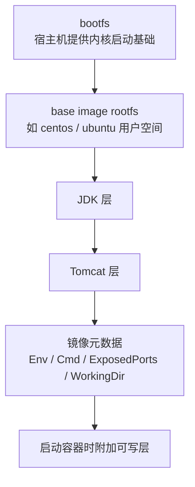

# 第六课：Docker 镜像原理

## 1. 这节课学什么

这一节我们开始真正进入 Docker 的“底层原理”部分，核心主题是：

**Docker 镜像到底是什么。**

这节课会围绕你图片里的几个关键问题展开：

1. Docker 镜像本质是什么？
2. 为什么一个 `centos` 镜像只有 200MB 左右，而一个 CentOS 安装 ISO 却要几个 G？
3. 为什么一个 `tomcat` 镜像可能有 500MB，而 Tomcat 安装包却只有几十 MB？
4. Linux 操作系统里的文件子系统，为什么会和 Docker 镜像原理直接相关？
5. 镜像分层、只读层、可写层这些词到底是什么意思？

这一节你如果学透了，后面再学：

- Dockerfile
- 镜像构建
- 镜像缓存
- 容器启动

都会顺很多。

## 2. 先看本节配图

### 2.1 镜像原理总问题图


### 2.2 Linux 文件系统与 bootfs / rootfs 图


### 2.3 镜像分层与只读层 / 可写层图


### 2.4 本节问题总结图


## 3. 先说结论：Docker 镜像本质上是什么

### 专业定义

Docker 镜像本质上不是“一个单纯的大压缩包”，而是：

**一个分层的、只读的文件系统快照集合，再加上一些运行配置元数据。**

这句话里有四个关键词，你一定要抓住：

- 分层的
- 只读的
- 文件系统快照
- 配置元数据

### 通俗理解

你可以把 Docker 镜像理解成：

**一个已经提前打包好的运行环境模板。**

这个模板里不仅有文件，还有：

- 程序本身
- 依赖库
- 默认启动命令
- 环境变量
- 暴露端口等信息

所以镜像不是只有“文件”，它还是：

**文件系统 + 运行说明书。**

## 4. 你给的 `docker inspect tomcat:latest`，其实已经暴露了镜像的本质

你给出的 `docker inspect tomcat:latest` 结果里，有几个字段特别关键。

## 5. `RootFS.Layers`

你给出的结果里有：

```json
"RootFS": {
  "Type": "layers",
  "Layers": [
    "sha256:d9a56420aee7ff835e0c05fc666d1237d40f0da5fe338738e651b01db4672a5d",
    "sha256:17e7a3c963abb873de3d121dea902c30be49c5cb3befda65e11f65bbfa126834",
    "sha256:25cbc9219da260fd8f79b34bfe3f762e5609a3384a6077b3e93b4a9faa0276c8",
    ...
  ]
}
```

这说明什么？

这说明：

**镜像不是一整块单体文件，而是由多层文件系统层组合起来的。**

每一层都可以理解成一次文件系统变更。

例如某一层可能表示：

- 加了一些基础目录
- 安装了 JDK
- 拷贝了 Tomcat
- 加了一些配置文件

## 6. `Config`

你给的结果里还有：

```json
"Config": {
  "ExposedPorts": {
    "8080/tcp": {}
  },
  "Env": [...],
  "Cmd": [
    "catalina.sh",
    "run"
  ],
  "WorkingDir": "/usr/local/tomcat"
}
```

这说明：

镜像里不止有文件系统层，还有运行时元数据，例如：

- 默认暴露端口
- 默认环境变量
- 默认启动命令
- 默认工作目录

### 一句话总结

所以 Docker 镜像不是“纯文件”，而是：

**分层文件系统 + 配置元数据。**

## 7. Linux 操作系统为什么和 Docker 镜像原理有关

这节课很多人第一次学会觉得抽象，其实关键原因是：

**Docker 镜像本质上就是站在 Linux 文件系统和内核机制之上做出来的。**

所以你想理解 Docker 镜像，就必须先理解 Linux 里操作系统镜像和文件系统的大致结构。

## 8. Linux 操作系统里有哪些核心子系统

你第二张图里列出了操作系统的多个组成部分：

- 进程调度子系统
- 进程通信子系统
- 内存管理子系统
- 设备管理子系统
- 文件管理子系统
- 网络通信子系统
- 作业控制子系统

这一节和 Docker 镜像关系最紧密的是：

**文件管理子系统。**

因为镜像本质上就是“文件系统内容的组织和复用”。

## 9. Linux 文件系统里为什么会提到 bootfs 和 rootfs

这也是很多 Docker 教程会讲到的经典概念。

### bootfs

可以粗略理解为：

- 引导文件系统
- 里面主要包含 bootloader 和 kernel

### rootfs

就是 root 文件系统，也就是你进入 Linux 系统后看到的这部分内容：

- `/bin`
- `/etc`
- `/usr`
- `/var`
- `/dev`
- `/proc`

这些典型目录都属于 rootfs 的范畴。

### 通俗理解

你可以把它理解成：

- `bootfs`：负责把系统“启动起来”
- `rootfs`：负责系统“启动后怎么正常工作”

## 10. Docker 为什么主要关心 rootfs，而不是完整 ISO

这是理解 Docker 镜像大小差异的关键。

Docker 容器不是虚拟机，它不需要自己单独引导一套完整操作系统内核。

容器的核心特点是：

- 共享宿主机内核
- 主要隔离用户空间

所以容器镜像更关心的是：

**应用运行所需的 rootfs 内容。**

而不是像虚拟机安装盘那样，还要带上：

- 引导程序
- 安装器
- 完整安装流程组件
- 各类额外硬件适配内容

## 11. 为什么一个 `centos` Docker 镜像只有几百 MB，而一个 CentOS ISO 要几个 G

这个问题特别经典。

## 12. 先说结论

因为：

**CentOS 的 ISO 是“完整安装介质”，而 Docker 的 `centos` 镜像只是“运行时所需的 rootfs 基础环境”。**

两者不是同一种东西，所以不能直接拿“镜像包大小”一对一类比。

## 13. ISO 里通常包含什么

一个完整的操作系统 ISO 往往包含：

- bootfs
- kernel
- 安装程序
- 软件包仓库内容
- 驱动与适配内容
- 文档、语言支持、安装辅助文件
- 很多不是运行时必须的组件

它的目标是：

**把一台机器从零安装成一个完整操作系统。**

## 14. Docker 基础镜像里通常包含什么

Docker 的基础镜像通常更像：

- 一套 rootfs
- 一些最小化运行所需目录和库
- 适合应用运行的用户空间环境

它的目标不是“安装一个完整系统”，而是：

**给容器提供可运行的用户空间基础。**

## 15. 通俗理解这个差别

你可以这样理解：

- ISO 像“整套装修材料 + 安装工人 + 施工图纸 + 开机引导”
- Docker 基础镜像像“已经准备好的可入住基础房间”

所以 Docker 镜像会小很多。

## 16. 为什么一个 Tomcat 安装包只有几十 MB，但 `tomcat` 镜像可能有 500MB

这也是初学者非常容易困惑的一点。

## 17. 先说结论

因为你看到的 `tomcat` 安装包只包含：

- Tomcat 自己的程序文件

而 Docker 的 `tomcat` 镜像，对外表现的是一个完整运行环境，它不只包含 Tomcat。

## 18. `tomcat` 镜像里一般至少还要包含什么

从你给的 `inspect` 结果就能看出来：

### JDK

环境变量里出现了：

```text
JAVA_HOME=/opt/java/openjdk
JAVA_VERSION=jdk-25.0.2+10
```

这说明镜像里带了 Java 运行环境。

Tomcat 本身不能脱离 Java 运行，所以它不只是“Tomcat 程序文件”。

### 基础操作系统层

镜像最底层还要有：

- 基础 Linux 用户空间
- 各种目录结构
- 系统库

### Tomcat 自己的文件

例如：

```text
CATALINA_HOME=/usr/local/tomcat
```

说明 Tomcat 文件本身也在镜像里。

### 配置元数据

还有：

- 默认启动命令
- 工作目录
- 暴露端口

## 19. 通俗理解

Tomcat 安装包像“发动机本体”。

但 Docker 里的 Tomcat 镜像，实际上是：

- 底盘
- 发动机
- 电路
- 油路
- 点火逻辑

组合成的一整套能直接跑起来的“车”。

所以它自然会比单独的 Tomcat 压缩包大很多。

## 20. Docker 镜像为什么要分层

这也是镜像原理里最重要的点之一。

## 21. 分层的专业意义

Docker 镜像分层的核心目的包括：

- 复用已有层
- 节省存储空间
- 提高分发效率
- 提高构建效率
- 支持增量修改

例如：

- 底层是 `ubuntu` 或 `centos` 的 rootfs
- 上面加一层 JDK
- 上面再加一层 Tomcat

这样如果多个镜像都依赖同一个 JDK 层，就不需要每次都重复存一份。

## 22. 通俗理解分层

你可以把镜像想成“乐高积木”。

- 最底下是基础积木
- 上面一层是运行环境
- 再上面一层是应用

每次不是整套重建，而是在现有积木上继续搭。

## 23. 第三张图里“只读镜像”和“可写容器层”是什么意思

这是容器启动时必须理解的一步。

### 镜像层

镜像本身的层通常是：

**只读的。**

因为镜像要保证可复用、可分发、可缓存，如果每次运行都随便改镜像本体，那就没法稳定复用了。

### 容器层

当你基于镜像启动容器时，Docker 会在镜像层之上额外挂一层：

**可写层。**

容器运行时产生的修改，例如：

- 新建文件
- 修改配置
- 写日志

都会先落到这一层。

### 通俗理解

镜像像“模板底板”，不能乱改。

容器像“在模板上临时加的一张透明可写纸”，你写的内容写在这层纸上，不会直接改坏底板。

## 24. 为什么这和数据卷也有关系

因为你前面已经学过：

- 容器可写层会跟着容器生命周期走
- 不适合长期保存关键数据

所以：

- 临时运行改动，写在容器层
- 需要长期保留的数据，应该放数据卷

这就是镜像、容器可写层、数据卷三者之间的关系。

## 25. Union File System 是什么

你第三张图里提到了：

**统一文件系统（Union File System）**

这是理解镜像分层的关键术语。

## 26. 专业解释

Union File System 的核心思想是：

**把多个不同的目录层叠起来，对外呈现为一个统一的文件系统视图。**

也就是说：

- 底层可能有很多层
- 但从容器内部看起来，像只有一套完整文件系统

这就是为什么用户在容器里看到的是：

- 一个 `/bin`
- 一个 `/usr`
- 一个 `/etc`

而不是“第 1 层一个 `/bin`、第 2 层一个 `/usr`”。

## 27. 通俗理解 Union File System

你可以把它理解成：

**很多透明塑料片叠在一起，用户从上往下看时，会把它们当成一张完整图。**

这就是“多层合成一个视图”的核心思想。

## 28. 为什么 `docker inspect tomcat:latest` 里会有很多层 ID

这是因为：

- Tomcat 镜像不是从零直接生成一整块内容
- 而是由多个层叠加而成

你看到的这些：

```json
"Layers": [
  "sha256:...",
  "sha256:...",
  ...
]
```

本质上就是这个镜像的层历史。

每一层都代表一次文件系统增量内容。

## 29. 为什么有些层 ID 看起来还重复了

你给的 `Layers` 里，有些哈希看起来重复出现。

这不奇怪。

这是因为：

- 镜像层是按内容寻址的
- 相同内容的层可能在不同镜像结构里被引用
- 某些构建路径中会复用已有层

你在 `inspect` 里看到的重点不是“每层都完全不同”，而是：

**镜像是分层、可复用、按内容组织的。**

## 30. 你这份 `inspect` 还能让我们看懂什么

除了分层，`inspect` 还能帮助你看懂镜像运行习惯。

例如：

### `ExposedPorts`

```json
"ExposedPorts": {
  "8080/tcp": {}
}
```

说明镜像作者希望这个镜像主要提供 8080 端口服务。

### `Cmd`

```json
"Cmd": [
  "catalina.sh",
  "run"
]
```

说明基于这个镜像启动容器时，默认会执行：

```bash
catalina.sh run
```

### `WorkingDir`

```json
"/usr/local/tomcat"
```

说明默认工作目录是 Tomcat 安装目录。

### `Env`

说明这个镜像已经把 Java 和 Tomcat 需要的环境变量都预先配置好了。

这就是镜像“可直接运行”的原因之一。

## 31. 从镜像原理角度重新看 Tomcat 镜像

你现在应该这样理解一个 Tomcat 镜像：

### 最底层

基础 rootfs，例如某个 Linux 用户空间环境。

### 中间层

JDK 层。

### 上层

Tomcat 文件层。

### 元数据层面

- 默认端口
- 默认启动命令
- 默认环境变量
- 工作目录

### 运行时

再额外挂一个容器可写层。

这就形成了一个完整的“可直接启动的 Tomcat 容器环境”。

## 32. 一张帮助你串起来的理解图



## 33. 初学者最容易误解的点

### 误区一：镜像就是一个压缩包

不完全对。

更准确地说，它是：

- 分层文件系统
- 加上运行配置元数据

### 误区二：镜像里自带完整 Linux 内核

不对。

容器共享宿主机内核，所以镜像主要关心用户空间和 rootfs。

### 误区三：Tomcat 镜像大小只代表 Tomcat 本体大小

不对。

它还包含：

- 基础层
- JDK
- 配置
- 其他依赖

### 误区四：容器运行时就是直接改镜像

不对。

容器运行时改的是上层可写层，不是镜像只读层本体。

## 34. 从专业角度总结这一课

Docker 镜像本质上是一个分层的只读文件系统集合，并附带启动容器所需的配置元数据。它依赖 Linux 文件系统管理能力和 Union File System 这类分层联合视图机制，把多个文件系统层组合成统一的 root 文件系统视图。容器启动时，Docker 不会修改镜像本体，而是在镜像只读层之上再叠加一个可写层作为容器运行时写入空间。

CentOS 镜像远小于操作系统 ISO，是因为 Docker 镜像主要提供运行时 rootfs，而不是完整安装介质。Tomcat 镜像又显著大于单独的 Tomcat 安装包，是因为它不仅包含 Tomcat 自身，还包含基础 Linux 用户空间、JDK 以及默认运行配置。

## 35. 用大白话总结这一课

你可以把这一节记成下面几句话：

- Docker 镜像不是单个大文件，而是一层层叠起来的运行环境模板
- 它主要提供的是 rootfs，不是完整操作系统安装盘
- 容器共享宿主机内核，所以镜像不用带完整 bootfs 和内核
- 一个镜像大，不一定是应用本身大，可能是它依赖的运行环境大
- 镜像层通常只读，容器启动后才会额外挂一个可写层
- Union File System 让很多层对外看起来像一个完整文件系统

## 36. 本节课你必须记住的重点

- Docker 镜像本质是分层只读文件系统 + 元数据
- `RootFS.Layers` 反映镜像分层结构
- `Config` 中的 `Env`、`Cmd`、`ExposedPorts`、`WorkingDir` 都是镜像元数据
- Linux 的 rootfs 概念是理解 Docker 镜像的关键
- Docker 基础镜像远小于 ISO，是因为两者目标完全不同
- Tomcat 镜像大，不是因为 Tomcat 本体大，而是因为它包含整套运行环境
- 镜像层只读，容器运行时有额外可写层
- Union File System 提供统一视图

## 37. 本节课课后思考题

你可以试着用自己的话回答下面几个问题：

1. Docker 镜像为什么说本质上是分层文件系统，而不是普通压缩包？
2. `RootFS.Layers` 为什么能证明镜像是分层的？
3. 为什么 Docker 基础镜像比 Linux ISO 小很多？
4. 为什么 Tomcat 镜像比单独的 Tomcat 安装包大很多？
5. 镜像只读层、容器可写层、数据卷三者各自负责什么？

如果你能把这 5 个问题讲清楚，第六课就真的学明白了。

## 38. 本节课一句话收尾

**Docker 镜像的本质，是建立在 Linux 文件系统之上的“分层只读运行环境模板”，容器启动时再在它上面附加一个可写层。**
