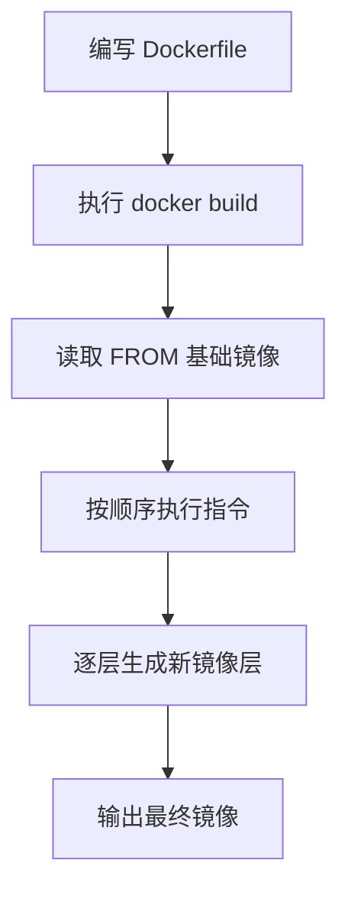

# 第七课：Dockerfile

## 1. 这节课学什么

这一节我们学习 Docker 里非常核心的一个内容：

**Dockerfile。**

这一节会重点讲清楚：

- Dockerfile 是干什么的
- 为什么需要 Dockerfile
- Dockerfile 怎么做镜像
- 它和 `docker commit` 有什么区别
- 常用、关键的 Dockerfile 关键字有哪些

你要求的关键字部分，我会专门整理成表格，按：

- 名称
- 作用
- 备注

来写，方便你后面查阅。

## 2. 先看本节配图

### 2.1 镜像制作方式图


### 2.2 Dockerfile 概念图


## 3. 先说结论：Dockerfile 是什么

### 专业定义

Dockerfile 是一个用于描述镜像构建过程的文本文件。它通过一条条指令，告诉 Docker：

- 基于哪个基础镜像开始
- 需要拷贝哪些文件
- 需要执行哪些安装命令
- 需要设置哪些环境变量
- 容器默认启动什么命令

Docker 根据这份文本说明书，自动构建出一个新的镜像。

### 通俗理解

你可以把 Dockerfile 理解成：

**镜像的配方**，或者说是：

**镜像的施工图纸。**

有了这份图纸，任何人都可以在任何支持 Docker 的环境里，按同样步骤构建出几乎一样的镜像。

## 4. 为什么会有 Dockerfile

这一点非常关键。

如果没有 Dockerfile，你当然也可以做镜像，例如你图片里第一张图就提到了另一种方式：

```bash
docker commit 容器id 镜像名称:版本号
docker save -o 压缩文件名称 镜像名称:版本号
docker load -i 压缩文件名称
```

这说明 Docker 镜像不是只能靠 Dockerfile 做出来，也可以通过“先改容器，再提交镜像”的方式得到。

但这种方式有明显问题。

## 5. 为什么 `docker commit` 不够理想

### 问题一：过程不透明

如果你进入一个容器里，手工装了很多东西，然后再执行：

```bash
docker commit
```

别人最后只能看到结果，看不到你中间到底做了哪些步骤。

### 问题二：难以复现

你今天手工执行了一串命令，明天自己都不一定能原样重复出来。

### 问题三：难以协作

团队里其他人想继续维护这个镜像时，不容易知道它是怎么来的。

### 问题四：不利于版本化管理

手工过程不容易像代码一样进入 Git 管理。

## 6. Dockerfile 为什么重要

Dockerfile 的核心价值，就是把“镜像构建过程”变成：

- 可阅读
- 可复现
- 可协作
- 可版本管理
- 可自动化

的文本描述。

### 通俗理解

`docker commit` 更像：

**你在厨房里凭感觉做了一道菜，然后端出来。**

Dockerfile 更像：

**你把这道菜的完整配方、原料、步骤都写成了菜谱。**

以后任何人都能照着做。

## 7. Dockerfile 到底是怎么做镜像的

这一节要把“做镜像”的过程想明白。

## 8. 核心原理：一条指令，一层变化

Dockerfile 里通常会有很多条指令，例如：

```dockerfile
FROM centos:7
RUN yum install -y vim
CMD ["/bin/bash"]
```

Docker 在构建镜像时，大致会这样处理：

1. 先取基础镜像
2. 执行第一条指令
3. 产生一个新的文件系统层
4. 再执行下一条指令
5. 再叠加一个新层
6. 最终生成新的镜像

### 专业解释

这本质上和你上一课学到的镜像分层原理是连起来的。

Dockerfile 的每一条会产生文件系统变化的指令，通常都会参与构建镜像的层结构。

### 通俗理解

Dockerfile 就像一层一层往上搭积木：

- 先放基础底座
- 再加依赖
- 再加配置
- 再加应用
- 最后告诉它怎么启动

## 9. Dockerfile 的工作流程是什么

你可以把 Dockerfile 的典型工作流程理解成这样：



## 10. Dockerfile 对不同角色有什么价值

你第二张图里提到了开发、测试、运维三类角色，这一点非常对。

## 11. 对开发人员

Dockerfile 可以帮助开发人员定义统一环境。

例如：

- 指定基础系统
- 指定语言版本
- 指定依赖安装方式

这样“我本地能跑”的环境，更容易被别人复现。

## 12. 对测试人员

测试人员可以直接拿 Dockerfile 构建测试镜像，而不用自己手工装环境。

这能减少：

- 环境不一致
- 安装依赖遗漏
- 人工配置误差

## 13. 对运维人员

运维人员最关心的是可部署、可迁移、可回滚。

Dockerfile 能把应用环境标准化，从而更容易实现：

- 自动化部署
- 环境一致性
- 持续集成与持续交付

## 14. Dockerfile 的一个最小示例

下面是一个非常简单的例子：

```dockerfile
FROM centos:7
RUN yum install -y vim
CMD ["/bin/bash"]
```

这三行分别表示：

- `FROM centos:7`
  以 `centos:7` 为基础镜像
- `RUN yum install -y vim`
  构建时安装 `vim`
- `CMD ["/bin/bash"]`
  容器默认启动 `/bin/bash`

### 通俗理解

这就像在说：

1. 先拿一个 `centos:7` 毛坯镜像
2. 给它装上 `vim`
3. 最后规定默认怎么启动

## 15. Dockerfile 常用关键字总表

下面这张表是这节课的重点内容。

| 名称 | 作用 | 备注 |
| --- | --- | --- |
| `FROM` | 指定基础镜像，构建通常从这里开始 | Dockerfile 几乎一定会先写它；也可用于多阶段构建 |
| `RUN` | 在构建镜像时执行命令 | 常用于安装软件、创建目录、修改配置；会参与镜像层构建 |
| `CMD` | 指定容器默认启动命令或参数 | 运行容器时可被覆盖；一个 Dockerfile 中通常最后只有一个生效 |
| `ENTRYPOINT` | 指定容器主入口命令 | 更偏“固定入口”；常与 `CMD` 搭配使用 |
| `COPY` | 把构建上下文中的文件复制到镜像中 | 语义清晰，现代实践中通常优先于 `ADD` |
| `ADD` | 把文件加入镜像，功能比 `COPY` 多 | 可自动解压本地压缩包，也可处理 URL；但也更容易让行为不直观 |
| `WORKDIR` | 设置后续指令的工作目录 | 后续 `RUN`、`CMD`、`ENTRYPOINT` 等都会受影响 |
| `ENV` | 设置环境变量 | 构建阶段和运行阶段都可能被使用 |
| `EXPOSE` | 声明容器打算使用的端口 | 只是声明，不等于真正对宿主机开放端口 |
| `VOLUME` | 声明挂载点 | 常用于标记需要持久化的数据目录 |
| `USER` | 指定后续指令执行用户和容器运行用户 | 有助于提升安全性，避免默认一直使用 root |
| `ARG` | 定义构建参数 | 只在构建阶段使用；不同于 `ENV` 的持久环境变量 |
| `LABEL` | 给镜像添加元数据标签 | 常用于作者、版本、说明、来源等信息 |
| `SHELL` | 指定后续 shell 形式指令所使用的 shell | Windows / 特殊 shell 场景更常见 |
| `STOPSIGNAL` | 指定容器停止时发送的系统信号 | 某些服务型容器会用到 |
| `HEALTHCHECK` | 定义容器健康检查命令 | 可让 Docker 判断容器是否“活着但不可用” |
| `ONBUILD` | 定义一个延迟触发指令 | 当该镜像被别的 Dockerfile 当作基础镜像时触发；初学阶段较少用 |
| `MAINTAINER` | 声明维护者 | 这是旧写法，现代更推荐使用 `LABEL`，所以认识即可 |

## 16. 这几个关键字是最核心、最常用的

如果你现在刚学 Dockerfile，不用一口气把所有指令背下来，先重点记下面这些：

- `FROM`
- `RUN`
- `COPY`
- `ADD`
- `CMD`
- `ENTRYPOINT`
- `WORKDIR`
- `ENV`
- `EXPOSE`
- `VOLUME`

## 17. `FROM`

### 作用

指定基础镜像。

### 示例

```dockerfile
FROM centos:7
```

### 为什么重要

它决定了你从哪一层开始往上构建。

### 通俗理解

这相当于先选一块底板。

## 18. `RUN`

### 作用

在构建镜像时执行命令。

### 示例

```dockerfile
RUN yum install -y vim
```

### 常见用途

- 安装软件
- 创建目录
- 修改配置
- 清理缓存

### 通俗理解

这一步是在“做镜像时动手施工”。

## 19. `CMD`

### 作用

指定容器默认启动时执行的命令。

### 示例

```dockerfile
CMD ["/bin/bash"]
```

### 关键特点

它更像一个“默认值”，运行容器时可能被替换。

### 通俗理解

它是在说：

**如果你没有特别指定，那容器默认这样启动。**

## 20. `ENTRYPOINT`

### 作用

指定容器启动时的固定入口命令。

### 和 `CMD` 的区别

- `CMD` 更像默认参数或默认命令
- `ENTRYPOINT` 更像固定入口程序

### 通俗理解

如果把容器比作一个程序壳：

- `ENTRYPOINT` 像主程序
- `CMD` 像默认传给主程序的参数

## 21. `COPY` 和 `ADD`

这两个非常容易混。

## 22. `COPY`

### 作用

把文件从构建上下文复制到镜像里。

### 示例

```dockerfile
COPY app.jar /app/app.jar
```

### 特点

行为更直接、可预测。

### 学习建议

如果只是普通复制文件，优先考虑 `COPY`。

## 23. `ADD`

### 作用

把文件加入镜像里，功能比 `COPY` 更多。

### 示例

```dockerfile
ADD app.tar.gz /app/
```

### 特点

它可能会自动解压本地压缩包，还支持某些额外来源。

### 学习建议

如果你只是复制文件，不要为了“看起来高级”就用 `ADD`，优先 `COPY` 更清晰。

## 24. `WORKDIR`

### 作用

设置工作目录。

### 示例

```dockerfile
WORKDIR /usr/local/tomcat
```

### 为什么有用

后面的很多命令都会默认在这个目录下执行。

### 通俗理解

就是先告诉 Docker：

**后面默认在这个目录里干活。**

## 25. `ENV`

### 作用

设置环境变量。

### 示例

```dockerfile
ENV JAVA_HOME=/opt/java/openjdk
```

### 为什么重要

很多应用启动依赖环境变量。

### 通俗理解

这相当于提前把运行环境需要的“系统变量”写好。

## 26. `EXPOSE`

### 作用

声明容器打算使用的端口。

### 示例

```dockerfile
EXPOSE 8080
```

### 你一定要注意

`EXPOSE` 只是声明，不是宿主机端口映射命令。

真正让宿主机能访问，通常还要在 `docker run` 时配合：

```bash
-p
```

### 通俗理解

它像在告诉别人：

**我这个容器通常会用这个端口。**

## 27. `VOLUME`

### 作用

声明数据卷挂载点。

### 示例

```dockerfile
VOLUME ["/data"]
```

### 为什么重要

它通常用于标记：

- 哪些目录适合做持久化
- 哪些目录不应该只存在于容器可写层里

### 通俗理解

就是提前告诉 Docker：

**这个目录更适合挂出去单独存数据。**

## 28. `ARG` 和 `ENV` 的区别

这个点初学者容易混淆，我单独讲一下。

### `ARG`

- 主要用于构建阶段
- 更像“构建参数”

### `ENV`

- 会写进镜像环境里
- 容器运行时也能看到

### 一句话区分

- `ARG`：构建时用
- `ENV`：运行时也继续存在

## 29. `CMD` 和 `ENTRYPOINT` 的区别

这也是 Dockerfile 学习中的经典难点。

### `CMD`

更像默认命令或默认参数，可被覆盖。

### `ENTRYPOINT`

更像固定主程序入口。

### 常见搭配方式

```dockerfile
ENTRYPOINT ["java", "-jar"]
CMD ["app.jar"]
```

这时容器默认会执行：

```bash
java -jar app.jar
```

### 通俗理解

- `ENTRYPOINT`：骨架
- `CMD`：默认填充值

## 30. 一个更完整一点的示例

```dockerfile
FROM centos:7
MAINTAINER example
RUN yum install -y vim
ENV APP_HOME=/app
WORKDIR /app
COPY hello.txt /app/hello.txt
VOLUME ["/app/data"]
CMD ["/bin/bash"]
```

这份 Dockerfile 的意思大致是：

1. 以 `centos:7` 为基础
2. 写一个维护者信息
3. 安装 `vim`
4. 设置环境变量
5. 切换工作目录
6. 复制文件进镜像
7. 声明一个数据卷目录
8. 默认启动 `/bin/bash`

## 31. Dockerfile 和镜像分层原理怎么连起来

你前一课刚学了镜像分层，现在这里就能串起来。

### 关系是这样的

- Dockerfile 是“怎么构建”的说明书
- 镜像分层是“构建结果怎么组织”的形式

也就是说：

- Dockerfile 描述构建步骤
- Docker 按这些步骤生成分层镜像

### 一句话理解

Dockerfile 管“过程”，分层镜像管“结果”。

## 32. Dockerfile 和 `docker commit` 怎么选

### `docker commit`

适合：

- 临时实验
- 快速保存现场

缺点：

- 不透明
- 不规范
- 不利于协作和复现

### Dockerfile

适合：

- 正式项目
- 团队协作
- 自动化构建
- 长期维护

### 结论

真实项目里，优先使用 Dockerfile。

## 33. 初学者最容易犯的错误

### 错误一：把 Dockerfile 当成 shell 脚本

不完全对。

它虽然会执行命令，但它是镜像构建描述文件，不是普通 shell 脚本。

### 错误二：觉得 `EXPOSE` 就等于端口开放了

不是。

它只是声明。

### 错误三：`COPY` 和 `ADD` 随便混用

如果只是普通拷贝，优先 `COPY`。

### 错误四：继续使用 `MAINTAINER` 当主流写法

现代实践里更推荐：

```dockerfile
LABEL maintainer="xxx"
```

### 错误五：不知道 `CMD` 会被覆盖

运行容器时，`CMD` 可能被新命令替换。

## 34. 从专业角度总结这一课

Dockerfile 是描述镜像构建过程的声明式文本文件。它通过一系列有顺序的指令，把基础镜像、软件安装、文件复制、环境变量配置、工作目录设置以及默认启动行为组织起来，最终交给 Docker 构建出新的分层镜像。

相较于手工修改容器再使用 `docker commit` 生成镜像的方式，Dockerfile 更具可复现性、可维护性、可协作性和可版本管理性，因此是现代 Docker 镜像构建的主流方式。

## 35. 用大白话总结这一课

你可以把 Dockerfile 记成下面几句话：

- Dockerfile 就是镜像的构建说明书
- 它是一份文本文件，不是点几下界面生成的神秘东西
- 你把“从基础镜像开始，到安装依赖，再到怎么启动”全部写进去
- Docker 就会按这份说明自动做出镜像
- 正式项目里，Dockerfile 比 `docker commit` 更重要、更规范

## 36. 本节课你必须记住的重点

- Dockerfile 是镜像构建文本文件
- 它的核心价值是可复现、可协作、可自动化
- `docker commit` 是手工做结果，Dockerfile 是把过程写清楚
- `FROM`、`RUN`、`COPY`、`CMD`、`ENTRYPOINT`、`ENV`、`WORKDIR`、`EXPOSE`、`VOLUME` 是最关键的指令
- `CMD` 是默认命令，`ENTRYPOINT` 更像固定入口
- `COPY` 通常优先于 `ADD`
- `EXPOSE` 只是声明端口，不等于对外开放

## 37. 本节课课后思考题

你可以试着回答下面几个问题：

1. Dockerfile 为什么比 `docker commit` 更适合正式项目？
2. Dockerfile 为什么说本质上是一份镜像“构建说明书”？
3. `FROM`、`RUN`、`CMD` 分别负责什么？
4. `COPY` 和 `ADD` 的核心区别是什么？
5. `CMD` 和 `ENTRYPOINT` 的区别是什么？

如果你能把这 5 个问题讲清楚，第七课就算掌握住了。

## 38. 本节课一句话收尾

**Dockerfile 的本质，就是用一份可读、可复现的文本配方，把镜像构建过程标准化。**
