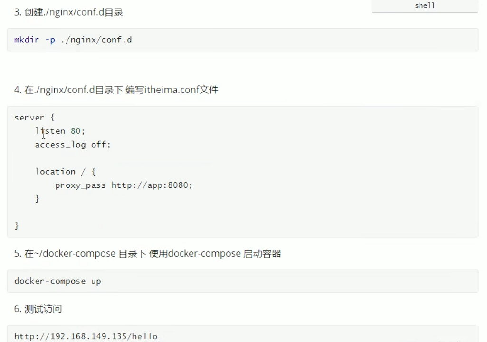
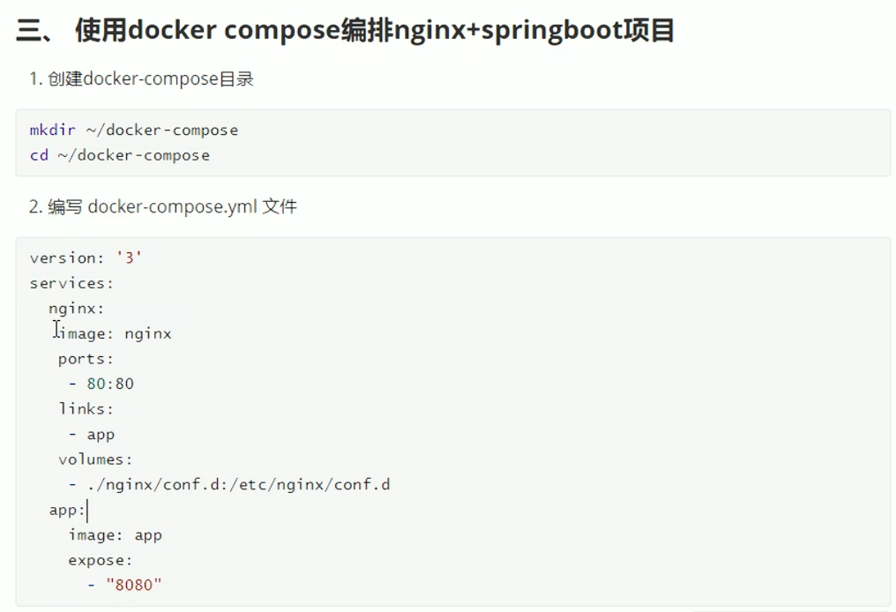
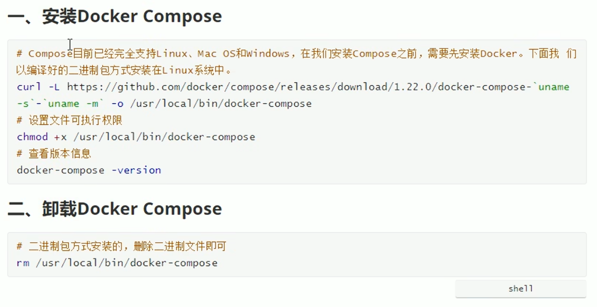
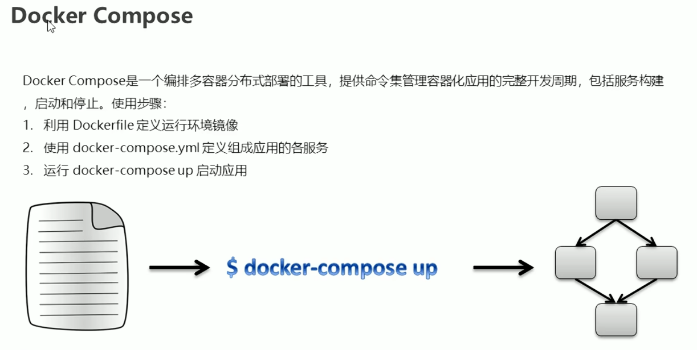
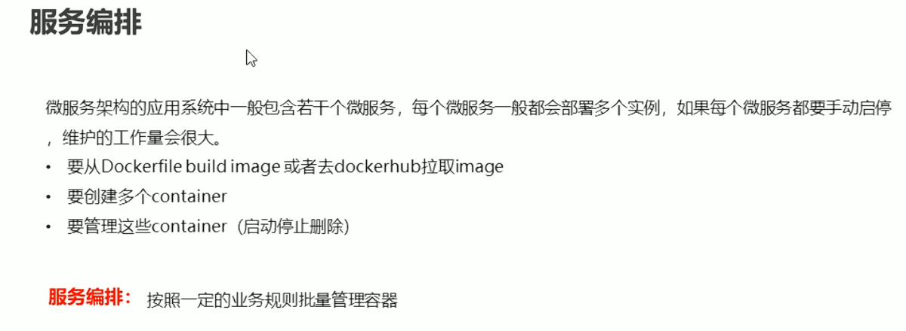
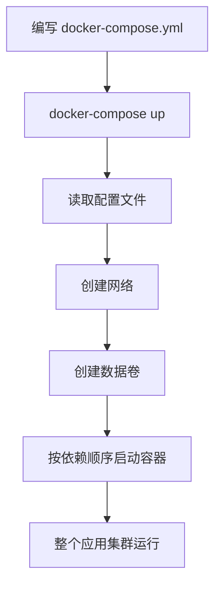
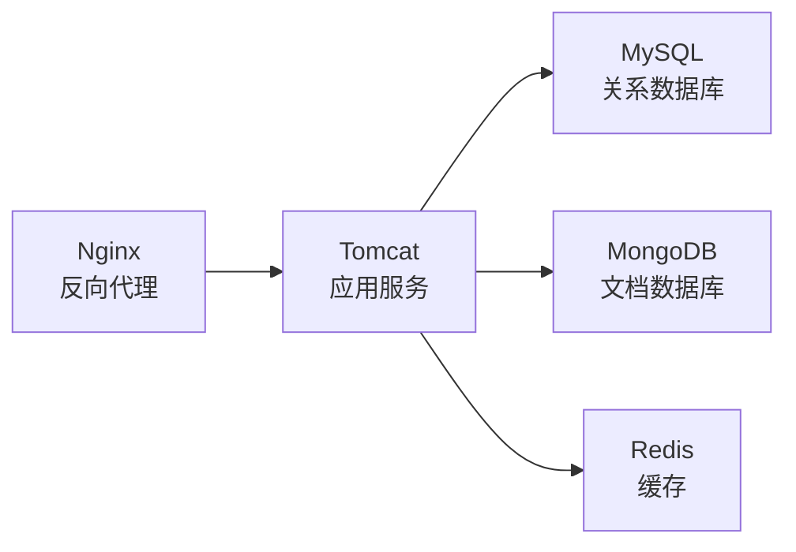
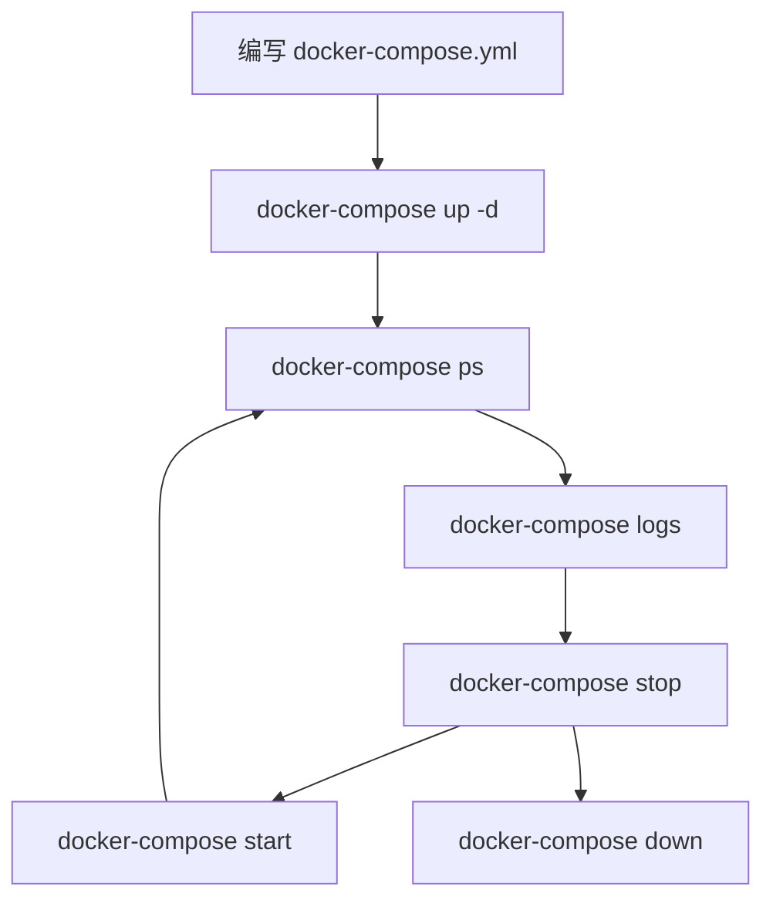

# 第八课：Docker Compose

## 1. 这节课学什么

这一节我们学习 Docker 里另一个非常核心的工具：

**Docker Compose。**

这一节会重点讲清楚：

- Docker Compose 是什么
- 为什么需要 Docker Compose
- Docker Compose 能解决什么问题
- docker-compose.yml 文件里每个字段到底代表什么意思
- Docker Compose 的常用命令有哪些
- 典型多容器应用场景是怎么组织的

这节课是从“会跑单个容器”到“会管理整个应用集群”的关键一步。

## 2. 先看本节配图

### 2.1 Docker Compose 概述图



### 2.2 Docker Compose 详解图



### 2.3 Docker Compose YML 结构图



### 2.4 Docker Compose 命令图



### 2.5 多容器架构与命令图



## 3. 先说结论：Docker Compose 是什么

### 专业定义

Docker Compose 是一个用于定义和管理多容器 Docker 应用的工具。它通过一个 `docker-compose.yml` 配置文件，描述应用中多个服务之间的关系、依赖、网络、存储等配置，然后使用一条命令实现多容器的编排、创建、启动和停止。

### 通俗理解

Docker Compose 就是：

**多容器应用的“剧本”。**

你把整个应用需要哪些容器、每个容器怎么配置、它们之间怎么连接，全部写进一个文件里，然后 Docker Compose 帮你一次性把整个“舰队”开起来。

### 一句话总结

Docker Compose = 多容器编排工具，用于管理整个应用集群。

## 4. 为什么会出现 Docker Compose

这一点非常关键。

在学习 Docker Compose 之前，你可能已经会：
- `docker run` 启动一个容器
- `docker stop` 停止一个容器
- `docker rm` 删除一个容器

但这只是“单兵作战”模式。

真实业务中，一个应用往往不止一个容器，而是由多个容器组成，比如一个典型的 Web 应用可能包含：

- Nginx：反向代理和负载均衡
- Tomcat：应用服务器
- MySQL：关系型数据库
- MongoDB：文档数据库
- Redis：缓存服务

### 如果没有 Docker Compose

你可能需要这样做：

```bash
# 1. 先启动数据库
docker run -d --name mysql -v mysql-data:/var/lib/mysql mysql:8.0

# 2. 再启动 Redis
docker run -d --name redis redis:7.2

# 3. 再启动 MongoDB
docker run -d --name mongodb mongo:7.0

# 4. 再启动 Tomcat，并连接各个服务
docker run -d --name tomcat \
  --link mysql \
  --link redis \
  --link mongodb \
  tomcat:9.0

# 5. 再启动 Nginx
docker run -d --name nginx \
  --link tomcat \
  -p 80:80 \
  nginx:1.25
```

这样做有什么问题？

### 问题一：配置分散

每个容器的配置分散在不同的命令里，不容易统一管理。

### 问题二：容器之间关系不清晰

`--link` 这种方式依赖容器名，不容易表达复杂的依赖关系。

### 问题三：难以复现

这套命令换一台机器部署时，很容易漏参数或写错顺序。

### 问题四：无法统一管理生命周期

启动、停止、删除都需要分别操作每个容器，很麻烦。

### 问题五：网络配置复杂

需要手动管理容器间的网络互通。

## 5. Docker Compose 为什么能解决这些问题

Docker Compose 的核心思路是：

**把整个应用的结构和配置，写成一份声明式的配置文件，然后让 Docker Compose 解析这份文件，统一管理多容器应用。**

### 通俗理解

你可以把 Docker Compose 理解成：

**从“逐个容器手动操作”变成“一份剧本统一指挥”。**

## 6. Docker Compose 的核心能力

从图中可以看到，Docker Compose 核心能力包括：

### 6.1 编排

把多个容器按照依赖关系、启动顺序组织起来。

### 6.2 调度

统一调度多容器的启动和停止。

### 6.3 部署

一条命令完成整个应用集群的部署。

### 6.4 多容器管理

统一管理应用中的所有容器，而不是逐个操作。

## 7. Docker Compose 和单个容器命令的本质区别

### 单容器模式

```bash
docker run mysql
```

只启动一个容器。

### Docker Compose 模式

```yaml
services:
  mysql:
    image: mysql:8.0
  redis:
    image: redis:7.2
  app:
    image: myapp:1.0
    depends_on:
      - mysql
      - redis
```

一条命令启动整个应用的所有容器，并自动处理依赖关系。

## 8. Docker Compose 解决了什么问题

### 8.1 解决“配置复杂”问题

所有配置集中在 docker-compose.yml 里，一目了然。

### 8.2 解决“容器管理”问题

一条命令管理所有容器，而不是逐个操作。

### 8.3 解决“容器集群”问题

从单个容器扩展到多容器集群管理。

### 8.4 解决“环境复现”问题

yml 文件可以提交到 Git，其他环境直接复用。

## 9. Docker Compose 的典型应用场景

### 场景一：Web 应用集群

典型结构：

- Nginx：反向代理
- Tomcat：应用服务器
- MySQL：数据库
- Redis：缓存

### 场景二：微服务架构

每个微服务是一个容器，服务之间通过网络通信。

### 场景三：开发环境

开发人员可以用一条命令启动完整开发环境。

### 场景四：CI/CD 环境

持续集成中用 Compose 启动完整测试环境。

## 10. Docker Compose 的工作流程

典型工作流程是：



## 11. docker-compose.yml 到底是什么

### 专业解释

docker-compose.yml 是 Docker Compose 的核心配置文件。

它是一个 YAML 格式的文件，用于声明式描述：
- 有哪些服务
- 每个服务使用哪个镜像
- 每个服务如何配置（端口、环境变量、数据卷、网络等）
- 服务之间的依赖关系

### 通俗理解

你可以把它理解成：

**多容器应用的“设计图纸”。**

## 12. docker-compose.yml 的基本结构

从图中可以看到，docker-compose.yml 的基本结构是：

```yaml
version: "3.8"  # compose 文件版本

services:        # 服务列表
  服务名:
    image: 镜像名
    container_name: 容器名
    ports:
      - "宿主机端口:容器端口"
    environment:
      - 环境变量
    networks:
      - 网络名
    depends_on:
      - 依赖的服务名

networks:        # 网络配置
  网络名:

volumes:         # 数据卷配置
  卷名:
```

## 13. 顶层关键字详解

docker-compose.yml 有三个顶级配置块：

### 13.1 services

定义所有服务（容器），每个服务对应一个容器。

### 13.2 networks

定义网络，容器之间通过网络通信。

### 13.3 volumes

定义数据卷，实现数据持久化和共享。

## 14. services 子项详解

### 14.1 image

指定使用的镜像。

```yaml
services:
  web:
    image: nginx:1.25
```

### 14.2 container_name

指定容器名称。

```yaml
services:
  web:
    image: nginx:1.25
    container_name: my-nginx
```

### 14.3 ports

端口映射，格式是 `宿主机端口:容器端口`。

```yaml
services:
  web:
    image: nginx:1.25
    ports:
      - "80:80"
      - "443:443"
```

### 14.4 environment

设置环境变量。

```yaml
services:
  db:
    image: mysql:8.0
    environment:
      - MYSQL_ROOT_PASSWORD=123456
      - MYSQL_DATABASE=myapp
```

### 14.5 networks

指定容器加入哪个网络。

```yaml
services:
  web:
    image: nginx:1.25
    networks:
      - frontend
  app:
    image: tomcat:9.0
    networks:
      - frontend
      - backend
```

### 14.6 depends_on

声明服务之间的依赖关系。

```yaml
services:
  app:
    image: tomcat:9.0
    depends_on:
      - db
      - redis
  db:
    image: mysql:8.0
  redis:
    image: redis:7.2
```

**注意：** `depends_on` 只保证启动顺序，不保证容器完全就绪。

### 14.7 volumes

挂载数据卷。

```yaml
services:
  db:
    image: mysql:8.0
    volumes:
      - mysql-data:/var/lib/mysql

volumes:
  mysql-data:
```

### 14.8 restart

容器退出时的重启策略。

```yaml
services:
  web:
    image: nginx:1.25
    restart: always
```

常见取值：
- `no`：不重启
- `always`：总是重启
- `on-failure`：失败时重启
- `unless-stopped`：除非手动停止，否则重启

## 15. networks 子项详解

Docker Compose 会为每个项目创建一个默认网络，所有服务默认加入这个网络，可以相互通信。

### 自定义网络示例

```yaml
services:
  web:
    image: nginx:1.25
    networks:
      - frontend
  app:
    image: tomcat:9.0
    networks:
      - frontend
      - backend
  db:
    image: mysql:8.0
    networks:
      - backend

networks:
  frontend:
  backend:
```

这样：
- web 和 app 都能在 frontend 网络
- app 和 db 都能在 backend 网络
- web 和 db 不能直接通信，实现了网络隔离

## 16. volumes 子项详解

```yaml
services:
  db:
    image: mysql:8.0
    volumes:
      - mysql-data:/var/lib/mysql

volumes:
  mysql-data:
```

## 17. 一个完整的 docker-compose.yml 示例

```yaml
version: "3.8"

services:
  nginx:
    image: nginx:1.25
    container_name: my-nginx
    ports:
      - "80:80"
    networks:
      - app-network

  tomcat:
    image: tomcat:9.0
    container_name: my-tomcat
    ports:
      - "8080:8080"
    environment:
      - JAVA_OPTS=-Xmx512m
    networks:
      - app-network
    depends_on:
      - mysql
      - redis

  mysql:
    image: mysql:8.0
    container_name: my-mysql
    environment:
      - MYSQL_ROOT_PASSWORD=123456
      - MYSQL_DATABASE=myapp
    volumes:
      - mysql-data:/var/lib/mysql
    networks:
      - backend
    restart: always

  redis:
    image: redis:7.2
    container_name: my-redis
    networks:
      - backend
    restart: always

  mongodb:
    image: mongo:7.0
    container_name: my-mongo
    networks:
      - backend
    restart: always

networks:
  app-network:
  backend:

volumes:
  mysql-data:
```

## 18. 从图中看多容器应用架构

一个典型的多容器架构通常是这样的：



依赖关系是：
- Nginx 依赖 Tomcat
- Tomcat 依赖 MySQL、MongoDB、Redis

## 19. Docker Compose 常用命令总表

从图中可以看到，Docker Compose 提供了丰富的命令。

## 20. 启动相关命令

### 20.1 docker-compose up

**作用：** 创建并启动所有服务。

```bash
# 启动所有服务
docker-compose up

# 后台运行
docker-compose up -d

# 指定文件启动
docker-compose -f docker-compose.yml up

# 重新构建镜像并启动
docker-compose up --build
```

### 20.2 docker-compose start

**作用：** 启动已存在的服务容器（不创建新容器）。

```bash
docker-compose start
```

### 20.3 docker-compose stop

**作用：** 停止运行中的服务容器（不删除容器）。

```bash
docker-compose stop
```

### 20.4 docker-compose restart

**作用：** 重启服务。

```bash
docker-compose restart
```

## 21. 停止与销毁相关命令

### 21.1 docker-compose down

**作用：** 停止并删除所有容器、网络，但保留数据卷。

```bash
docker-compose down
```

删除容器、网络和默认桥接网络：

```bash
# 同时删除数据卷
docker-compose down -v
```

### 21.2 docker-compose rm

**作用：** 删除已停止的服务容器。

```bash
docker-compose rm
```

## 22. 查看与日志相关命令

### 22.1 docker-compose ps

**作用：** 查看当前 Compose 项目中的容器状态。

```bash
docker-compose ps
```

### 22.2 docker-compose logs

**作用：** 查看服务日志。

```bash
# 查看所有服务日志
docker-compose logs

# 实时跟踪日志
docker-compose logs -f

# 查看指定服务日志
docker-compose logs -f nginx
```

## 23. 镜像相关命令

### 23.1 docker-compose pull

**作用：** 拉取服务依赖的镜像。

```bash
docker-compose pull
```

### 23.2 docker-compose build

**作用：** 构建自定义镜像。

```bash
# 构建所有服务镜像
docker-compose build

# 重新构建
docker-compose build --no-cache
```

### 23.3 docker-compose images

**作用：** 列出 Compose 项目中使用的镜像。

```bash
docker-compose images
```

## 24. 操作与调试相关命令

### 24.1 docker-compose exec

**作用：** 在运行中的服务容器里执行命令。

```bash
# 进入 nginx 容器
docker-compose exec nginx /bin/bash

# 执行单个命令
docker-compose exec db mysql -uroot -p
```

### 24.2 docker-compose run

**作用：** 在服务中运行一次性命令。

```bash
# 一次性运行命令
docker-compose run web /bin/sh
```

### 24.3 docker-compose pause

**作用：** 暂停服务。

```bash
docker-compose pause
```

### 24.4 docker-compose unpause

**作用：** 恢复暂停的服务。

```bash
docker-compose unpause
```

## 25. 扩展与伸缩相关命令

### 25.1 docker-compose scale

**作用：** 扩展服务到指定数量的容器。

```bash
# 将 web 服务扩展到 3 个容器
docker-compose scale web=3

# 将 app 服务扩展到 2 个容器
docker-compose scale app=2
```

**注意：** 在新版 Docker Compose 中，推荐使用 `docker-compose up --scale`。

## 26. 配置与验证相关命令

### 26.1 docker-compose config

**作用：** 验证并显示 docker-compose.yml 的解析结果。

```bash
docker-compose config
```

### 26.2 docker-compose top

**作用：** 显示运行中的进程。

```bash
docker-compose top
```

## 27. Docker Compose 的生命周期管理

完整的服务生命周期通常是这样：



### 典型操作顺序

1. 编写 docker-compose.yml
2. `docker-compose up -d` 启动
3. `docker-compose ps` 查看状态
4. `docker-compose logs -f` 查看日志
5. `docker-compose exec` 进入容器调试
6. `docker-compose stop` 停止
7. `docker-compose down` 清理

## 28. Docker Compose 和 docker run 的区别

这是一个非常重要的对比。

### docker run 的局限性

- 只能管理单个容器
- 配置分散在命令行
- 服务之间关系不直观
- 不利于复现和协作

### docker-compose 的优势

- 一份文件管理整个应用集群
- 声明式配置，关系清晰
- 版本控制友好
- 一条命令完成集群操作

## 29. Docker Compose 的版本

docker-compose.yml 文件有一个 `version` 字段，用于指定文件格式版本。

常见版本：

| 版本 | 说明 |
| --- | --- |
| "3.8" | 当前推荐版本，功能全面 |
| "3.7" | 支持 Docker Engine 19.03+ |
| "2.4" | 较老但兼容性好的版本 |

**注意：** version 字段主要是为了向前兼容，不一定和 Docker Engine 版本对应。

## 30. Docker Compose 的安装

在 macOS 和 Windows 上，Docker Desktop 已经自带了 Docker Compose。

在 Linux 上需要单独安装：

```bash
# 下载二进制文件
sudo curl -L "https://github.com/docker/compose/releases/download/v2.24.0/docker-compose-$(uname -s)-$(uname -m)" -o /usr/local/bin/docker-compose

# 添加执行权限
sudo chmod +x /usr/local/bin/docker-compose

# 验证安装
docker-compose --version
```

## 31. Docker Compose 实战：一个完整的 WordPress 项目

```yaml
version: "3.8"

services:
  db:
    image: mysql:8.0
    container_name: wordpress-db
    environment:
      MYSQL_ROOT_PASSWORD: rootpassword
      MYSQL_DATABASE: wordpress
      MYSQL_USER: wordpress
      MYSQL_PASSWORD: wordpress
    volumes:
      - db-data:/var/lib/mysql
    networks:
      - wordpress-net
    restart: always

  wordpress:
    image: wordpress:latest
    container_name: wordpress-app
    depends_on:
      - db
    ports:
      - "8080:80"
    environment:
      WORDPRESS_DB_HOST: db
      WORDPRESS_DB_USER: wordpress
      WORDPRESS_DB_PASSWORD: wordpress
      WORDPRESS_DB_NAME: wordpress
    volumes:
      - wordpress-data:/var/www/html
    networks:
      - wordpress-net
    restart: always

networks:
  wordpress-net:

volumes:
  db-data:
  wordpress-data:
```

启动命令：

```bash
docker-compose up -d
```

## 32. Docker Compose 常见错误与排查

### 错误一：端口冲突

如果宿主机端口已被占用，启动会失败。

排查：
```bash
docker-compose ps
docker-compose logs
```

### 错误二：依赖服务未就绪

容器启动了，但依赖的服务还没准备好。

排查：
```bash
docker-compose exec <service-name> ping <dependency-name>
```

### 错误三：数据卷权限问题

容器内无法写入数据卷。

排查：
```bash
docker-compose exec <service-name> ls -la /path
```

## 33. Docker Compose 进阶：使用 .env 文件

可以把环境变量抽离到 .env 文件中：

**docker-compose.yml：**

```yaml
services:
  db:
    image: mysql:8.0
    environment:
      MYSQL_ROOT_PASSWORD: ${DB_ROOT_PASSWORD}
```

**.env：**

```
DB_ROOT_PASSWORD=mysecretpassword
```

启动时 Docker Compose 会自动读取 .env 文件。

## 34. Docker Compose 的网络隔离

默认情况下，Docker Compose 会创建一个默认网络，所有服务都在这个网络里，可以相互通信。

如果需要更严格的网络隔离：

```yaml
services:
  frontend:
    networks:
      - frontend-net
  backend:
    networks:
      - frontend-net
      - backend-net
  database:
    networks:
      - backend-net

networks:
  frontend-net:
  backend-net:
```

这样 database 只能被 backend 访问，不能被 frontend 直接访问。

## 35. Docker Compose 和 Dockerfile 的关系

Docker Compose 和 Dockerfile 是两个互补的工具：

| 维度 | Dockerfile | Docker Compose |
| --- | --- | --- |
| 管理对象 | 单个镜像 | 多容器应用 |
| 配置格式 | Dockerfile | docker-compose.yml |
| 用途 | 构建自定义镜像 | 编排多容器应用 |
| 典型用法 | 定义镜像怎么构建 | 定义应用由哪些容器组成 |

### 常见组合使用

```yaml
services:
  web:
    build: ./webapp
    ports:
      - "8080:8080"
```

这里 `build` 会引用同目录下的 Dockerfile。

## 36. 从专业角度总结这一课

Docker Compose 是 Docker 官方提供的多容器编排工具，通过一份声明式的 YAML 配置文件，描述整个应用的拓扑结构、服务依赖、网络划分和数据卷配置，然后用一条命令实现多容器的统一生命周期管理。

它解决的核心问题是：
- 多容器应用的配置复杂性问题
- 容器集群的统一管理问题
- 环境复现和团队协作问题

## 37. 用大白话总结这一课

你可以把 Docker Compose 记成下面几句话：

- Docker Compose 就是多容器应用的“剧本”
- 你把整个应用需要哪些容器、怎么配置、怎么连接，全部写进 docker-compose.yml
- 然后一条 `docker-compose up` 就能把整个集群开起来
- `docker-compose down` 能把整个集群停掉
- 比逐个 `docker run` 管理要方便得多

## 38. 本节课你必须记住的重点

- Docker Compose 是多容器编排工具
- 核心配置文件是 docker-compose.yml
- services 定义服务列表
- networks 定义网络
- volumes 定义数据卷
- `depends_on` 定义启动顺序依赖
- `docker-compose up -d` 是最常用的启动命令
- `docker-compose down` 是最常用的停止命令
- Docker Compose 适合微服务架构和复杂多容器应用

## 39. 本节课课后思考题

你可以试着回答下面几个问题：

1. Docker Compose 解决的核心问题是什么？
2. docker-compose.yml 中 `services`、`networks`、`volumes` 三个顶级配置块分别负责什么？
3. `depends_on` 和网络配置的作用分别是什么？
4. `docker-compose up -d` 和 `docker-compose start` 有什么区别？
5. 如何用 Docker Compose 实现一个包含 Nginx、Tomcat、MySQL 的三层 Web 应用？

如果你能把这 5 个问题讲清楚，第八课就算真正掌握了。

## 40. 本节课一句话收尾

**Docker Compose 的本质，就是把多容器应用的管理，从“逐个 docker run”变成“一份剧本统一指挥”。**
