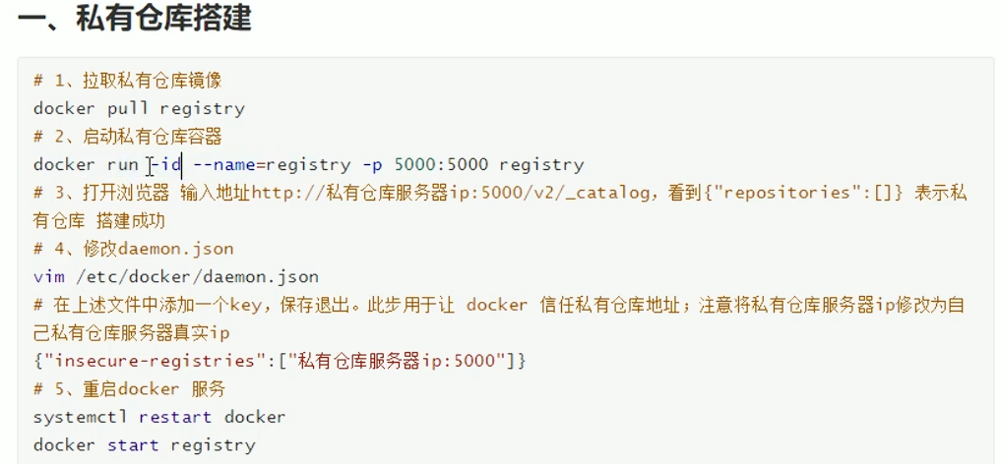
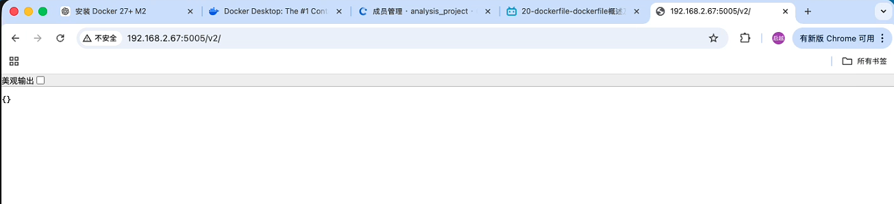
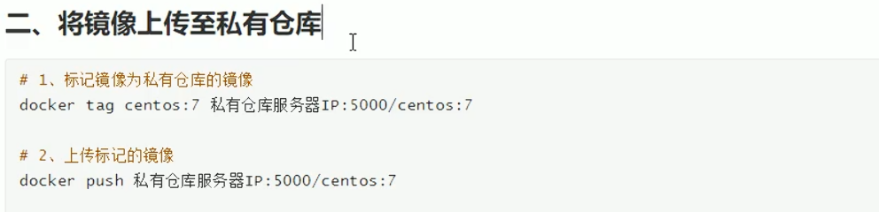
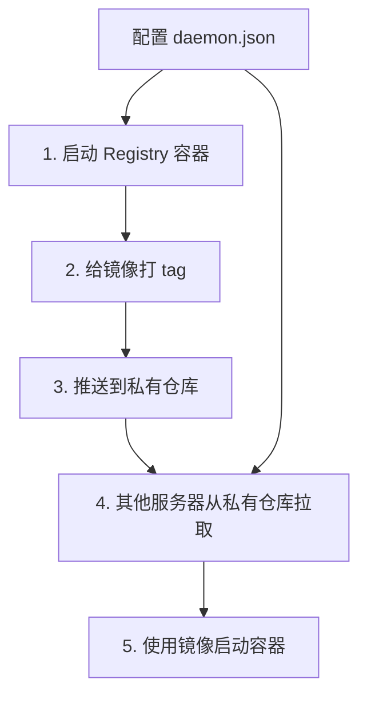
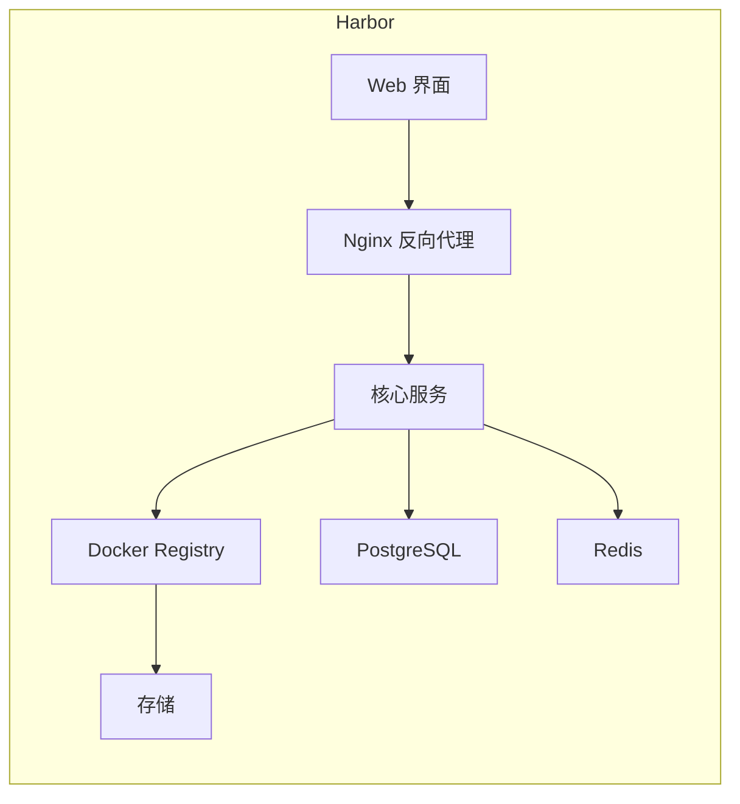

# 第九课：Docker 私有仓库

## 1. 这节课学什么

这一节我们学习 Docker 私有仓库的相关知识，这是企业级 Docker 使用中非常重要的一环。

这一节会重点讲清楚：

- 什么是私有仓库
- 为什么需要私有仓库
- 如何配置 Docker 私有仓库
- 如何给镜像打标签（tag）
- 如何上传镜像到私有仓库
- 如何从私有仓库拉取镜像
- 私有仓库使用中常见的代理问题及解决方案

## 2. 先看本节配图

### 2.1 Docker 私有仓库配置图



### 2.2 Docker 私有仓库操作命令图



### 2.3 Docker 拉取与信息查看图



## 3. 先说结论：什么是私有仓库

### 专业定义

Docker 私有仓库（Private Registry）是指部署在企业内部或本地环境中的 Docker 镜像仓库服务，用于存储和管理组织内部自定义的 Docker 镜像。与 Docker Hub 这样的公共仓库不同，私有仓库的镜像是不对外公开的，只有授权的用户或服务器可以访问。

### 通俗理解

你可以把私有仓库理解成：

**企业内部的"私人镜像商店"**。

- Docker Hub 像公开的"淘宝"，任何人都能买到公开的镜像
- 私有仓库像企业的"内部仓库"，只有本企业的人才能用

### 常见的私有仓库方案

- **Docker Registry**：官方提供的开源仓库，简单轻量
- **Docker Trusted Registry (DTR)**：企业版，功能更完善
- **Harbor**：VMware 开源的企业级仓库，功能强大

## 4. 为什么需要私有仓库

### 4.1 节省网络带宽

如果你在公司内网有多台服务器需要使用同一个镜像，每次都从 Docker Hub 拉取会消耗大量外网带宽。

有了私有仓库，镜像只需要从外网拉取一次到私有仓库，其他服务器都从内网拉取。

### 4.2 提高安全性

- 有些镜像包含企业的商业代码或配置，不适合放到公共仓库
- 私有仓库可以设置访问权限，只允许授权用户访问
- 可以对镜像进行安全扫描和漏洞检测

### 4.3 加快部署速度

内网拉取镜像速度比外网快得多，能显著提高部署效率。

### 4.4 保障镜像可用性

当 Docker Hub 服务不稳定时，私有仓库可以作为镜像的备份来源。

### 4.5 符合企业合规要求

有些行业有数据合规要求，不允许把镜像放到第三方服务器上。

## 5. Docker Registry 的工作模式

Docker Registry 是 Docker 官方提供的开源镜像仓库软件。

### 5.1 镜像存储格式

Registry 中的镜像存储格式是：

```text
仓库地址:端口/镜像名:标签
```

例如：

```text
192.168.2.67:5005/centos:7
```

### 5.2 仓库层级结构

Registry 使用两级结构：

- **仓库名**：例如 `centos`
- **标签**：例如 `7`、`latest`

完整镜像名是 `centos:7`。

### 5.3 API 端点

Registry 提供 REST API：

```text
GET /v2/                      # 检查仓库是否可用
GET /v2/_catalog              # 列出所有仓库
GET /v2/<name>/tags/list     # 列出某个仓库的所有标签
```

## 6. Docker 私有仓库配置详解

### 6.1 为什么需要配置 daemon.json

Docker 默认只允许从 HTTPS 地址拉取镜像。如果要使用 HTTP 协议的私有仓库，需要在 Docker 配置中声明"这是可信的仓库"。

这就是 `daemon.json` 的作用。

### 6.2 daemon.json 配置示例

从图中可以看到，完整的配置是这样的：

```json
{
  "builder": {
    "gc": {
      "defaultKeepStorage": "20GB",
      "enabled": true
    }
  },
  "experimental": false,
  "insecure-registries": [
    "192.168.2.67:5005"
  ],
  "registry-mirrors": [
    "https://err004vo.mirror.aliyuncs.com"
  ]
}
```

### 6.3 关键配置项解析

#### insecure-registries

这是最关键的配置项，用于声明可信的 HTTP 仓库地址。

```json
"insecure-registries": [
  "192.168.2.67:5005"
]
```

**注意：** 如果你的私有仓库使用 HTTP 而不是 HTTPS，必须添加到这个列表中。

#### registry-mirrors

镜像加速器地址，用于加速从 Docker Hub 拉取镜像。

```json
"registry-mirrors": [
  "https://err004vo.mirror.aliyuncs.com"
]
```

### 6.4 如何修改 daemon.json

不同操作系统的 Docker 配置文件位置不同：

| 操作系统 | 配置文件位置 |
| --- | --- |
| Linux | `/etc/docker/daemon.json` |
| macOS (Docker Desktop) | Docker Desktop 设置 → Docker Engine |
| Windows | Docker Desktop 设置 → Docker Engine |

### 6.5 修改配置后需要重启

修改 `daemon.json` 后需要重启 Docker 服务使配置生效。

macOS 和 Windows 用户通过 Docker Desktop 重启即可。

## 7. 启动私有仓库

### 7.1 使用 Docker 启动 Registry

最简单的方式是用 Docker 启动 Registry：

```bash
docker run -d \
  -p 5005:5000 \
  --name registry \
  registry:2
```

### 7.2 命令参数解析

| 参数 | 含义 |
| --- | --- |
| `-d` | 后台运行 |
| `-p 5005:5000` | 把宿主机的 5005 端口映射到容器的 5000 端口 |
| `--name registry` | 给容器起名为 registry |
| `registry:2` | 使用 Registry 2 版本镜像 |

### 7.3 验证 Registry 是否启动成功

```bash
docker ps -a
```

应该看到类似输出：

```
CONTAINER ID   IMAGE        COMMAND                  CREATED         STATUS                      PORTS                                         NAMES
2a30c4396c75   registry:2   "/entrypoint.sh /etc…"   5 seconds ago   Up 5 seconds                0.0.0.0:5005->5000/tcp, [::]:5005->5000/tcp   registry
```

### 7.4 验证 Registry API 是否正常

```bash
curl http://192.168.2.67:5005/v2/
```

如果返回 `{}`，说明 Registry 运行正常。

## 8. 镜像 tag 操作

### 8.1 什么是镜像 tag

镜像 tag 用于给镜像打标签，格式是：

```text
镜像名:标签
```

tag 可以理解成镜像的"版本号"或"别名"。

### 8.2 为什么要打 tag

在推送镜像到私有仓库之前，需要给镜像打上一个包含仓库地址的 tag。

**原因：** Docker 推送和拉取镜像时，是根据镜像名中的仓库地址来决定发送到哪个仓库的。

### 8.3 tag 命令格式

```bash
docker tag 源镜像名:标签 目标镜像名:标签
```

### 8.4 tag 操作示例

#### 示例一：给本地镜像打 tag

```bash
# 把 centos:7 打上私有仓库的 tag
docker tag centos:7 192.168.2.67:5005/centos:7
```

执行后：

```
IMAGE                        ID             DISK USAGE
192.168.2.67:5005/centos:7   be65f488b776        434MB
centos:7                     be65f488b776        434MB
```

**注意：** 它们指向同一个镜像 ID，只是名字不同。

#### 示例二：打多个 tag

```bash
# 同一个镜像可以打多个 tag
docker tag centos:7 192.168.2.67:5005/centos:7
docker tag centos:7 192.168.2.67:5005/centos:latest
docker tag myapp:1.0 192.168.2.67:5005/myapp:1.0
docker tag myapp:1.0 192.168.2.67:5005/myapp:latest
```

#### 示例三：打 tag 常见错误

```bash
# 错误写法：缺少空格
docker tag images centos:7 192.168.2.67:5005/centos:7

# 正确写法
docker tag centos:7 192.168.2.67:5005/centos:7
```

错误提示：

```
docker: 'docker tag' requires 2 arguments
Usage: docker tag SOURCE_IMAGE[:TAG] TARGET_IMAGE[:TAG]
```

### 8.5 tag 命令格式图解

```
docker tag 源镜像            目标镜像
         ↓                    ↓
    centos:7      192.168.2.67:5005/centos:7
                           ↑           ↑    ↑
                       仓库地址    镜像名  标签
```

## 9. 上传镜像到私有仓库

### 9.1 push 命令格式

```bash
docker push 仓库地址:端口/镜像名:标签
```

### 9.2 上传示例

```bash
# 上传 centos 镜像到私有仓库
docker push 192.168.2.67:5005/centos:7
```

### 9.3 推送输出解析

成功的推送会显示类似：

```
The push refers to repository [192.168.2.67:5005/centos]
6717b8ec66cd: Pushed
7: digest: sha256:73f11afcbb50d8bc70eab9f0850b3fa30e61a419bc48cf426e63527d14a8373b size: 530
sha256:be65f488b7764ad3638f236b7b515b3678369a5124c47b8d32916d6487418ea4 -> sha256:73f11afcbb50d8bc70eab9f0850b3fa30e61a419bc48cf426e63527d14a8373b
```

关键信息：

- `6717b8ec66cd: Pushed`：镜像层推送成功
- `digest: sha256:73f11afc...`：镜像的唯一摘要
- `sha256:be65f488... -> sha256:73f11afc...`：本地镜像和远程仓库镜像的映射关系

### 9.4 验证上传是否成功

#### 方法一：查看仓库目录

```bash
curl http://192.168.2.67:5005/v2/_catalog
```

返回：

```json
{"repositories":["centos"]}
```

这说明仓库中已经有了 `centos` 这个镜像。

#### 方法二：查看镜像标签

```bash
curl http://192.168.2.67:5005/v2/centos/tags/list
```

返回：

```json
{"name":"centos","tags":["7"]}
```

## 10. 从私有仓库拉取镜像

### 10.1 pull 命令格式

```bash
docker pull 仓库地址:端口/镜像名:标签
```

### 10.2 拉取示例

```bash
# 从私有仓库拉取 centos 镜像
docker pull 192.168.2.67:5005/centos:7
```

### 10.3 拉取输出解析

成功的拉取会显示：

```
7: Pulling from centos
Digest: sha256:73f11afcbb50d8bc70eab9f0850b3fa30e61a419bc48cf426e63527d14a8373b
Status: Downloaded newer image for 192.168.2.67:5005/centos:7
192.168.2.67:5005/centos:7
```

### 10.4 查看拉取后的镜像

```bash
docker images
```

会看到新拉取的镜像：

```
IMAGE                        ID             DISK USAGE
192.168.2.67:5005/centos:7   73f11afcbb50        434MB          108MB
...
```

## 11. 私有仓库的完整工作流程



### 完整操作示例

```bash
# 1. 启动私有仓库
docker run -d -p 5005:5000 --name registry registry:2

# 2. 查看本地镜像
docker images

# 3. 给镜像打 tag
docker tag centos:7 192.168.2.67:5005/centos:7

# 4. 推送到私有仓库
docker push 192.168.2.67:5005/centos:7

# 5. 验证推送成功
curl http://192.168.2.67:5005/v2/_catalog

# 6. 从私有仓库拉取镜像
docker pull 192.168.2.67:5005/centos:7

# 7. 使用镜像
docker run -it 192.168.2.67:5005/centos:7 /bin/bash
```

## 12. 私有仓库常见问题与解决方案

### 12.1 HTTP 协议问题

#### 问题描述

推送时报错：

```
http: server closed idle connection
```

或者：

```
failed to do request: Post "https://192.168.2.67:5005/v2/centos/blobs/uploads/": EOF
```

#### 原因

Docker 默认要求 HTTPS，但私有仓库使用的是 HTTP。

#### 解决方案

在 `daemon.json` 的 `insecure-registries` 中添加仓库地址：

```json
{
  "insecure-registries": [
    "192.168.2.67:5005"
  ]
}
```

修改后重启 Docker。

### 12.2 代理问题

#### 问题描述

```bash
docker push 192.168.2.67:5005/centos:7
```

报错：

```
http: server closed idle connection
```

#### 原因

宿主机配置了代理，但代理不支持 Docker Registry 的 HTTP 连接。

#### 排查方法

```bash
docker info | grep -i proxy
```

输出：

```
HTTP Proxy: http.docker.internal:3128
HTTPS Proxy: http.docker.internal:3128
No Proxy: hubproxy.docker.internal
```

#### 解决方案

在 Docker Desktop 设置中，或者在 `daemon.json` 中添加 `192.168.2.67:5005` 到 `no-proxy` 列表。

对于 Docker Desktop：
1. 设置 → Resources → Proxies
2. 添加 `192.168.2.67:5005` 到 "Bypass proxy settings for these hosts & domains"

### 12.3 端口冲突

#### 问题描述

启动 Registry 容器时报错：

```
docker: Error response from daemon: driver failed programming external connectivity on endpoint registry: Error starting userland proxy: listen tcp4 0.0.0.0:5005: bind: address already in use.
```

#### 原因

宿主机 5005 端口已经被其他程序占用。

#### 解决方案

1. 找出占用端口的程序并停止
2. 或者使用其他端口映射

```bash
# 查看端口占用
lsof -i :5005

# 或者使用其他端口
docker run -d -p 5006:5000 --name registry registry:2
```

### 12.4 仓库地址错误

#### 问题描述

推送时报错 404：

```
Error: Status 404 trying to push repository centos:...
```

#### 原因

镜像 tag 中的仓库地址写错了。

#### 解决方案

确保 tag 格式正确：

```bash
# 错误
docker push centos:7

# 正确
docker push 192.168.2.67:5005/centos:7
```

### 12.5 镜像层太大导致超时

#### 问题描述

推送过程中卡住，然后报错：

```
EOF
```

#### 解决方案

1. 检查网络连接
2. 增加 Docker 超时时间
3. 使用 `docker login` 确保认证正确

## 13. Docker Registry 的数据持久化

### 13.1 默认情况下数据不持久化

如果不用数据卷，Registry 容器删除后，所有镜像数据会丢失。

### 13.2 使用数据卷持久化

```bash
docker run -d \
  -p 5005:5000 \
  --name registry \
  -v registry-data:/var/lib/registry \
  registry:2
```

这样镜像数据会存储在 Docker 管理的数据卷 `registry-data` 中，删除容器后数据依然保留。

### 13.3 验证数据卷

```bash
docker inspect registry
```

会看到类似：

```json
"Mounts": [
  {
    "Type": "volume",
    "Name": "registry-data",
    "Destination": "/var/lib/registry"
  }
]
```

## 14. 多架构镜像推送

### 14.1 什么是多架构镜像

同一个镜像名可以支持多种架构（amd64、arm64 等）。

### 14.2 推送多架构镜像注意

从推送输出可以看到：

```
Not all multiplatform-content is present and only the available single-platform image was pushed
```

这只是一个提示，不影响单架构镜像的使用。

## 15. 企业级私有仓库方案对比

| 方案 | 特点 | 适用场景 |
| --- | --- | --- |
| Docker Registry | 轻量、简单、开源 | 小规模团队 |
| Docker Trusted Registry | 企业级、功能完善 | 中大型企业 |
| Harbor | 功能全面、开源、社区活跃 | 中大型企业 |
| 阿里云容器镜像服务 | 云服务、免运维 | 云上部署 |
| 腾讯云容器镜像服务 | 云服务、免运维 | 云上部署 |

## 16. Harbor 简介

Harbor 是 VMware 开源的企业级 Docker Registry 项目，提供更强大的功能：

### 16.1 Harbor 核心功能

- **基于角色的访问控制 (RBAC)**：细粒度权限控制
- **镜像复制**：支持跨数据中心复制
- **安全扫描**：集成 Clair 进行漏洞扫描
- **审计日志**：记录所有操作
- **图形化界面**：友好的 Web UI

### 16.2 Harbor 架构



### 16.3 Harbor 的使用场景

- 需要团队协作和多用户权限管理
- 需要镜像安全扫描
- 需要跨多个数据中心复制镜像
- 需要图形化界面管理镜像

## 17. 从专业角度总结这一课

Docker 私有仓库是企业级容器化部署中不可或缺的基础设施。通过私有仓库，组织可以实现内网镜像分发、节省带宽、提高安全性、保障可用性。

Docker Registry 是最轻量的私有仓库方案，通过简单的容器部署即可使用。关键配置包括 daemon.json 中的 insecure-registries 设置，以及正确的 tag 和 push 操作流程。

## 18. 用大白话总结这一课

你可以把私有仓库操作记成下面几句话：

- 私有仓库就是企业内部的"镜像店"
- 先在 daemon.json 里把仓库地址加到 insecure-registries
- 启动 Registry 容器后就可以用了
- 推送前先给镜像打 tag：`docker tag 镜像名 仓库地址/镜像名:标签`
- 推送用 `docker push`
- 拉取用 `docker pull`
- 遇到 HTTP 错误先检查 insecure-registries 配置

## 19. 本节课你必须记住的重点

- 私有仓库是内网的镜像存储服务
- `daemon.json` 中 `insecure-registries` 用于配置可信 HTTP 仓库
- 启动 Registry：`docker run -d -p 5005:5000 --name registry registry:2`
- 打 tag：`docker tag 源镜像 目标镜像`
- 推送：`docker push 仓库地址/镜像名:标签`
- 拉取：`docker pull 仓库地址/镜像名:标签`
- 验证仓库：`curl http://仓库地址:端口/v2/_catalog`
- 代理问题需要把仓库地址加到 no-proxy 配置中

## 20. 本节课课后思考题

你可以试着回答下面几个问题：

1. 私有仓库和 Docker Hub 的核心区别是什么？
2. 为什么需要把私有仓库地址加到 `insecure-registries` 中？
3. `docker tag` 命令的作用是什么？为什么要打 tag 才能推送？
4. 私有仓库推送和拉取的完整流程是什么？
5. 如果遇到 "http: server closed idle connection" 错误，应该怎么排查？

如果你能把这 5 个问题讲清楚，第九课就算真正掌握了。

## 21. 本节课一句话收尾

**Docker 私有仓库的本质，就是把镜像的分发和存储从外网移到内网，让团队成员能够安全、高效、低成本地共享容器镜像。**
