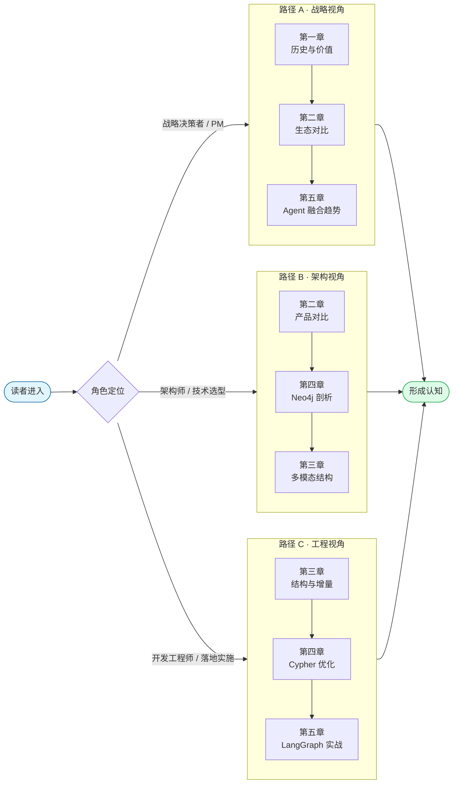
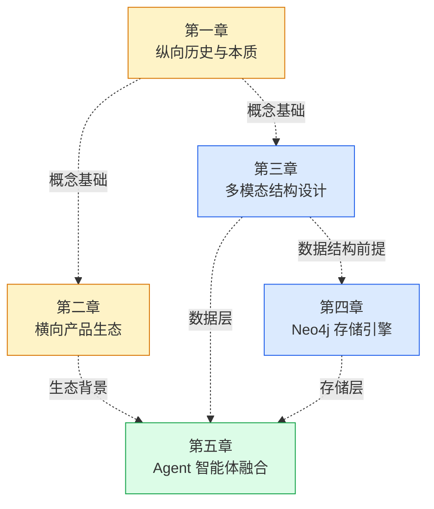

# 大模型与知识图谱融合技术及智能应用深度研究报告（第二版 · 系列）

> **版本说明**：本报告为第二版系列化版本，基于首版 `研究报告.md` 全面修订、深化、扩充。
> - **修订**：修正首版中 DBpedia 发布年份等事实性错误；澄清 Metaweb / Freebase 与 Google Knowledge Graph 的关系；重新措辞 LangGraph 与传统 Chain 的架构对比。
> - **深化**：在每章新增 Neural-Symbolic、TKG、LPG vs RDF、HNSW 向量索引、Page Cache 调优、MCP 工具封装等工程纵深内容。
> - **可视化**：新增七张以上 Mermaid 图表（时间线、流程图、状态机、思维导图等），全部使用 Mermaid 语法以便在 VSCode、Typora、GitHub 等环境中原生渲染。
> - **系列化**：原单文档拆分为 5 个独立章节文档，便于分发、协作评审与独立引用。

---

## 一、报告定位与核心论点

本系列研究报告围绕**"大模型（LLM）与知识图谱（KG）双螺旋融合"**这一核心命题，从历史、产品、工程、存储引擎、智能体架构五个维度系统剖析该领域的技术本质、工业实践与未来走向。核心论点有三：

1. **知识图谱是大模型从"感知智能"迈入"认知智能"的必经基础设施**——它以确定性符号知识为锚点，根治幻觉、提供可解释性、支撑多跳推理；
2. **GraphRAG（基于图引擎的检索增强生成）已成为二零二五年至二零二六年工业界事实标准**——从 Amazon COSMO 到 Neo4j + LangGraph，全球头部团队正在此收敛；
3. **多模态、增量化、智能体化**是图谱工程的下一代演进方向——分别对应"资源形态升级"、"更新代谢机制"、"调用范式升级"三个正交维度。

---

## 二、系列章节索引

| 章节 | 文件 | 核心议题 | 关键可视化 |
|------|------|---------|-----------|
| **第一章** | [`01_知识图谱的纵向分析.md`](./01_知识图谱的纵向分析.md) | 历史演进、技术本质、应用边界、技术局限 | 技术演进时间线 / KG 全生命周期流程图 |
| **第二章** | [`02_工业界产品横向对比.md`](./02_工业界产品横向对比.md) | 国内外 KG 产品生态博弈、LPG vs RDF 路线、GQL 标准化 | 生态思维导图 / 定位象限图 |
| **第三章** | [`03_多模态知识图谱结构设计.md`](./03_多模态知识图谱结构设计.md) | 层次树+语义图混合结构、跨模态对齐、增量更新、防御性删除 | 混合图结构图 / 增量更新状态流 |
| **第四章** | [`04_Neo4j技术剖析与Cypher优化.md`](./04_Neo4j技术剖析与Cypher优化.md) | 免索引邻接、Cypher 25、查询缓存、Page Cache 调优、HNSW 向量索引 | 性能代差对比图 / 优化 Checklist |
| **第五章** | [`05_Agent与知识图谱深度融合.md`](./05_Agent与知识图谱深度融合.md) | LangGraph GraphRAG 工作流、`langchain_neo4j`、MCP 安全围栏 | LangGraph 状态机图 / MCP 分层架构图 |

---

## 三、建议阅读路径

根据读者角色差异，推荐如下三条阅读路径：

---

## 四、章节依赖关系

各章节虽可独立阅读，但从知识递进关系看存在如下依赖：

- **黄色节点**（概念层）：建立认知基础；
- **蓝色节点**（工程层）：落地所需的底层能力；
- **绿色节点**（应用层）：面向场景的终极范式。

---

## 五、版本对照与订正要点

| # | 首版位置 | 首版原文 | 第二版订正 | 订正依据 |
|---|---------|---------|-----------|---------|
| 1 | 第一节第一段 | DBpedia（二零一零年） | DBpedia（二零零七年） | DBpedia 首个公开数据集发布于 2007 年 WWW 大会（Banff） |
| 2 | 第一节第一段 | 谷歌整合 MetaWeb 的底层技术 | 谷歌收购 MetaWeb 公司（2010 年 7 月），整合其旗下 Freebase 数据库 | 历史事实澄清 |
| 3 | 第四节第三小节 | `MATCH (n)-[*1..5]->(m)` 灾难性语句 | 补充"未指定关系类型与节点标签导致笛卡尔爆炸" | 工程原理补全 |
| 4 | 第五节第二小节 | 早期 LangChain 基于简单 DAG | 早期基于无状态线性链（Chain），LangGraph 引入有状态有向图（含 Cycles） | 表述精确化 |

---

## 六、引用与更新政策

- 本系列所有技术声明（Neo4j 特性、Cypher 25 语法、`langchain_neo4j` API、COSMO 数据、MMGraphRAG 指标等）均基于 **2026 年 4 月前** 的公开文档、论文与官方博客核实。
- 后续如有 Neo4j、LangChain、Anthropic MCP 等重大版本更新，本系列将追加 `CHANGELOG.md` 说明增量变动。
- 读者在实施前务必以对应项目的 **最新官方文档** 为准，本系列仅提供方法论与原理洞察。

---

**开始阅读**：请从 [`01_知识图谱的纵向分析.md`](./01_知识图谱的纵向分析.md) 启程，或依上述路径图选择适合自身角色的入口。
