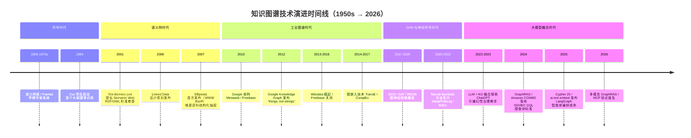
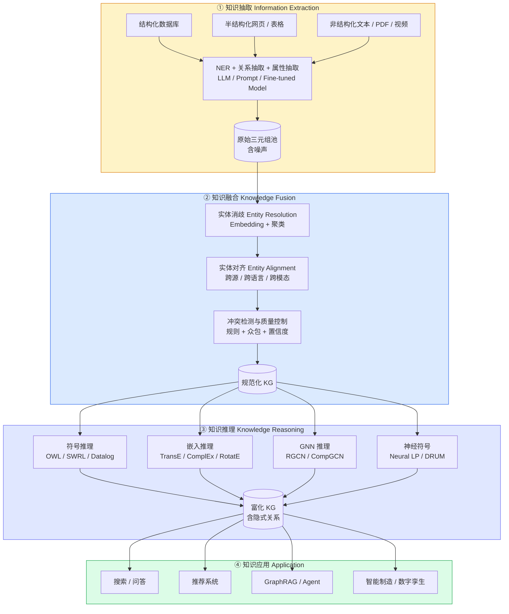
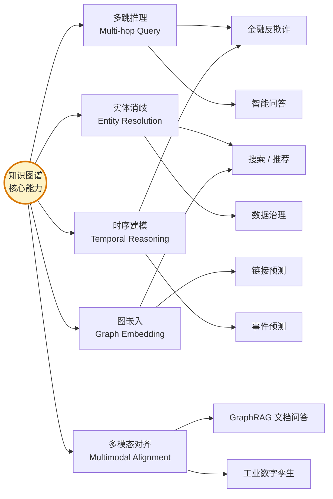

# 第一章 · 知识图谱的纵向分析：历史演进、技术本质与应用边界

> 本章从时间维度审视知识图谱（Knowledge Graph, KG）的缘起、技术本质、核心价值与工程局限，并交代其在现代 AI 体系中的定位。
>
> **建议先读**：本章是全系列的概念基础，后续四章均建立在此之上。

---

## 1.1 历史演进：从符号逻辑到认知智能的六十年跨越

知识图谱作为人工智能与知识工程领域的核心基础设施，其发展历程并非一蹴而就，而是伴随着计算科学对信息组织方式的不断探索而逐渐成型的。从纵向的历史演进来看，知识图谱的技术根基可以追溯到二十世纪五十年代至七十年代的语义网络（Semantic Networks）和专家系统。在这一时期，研究人员试图通过符号逻辑与"如果-则"（If-Then）规则让计算机具备初步的推理能力，但早期的专家系统面临着领域局限性强、维护更新困难等瓶颈。

进入二十一世纪，互联网的普及带来了信息爆炸。二零零一年，Tim Berners-Lee 正式提出了语义网（Semantic Web）的构想，引入了资源描述框架（RDF）和网络本体语言（OWL）等底层标准，标志着机器可读知识互联时代的开端。随后，学术界与工业界相继推出了 **DBpedia**（由 Sören Auer、Jens Lehmann、Christian Bizer 等人于**二零零七年**在 WWW Banff 大会上正式发布）等基于维基百科结构化数据的链接数据项目，为全球范围内的开放知识图谱奠定了基础。

然而，知识图谱这一概念真正在工业界引发范式革命，始于二零一二年谷歌正式发布 **Google Knowledge Graph**。谷歌于 **二零一零年七月收购了 Metaweb 公司**，将其旗下的 **Freebase 知识底座**整合进搜索引擎底层架构，并于 2012 年 5 月正式对外发布"Knowledge Graph"产品形态，实现了从传统的"文本字符串匹配"向真实的"客观事物认知"的跨越（"things, not strings"）。Freebase 本身则在 2014 年宣布退役并将数据迁移至 Wikidata，于 2016 年正式关闭。

这种技术演进的根本动因在于，随着全球数据规模呈指数级增长，传统的关系型数据库和基于关键字的倒排索引已经无法有效处理高度互联、语义极其复杂的实体关系，导致了严重的数据孤岛现象。知识图谱的出现，使得人工智能系统开始从浅层的"感知智能"向深度的"认知智能"迈进。

### 可视化 · 知识图谱技术演进时间线

---

## 1.2 核心价值：为大模型提供确定性符号锚点

知识图谱的核心价值在于其通过"实体-关系-实体"的主谓宾三元组结构，为海量、异构且碎片化的底层数据提供了高度统一的语义表达底座。在当前的工业实践中，它主要解决了诸多长期困扰数据科学领域的痛点。

首先，它彻底打破了系统间的数据孤岛，在金融风控、医疗诊断、供应链管理等复杂场景中，知识图谱能够以原生的图拓扑结构穿透多层级关联（Multi-hop），极大地提升了发现隐藏风险路径和欺诈网络的效率。其次，在大型语言模型（LLM）爆发的当下，知识图谱成为了缓解大模型"幻觉"问题的最有效手段之一。大型语言模型虽然具备令人惊叹的自然语言生成与泛化能力，但其本质是概率模型，缺乏坚实的事实依据和长效、可更新的记忆机制。知识图谱作为一种确定性的外部符号知识库，为语言模型提供了精准的实体上下文和高度可解释的逻辑推理路径，从而在根本上解决了大模型在垂直领域落地时的事实准确性和数据溯源难题。

### 深化：KG 与 LLM 的能力互补矩阵

为便于读者直观理解"为何一定要把 KG 喂给 LLM"，以下对比两者关键能力维度：

| 能力维度 | 大语言模型（LLM） | 知识图谱（KG） | 融合后效果 |
|---------|------------------|---------------|-----------|
| **事实准确性** | 概率生成，存在幻觉 | 确定性三元组，事实可追溯 | 幻觉率显著下降 |
| **推理可解释性** | 黑盒，Chain-of-Thought 仍是启发式 | 路径可视、可审计 | 推理链条可复现 |
| **更新成本** | 预训练成本极高，仅能 SFT/RAG 近似更新 | 单条三元组可独立增删 | 实时知识代谢 |
| **语言泛化性** | 强（多语言、少样本、开放域） | 弱（依赖本体 Schema） | 获得自然语言接口 |
| **长尾覆盖** | 受训练语料分布限制 | 可由领域专家补齐长尾 | 覆盖更完整 |
| **多跳逻辑推理** | 易断链、遗忘 | 原生 O(1) 指针跳转 | 支持深度推演 |

---

## 1.3 技术局限：不可忽视的工程代价

然而，在审视知识图谱的巨大价值时，工程界也必须正视其不可忽视的技术局限性与缺点。首先，高质量知识图谱的构建与持续维护面临着极高的成本门槛。这不仅需要进行极其复杂的本体（Ontology）和元数据建模，还需要在数据管道中执行繁重的数据清洗和知识融合（如实体消歧与对齐）任务，通常必须由经验丰富的数据工程师与特定领域的领域专家协同完成。

其次，传统知识图谱在时效性与动态更新机制上存在固有的瓶颈。静态图谱难以适应快速变化的现实商业世界，尽管学术界与工业界正在积极研发**动态知识图谱（DKG）**和**时序知识图谱（TKG）**，试图将时间戳维度嵌入三元组事实中（即将三元组扩展为四元组 `(s, p, o, t)` 或五元组），但在处理极高并发的写操作、维持历史数据快照以供趋势分析，以及兼顾图遍历性能方面，依然面临着巨大的工程挑战。

此外，知识图谱本质上是"以数据和关联为中心"的拓扑表示，它在处理涉及复杂决策树、条件分支约束和顺序工作流逻辑时，其原生表达能力往往显得捉襟见肘。对于这类高度依赖状态机的决策任务，传统的规则引擎或工作流编排系统往往比单纯的图结构更为适用。在推理算法层面，尽管图神经网络（GNN）和知识图谱嵌入（KGE）技术取得了长足进步，但纯神经网络方法往往牺牲了可解释性，而在金融、医疗等高合规性要求的场景中，必须依赖**神经符号（Neural-Symbolic）方法**来兼顾推理泛化能力与逻辑的绝对可靠性。

### 深化：时序 / 动态 KG 与静态 KG 的对比

| 特性 | 静态 KG | 动态 KG (DKG) | 时序 KG (TKG) |
|------|---------|---------------|---------------|
| **三元组形态** | `(s, p, o)` | `(s, p, o)` + 版本号 | `(s, p, o, t)` 或 `(s, p, o, [t_start, t_end])` |
| **典型代表模型** | TransE / ComplEx / RotatE | Streaming KGE | **TTransE / TComplEx / TeMP / RE-NET** |
| **应用场景** | 百科问答、反欺诈静态规则 | 实时推荐、在线风控 | 事件预测、趋势分析、金融合规审计 |
| **存储开销** | 低 | 中（维护版本链） | 高（维护时间快照 / 区间索引） |
| **查询语义复杂度** | 低 | 中 | 高（需支持"某时刻有效的事实"这类时间谓词） |

### 深化：Neural-Symbolic 主流方法

| 方法 | 代表模型 | 核心思想 | 适用场景 |
|------|---------|---------|---------|
| **概率逻辑神经** | DeepProbLog | 在 Prolog 规则中嵌入神经判别器 | 含规则约束的分类任务 |
| **概念学习** | Neuro-Symbolic Concept Learner (NSCL) | 视觉感知 + 程序化符号推理 | VQA、视觉推理 |
| **知识图谱推理** | Neural LP / DRUM / RNNLogic | 从 KG 中学习可解释的一阶逻辑规则 | 链接预测 + 规则抽取 |
| **约束强化** | LTN (Logic Tensor Networks) | 将一阶逻辑编码为张量损失 | 带硬约束的多任务学习 |

神经符号方法在金融、医疗、法律等高合规性场景具有不可替代性：**纯神经方法给不出审计报告，纯符号方法处理不了自然语言歧义**，两者结合才是工业级可靠性的标配。

---

## 1.4 核心技术链路：从原始文本到可推理知识库

构建与应用知识图谱涉及一条长且复杂的核心技术链路。在生命周期的起点，**知识抽取（Information Extraction）**技术利用自然语言处理（NLP）和大语言模型，从结构化数据库、半结构化的网页表格以及完全非结构化的文本文档中提取实体、语义关系和具体属性。紧接着，**知识融合（Knowledge Fusion）**技术登场，其主要任务是消除分布在不同数据源中实体的指称歧义与逻辑冲突。例如，将不同文档中提到的"苹果公司"和"Apple Inc."对齐为同一个规范化实体，从而形成统一且无歧义的事实图谱。最后，通过**知识推理（Knowledge Reasoning）**技术，系统能够基于现有事实推导出原本隐藏的隐式关联关系，最终形成一个可供上层应用直接调用的智能知识库。

### 可视化 · KG 全生命周期技术链路

---

## 1.5 典型应用场景：从搜索到工业数字孪生

在实际的业务落地中，除了作为搜索引擎和智能问答系统底层的基石，知识图谱已被广泛且深度地应用于各类核心商业场景。

- **电子商务**：结合商品属性图谱与用户行为网络，驱动下一代智能推荐系统（典型代表：Amazon COSMO、淘宝 E-commerce KG）。
- **医药研发**：链接化合物、临床试验记录和海量医学文献，加速靶点预测与新药发现周期（典型代表：AstraZeneca Biomedical KG、Hetionet）。
- **智能制造与物联网（IoT）**：承载设备传感器数据、维护日志和供应链网络，成为构建工业数字孪生与实施预测性维护的核心中枢。
- **金融反欺诈**：通过账户-设备-IP-交易多层关联图，毫秒级识别团伙欺诈网络（典型代表：蚂蚁集团资金流图、PayPal 反洗钱图）。
- **内容治理与合规**：利用实体关系与事件图谱进行舆情分析、虚假信息溯源、关联风险告警（典型代表：Thomson Reuters、路孚特 ESG 图谱）。

### 可视化 · 应用场景与核心技术需求映射

---

## 1.6 本章小结

知识图谱从 1950 年代的语义网络、2001 年的 Semantic Web、2007 年的 DBpedia，到 2012 年 Google Knowledge Graph 真正引爆工业界，直至今日与大模型深度融合的 GraphRAG 范式，走过了**"符号 → 语义 → 嵌入 → 神经符号 → 大模型协同"**的完整路径。其核心价值在于为 AI 系统提供**确定性的符号锚点**，而不可忽视的代价是**高昂的构建成本与动态更新挑战**。

下一章，我们将从"横向"视角审视这条纵向演进路径的产物——全球工业界当下最具代表性的 KG 产品生态与竞争格局。

---

**下一章**：[`02_工业界产品横向对比.md`](./02_工业界产品横向对比.md) · 工业界知识图谱产品的横向对比：智能助手、推荐系统与知识库的生态博弈
