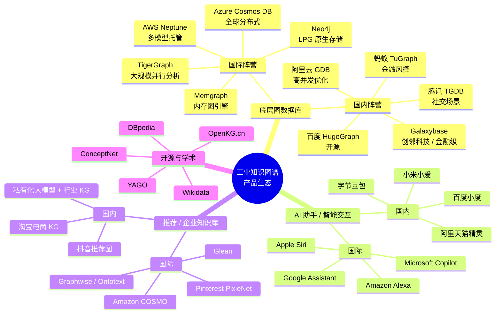
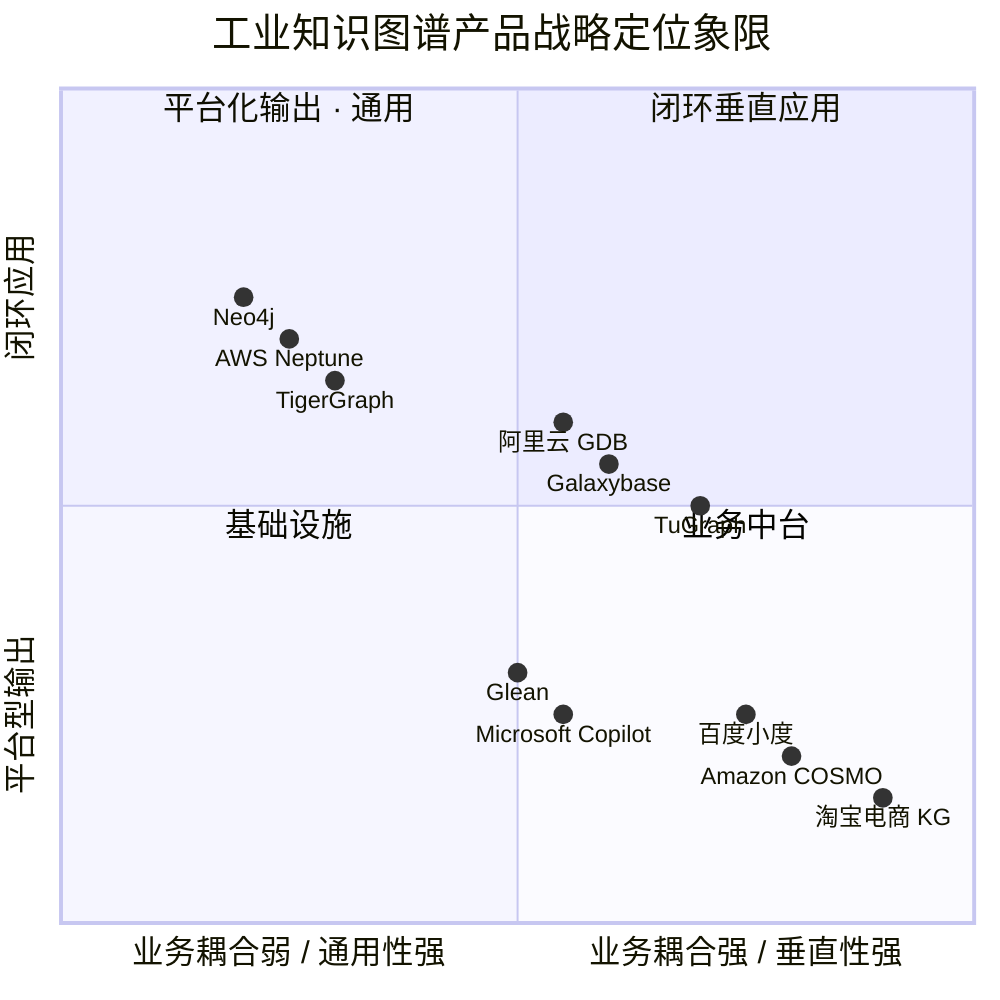
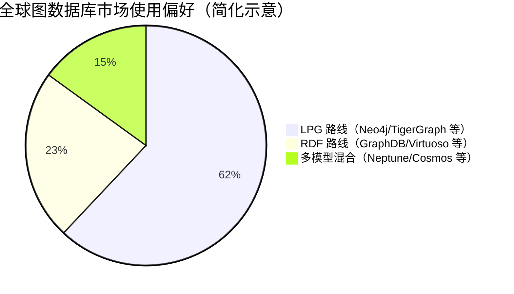
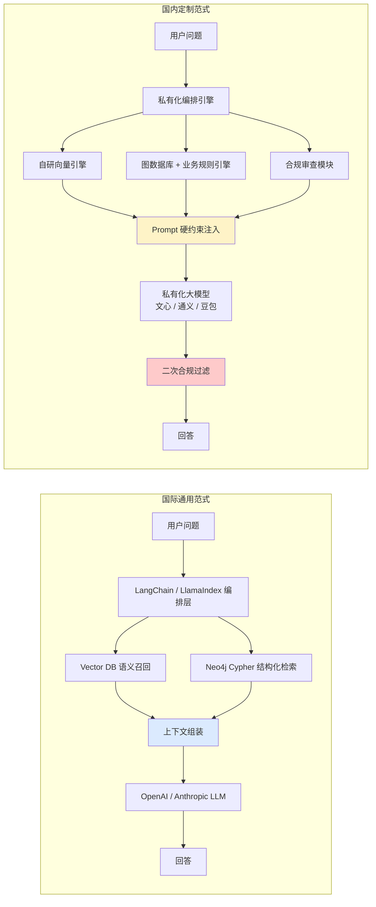

# 第二章 · 工业界知识图谱产品的横向对比：智能助手、推荐系统与知识库的生态博弈

> 本章从横向维度审视全球工业界当下最具代表性的知识图谱产品与生态位，剖析国内外战略路径差异，并延伸解读 LPG / RDF 两条技术路线的博弈与 GQL 标准化的意义。
>
> **前置阅读**：[`01_知识图谱的纵向分析.md`](./01_知识图谱的纵向分析.md)

---

## 2.1 竞争格局概述

在当前的工业应用生态中，知识图谱已经彻底超越了单纯底层数据库的角色，演变为了支撑高级人工智能助手、个性化推荐系统以及企业级智能知识库的核心引擎。全球范围内的科技巨头与初创公司在知识图谱产品的战略定位、架构设计和应用生态上呈现出显著的差异化发展路径，形成了各具特色的竞争格局。

### 可视化 · 工业界 KG 产品生态全景思维导图

---

## 2.2 三维度横向对比

为了更加清晰地展现当前工业界成熟产品的特性与差异，以下从**底层基础设施**、**面向消费终端的 AI 助手**以及**企业级智能推荐与知识库**三个核心维度，对国内外代表性产品进行详尽的横向对比分析。

| **分析维度** | **国际市场代表性产品与生态** | **国内市场代表性产品与生态** | **核心差异与技术路线演进对比** |
|--------------|------------------------------|------------------------------|--------------------------------|
| **底层图数据库与云原生平台** | **Neo4j**：作为全球市场占有率最高、生态最完善的原生图数据库，主打极其优化的原生图存储和直观的 Cypher 查询语言，拥有丰富的图数据科学算法库（GDS）。 **AWS Neptune / Azure Cosmos DB**：全球顶级云厂商提供的托管型图数据库服务，具有多模型支持能力（兼容 RDF 与 LPG 属性图模型），并与云端各类 AI 服务深度集成。 **TigerGraph**：专注于企业级大规模并行图分析，其底层采用分布式架构，适用于极高吞吐量的复杂反欺诈和推荐网络分析。 | **阿里云 GDB (Graph Database)**：深度集成于阿里云生态，底层针对高并发读写和海量关系网络进行了特殊优化，支撑了阿里经济体内部极为庞大的业务需求。 **Galaxybase（创邻科技）**：作为国内图数据库的代表，主打金融级的分布式高并发处理能力，同时极度契合国内信创合规和数据主权要求。 **百度 HugeGraph / 腾讯云图数据库 / 蚂蚁 TuGraph**：基于开源生态或自研引擎，服务于自身社交、搜索、金融风控及云客户的通用图计算场景。 | **国际厂商**的产品战略更侧重于打造通用型、标准化、全球化的底层基础设施，通过推动如 GQL 等标准化查询语言、提供完善的开发者工具链和丰富的算法库来巩固其市场统治力。 **国内厂商**的发展路径则带有鲜明的"业务驱动"色彩，其底层引擎往往是在经历过"双十一"购物节、微信海量社交网络等极端流量洪峰的洗礼后，才将内部成熟的平台能力输出为云服务。因此，国内产品在极致的高并发处理、横向扩展能力以及满足本土化数据安全合规要求方面展现出了更强的适应性。 |
| **面向终端的 AI 助手与智能交互** | **Apple Siri / Amazon Alexa / Microsoft Copilot**：作为全球最为普及的智能助手，它们在底层深度依赖规模庞大的通用常识知识图谱。通过将用户的语音或文本指令映射到图谱实体，进行复杂的意图识别与跨领域推理，支持多轮对话、上下文保持及任务自动化执行。 | **百度"小度" / 小米"小爱同学" / 阿里"天猫精灵"**：这类国内产品深刻嵌入了本土的智能家居和移动互联网生态。其背后的知识图谱不仅涵盖百科知识，更深度融合了本地生活服务、垂类内容分发（如音乐、短视频）以及智能硬件控制协议。 | **共同点**：均采用"语言模型 + 知识图谱"的双驱架构，利用图谱补全模型在具体事实上的短板。 **差异点**：**国际产品**在办公协同、跨系统应用集成（如微软 Copilot 在 Microsoft 365 体系内的深度穿透）和多语种跨文化理解上更为成熟。 **国内产品**则在 C 端消费市场的渗透率达到了前所未有的高度，其背后的知识图谱构建更加侧重于 O2O（线上到线下）生活服务链路的打通与泛娱乐内容的精准分发。 |
| **智能推荐系统与企业知识库** | **Amazon COSMO**：亚马逊开发了 COSMO 框架，利用大语言模型从海量用户购买行为和商品共现数据中挖掘隐式常识知识，通过 `usedFor / capableOf / isA / cause` 四类关系与人工标注 Critic 过滤，构建了深度融合商品功能、目标受众与使用场景的常识知识图谱，极大地优化了长尾查询和复杂场景下的个性化商品推荐（下游任务最高提升 60%）。 **Glean / Graphwise（Ontotext）**：作为企业级知识库管理与搜索的先驱，通过构建企业专属知识图谱（涵盖文档、工单、代码库及员工人际关系），结合混合检索架构，为企业内部的大模型助手提供无幻觉、带权限控制的上下文依据。 | **淘宝/京东智能推荐体系 / 抖音推荐算法**：在电商与短视频领域，国内大厂将多模态知识图谱（MMKG）与超大规模的用户行为图网络深度融合，通过图神经网络（GNN）对用户兴趣漂移进行毫秒级计算，实现了多模态内容（图文、短视频、直播）的极致匹配分发。 **传统行业知识库中台**：国内大量金融、电力、医疗机构正基于私有化部署的大模型，结合自建的行业知识图谱，构建深度的企业级知识库助手，以替代传统的基于关键字的搜索引擎。 | **国际应用**在制药、金融反欺诈以及复杂的 B2B 知识管理领域，其商业化产品和实施方法论更为标准化和体系化，注重生态协同与数据资产治理。 **国内应用**则在依靠巨大流量变现的电商导购和短视频分发端，其底层的图驱动推荐算法在多模态理解、实时计算延迟优化以及兴趣挖掘深度上，已经达到了极高的世界领先水平。 |

---

## 2.3 定位象限：国内外产品的战略坐标

**解读**：
- **左上角（平台化通用）**：国际厂商 Neo4j、Neptune、TigerGraph 主导，对外输出标准化图数据库能力；
- **右下角（闭环垂直）**：国内电商、搜索、生活服务巨头占据，图谱是自身业务飞轮的一部分而非独立商品；
- **中间带（业务中台）**：国内云厂商的图数据库服务兼具平台与垂直属性，是自身电商/金融业务沉淀后的对外输出；
- **右上角（闭环垂直但向外赋能）**：蚂蚁 TuGraph 这类起家于自身金融风控、之后开源输出的引擎，位置特殊。

---

## 2.4 深化：LPG vs RDF 路线之争与 GQL 的统一之路

从上述横向对比可以清晰地看出，将知识图谱作为大模型外挂知识库（即 GraphRAG 架构）已经成为全球工业界共同探索的终极范式。在国际生态中，得益于 LangChain、LlamaIndex 等开源编排框架的快速迭代，像 Neo4j 这样的图数据库厂商已经建立起了极其成熟、流水线化的工作流。它们通过结合专属的向量数据库（Vector Database），完美实现了"稠密向量语义召回 + 知识图谱结构化检索"的双路融合检索机制。相较之下，国内的互联网巨头由于面临更为复杂的业务环境与严苛的合规审查，往往倾向于采用重度定制的自研混合检索架构。在这些架构中，知识图谱不仅仅提供补充信息，其精确的推理结果往往被作为大模型提示词（Prompt）工程中的硬性约束条件，以此从根本上阻断大型语言模型在严肃商业场景中可能产生的合规风险与"幻觉"灾难。

但在这些表层差异之下，一个更深刻的技术分歧长期存在——**Labeled Property Graph（LPG，标签属性图）与 Resource Description Framework（RDF，资源描述框架）两条图数据模型路线的博弈**。

### 2.4.1 两条路线的本质差异

| 维度 | **LPG（标签属性图）** | **RDF（资源描述框架）** |
|------|----------------------|------------------------|
| **代表产品** | Neo4j、TigerGraph、Neptune (LPG 模式)、JanusGraph | GraphDB（Ontotext）、Virtuoso、AllegroGraph、Stardog、Neptune (RDF 模式) |
| **核心建模单元** | 节点 / 关系 / 属性（均可附加键值对） | 主谓宾三元组 (subject, predicate, object) |
| **唯一标识** | 内部 ID（可自定义业务主键） | URI / IRI（全球唯一） |
| **Schema 机制** | 松散 Schema，可后验补齐 | 严格本体（OWL）、开放世界假设 |
| **查询语言** | Cypher、Gremlin、GSQL | SPARQL |
| **推理能力** | 依赖应用层 / 嵌入模型 | 原生 OWL / SWRL 规则推理 |
| **工业优势** | 开发体验好，Schema 灵活，性能优 | 跨组织互联、语义严谨、本体可复用 |
| **典型场景** | 电商推荐、社交网络、反欺诈 | 生物医药、政府数据互联、出版业 |

### 2.4.2 市场占比与应用偏好

LPG 路线在工业界占据主流，核心原因是**开发体验友好、Schema 迭代成本低**；而 RDF 在制药、出版、政府开放数据等需要**跨组织语义互联**的领域依然不可替代。

### 2.4.3 GQL：国际标准统一两大阵营

**二零二四年四月**，ISO/IEC 正式批准并发布了 **ISO/IEC 39075:2024 Graph Query Language (GQL)**，这是 40 年来继 SQL 之后第二个被 ISO 正式采纳的数据库查询语言国际标准。GQL 以 Cypher 为语法基础（Neo4j 主导贡献），同时兼容 LPG 与 RDF 两类模型的查询诉求。这一标准化浪潮的产业意义深远：

1. **消除锁定风险**：企业不再担心选择 Neo4j、TigerGraph、Neptune 之一后被深度绑定；
2. **加速人才流动**：开发者一次学习 GQL，可在多平台间无缝迁移；
3. **推动 RDF / LPG 融合**：多模型图数据库（如 Neptune、Cosmos DB）得以用统一语言服务两类场景；
4. **倒逼国内厂商对标**：阿里 GDB、Galaxybase、TuGraph 等均已启动 GQL 兼容适配工作。

---

## 2.5 深化：GraphRAG 架构在国内外的落地差异

**关键差异**：国内范式普遍多一层**合规审查模块**（对应广告法、医疗广告、金融表述等监管要求），且倾向于将 KG 推理结果作为 **硬约束** 而非 **软提示** 注入 Prompt，以在最大程度上规避内容安全事故。

---

## 2.6 本章小结

全球知识图谱产品呈现出**"国际重平台化、国内重业务闭环"**的路线分化，底层技术路线上**LPG 占主流但 RDF 在垂直领域不可替代**，而二零二四年 ISO/IEC 正式发布的 **GQL 标准**首次为两大阵营提供了语言层面的统一契机。在 GraphRAG 架构的落地上，国际生态依托开源编排框架（LangChain / LlamaIndex）形成标准化流水线，国内则以"私有化 + 合规前置"为核心特征走出定制化路径。

下一章，我们将进入工程细节，剖析**多模态资源如何被映射到图谱结构**、**增量更新如何平衡成本与一致性**、**节点删除如何避免级联灾难**这三大当代 KG 工程的真正难点。

---

**上一章**：[`01_知识图谱的纵向分析.md`](./01_知识图谱的纵向分析.md) · 知识图谱的纵向分析
**下一章**：[`03_多模态知识图谱结构设计.md`](./03_多模态知识图谱结构设计.md) · 多模态知识图谱的结构设计与增量工程演进实践
