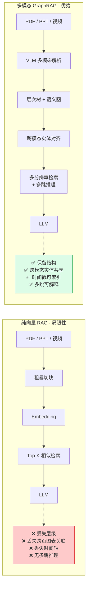
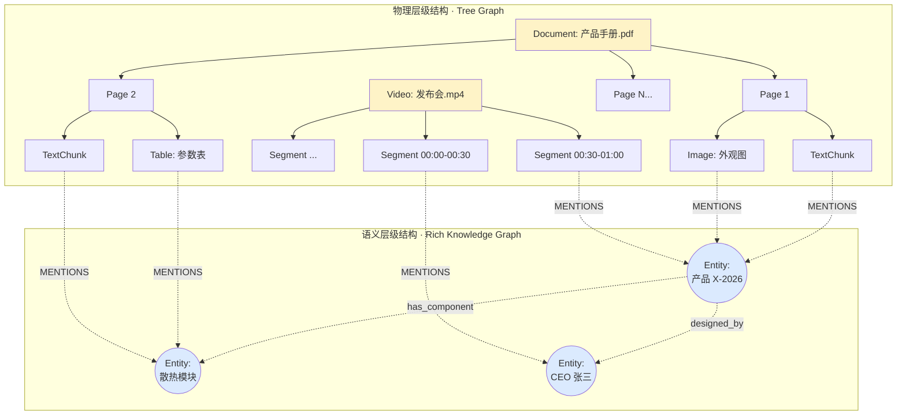
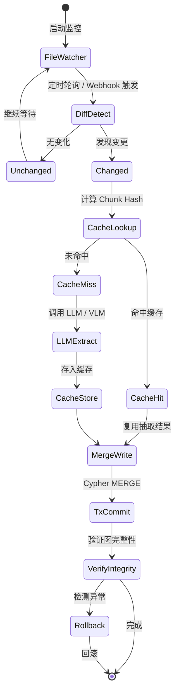
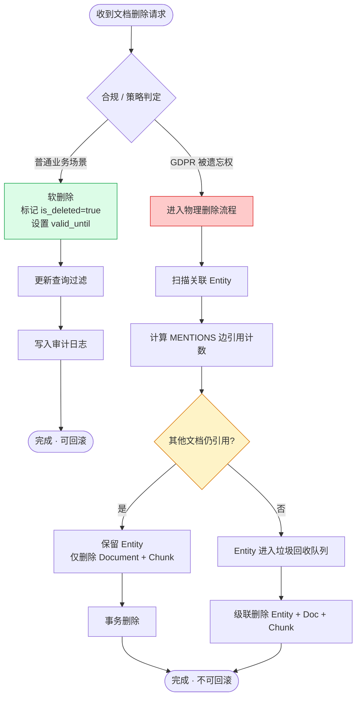

# 第三章 · 多模态知识图谱的结构设计与增量工程演进实践

> 本章直面工程实战：当输入不再是纯文本，而是 PDF、PPT、学术报告、培训视频时，图谱该如何设计？当知识库持续演进时，如何避免每次都做全量重建？当数据被废弃时，如何安全删除而不破坏图谱全局结构？
>
> **前置阅读**：[`01_知识图谱的纵向分析.md`](./01_知识图谱的纵向分析.md)

---

## 3.1 问题背景：为何纯向量 RAG 不够用

随着企业知识管理需求的全面升级，AI 助手与智能推荐系统所摄取的信息源早已不再局限于纯文本，而是涵盖了 PDF 文档、PPT 幻灯片、学术报告以及业务培训视频等海量多模态（Multi-modal）资源。传统的单一向量检索技术在处理此类资源时暴露出致命缺陷：它会将文档强制撕裂为孤立的文本块，完全丢失了文档内在的层级树状结构、跨页图表间的逻辑关联，以及音视频流中极为关键的时间维度语义。因此，构建具有空间与时间表达能力的**多模态知识图谱（MMKG）**，并将其融入 GraphRAG 架构，成为了当前人工智能工程界公认的最佳实践方案。

### 可视化 · 纯向量 RAG vs 多模态 GraphRAG



---

## 3.2 适配多模态资源的混合图结构设计

针对复杂的多模态文档输入，最优的图结构设计策略是摒弃单一模式，采用结合了**层次树状图（Tree Graph）**与**富文本语义图谱（Rich Knowledge Graph, RKG）**的混合嵌套模型。这种融合架构既完美复刻了文件的物理承载形态，又在底层实现了跨越介质的深层次语义互联。

### 3.2.1 物理层级结构（Document Hierarchy & Topology）

在图谱中，首先必须忠实映射文档的物理骨架。对于一个 PDF 或 PPT，图谱会定义顶层的 `Document` 节点。从该节点出发，通过 `HAS_PAGE` 或 `HAS_SLIDE` 关系边，向下分裂出 `Page` 或 `Slide` 节点。进一步向下，页面被解析算法切割，生成叶子节点，如 `TextChunk`（文本块）、`Image`（图像内容）或 `Table`（结构化表格）。对于视频资源，则通过 `HAS_SEGMENT` 关系分解为带有严格时间戳（Timestamp）属性的 `VideoSegment` 节点。节点之间通过 `NEXT_CHUNK` 边相连以保持阅读或播放顺序。这种极其严密的树状层级结构，为后续 RAG 阶段的"多分辨率检索"（Multi-resolution Retrieval）提供了物理基础：AI 系统可以自由地"放大"焦点以读取某个具体的视频帧特征，也可以顺着关系边"缩小"视野，提取整个 PPT 章节的全局摘要。

### 3.2.2 跨模态实体语义关联（Semantic Interconnection）

物理切割只是第一步，多模态知识图谱的灵魂在于语义聚合。系统必须确保文本段落、图像特征和视频帧不能作为孤立的孤岛存在。通过调用视觉-语言大模型（VLM，如 GPT-4V、Claude Vision、Gemini Vision）和先进的信息抽取算法，系统从各种模态节点中提取出共性的抽象实体节点（`Entity`，例如某个特定的"化学分子式"、"某型号产品"或"业务流程"）。随后，无论是包含该产品文字描述的 `TextChunk`，还是展示该产品 3D 渲染图的 `Image` 节点，抑或是高管在视频演示该产品的 `VideoSegment`，都会通过统一的 `MENTIONS` 关系边链接到这个核心的 `Entity` 节点上。

这种架构（通常被称为 **MMGraphRAG**，参见 arXiv:2507.20804）赋予了人工智能前所未有的跨模态多跳推理能力。在 DocBench 基准上，MMGraphRAG 达到 76.8% 的整体准确率，远超 NaiveRAG 的 59.5% 与纯文本 GraphRAG 的 52.3%，在多模态问题上更是达到 88.7%。例如，当用户提问"根据大会视频的演示和这本 PDF 操作手册，总结该产品的设计缺陷"时，大模型可以通过核心实体节点作为桥梁，瞬间跨越视频特征和文本指令的鸿沟，提供出精确的综合研判。

### 可视化 · 多模态混合图结构



物理层（黄色）与语义层（蓝色）通过 `MENTIONS` 关系边实现跨模态聚合——**这正是"多分辨率检索 + 多跳推理"的物理基础**。

---

## 3.3 构建过程中的工程问题及解决方案

在将上述精妙的结构落地时，工程团队会面临一系列棘手的技术挑战。

### 3.3.1 跨模态的实体对齐与消歧

PDF 文本中提及的"董事长张三"、PPT 组织架构图中的职位块、以及现场演讲视频中识别出的特定人脸，系统如何确认它们指代同一个物理世界中的实体？如果无法对齐，图谱将充满冗余和断层的节点。目前的成熟解决方案是引入多模态融合管道（如 **Unstructured**、**Docling**、**MarkItDown** 等专门的文件解析引擎）。

在图谱构建阶段，不直接进行字符级别的合并，而是为每个提取特征建立一个临时的 `Semantic_Concept` 层。将文本的语义 Embedding 向量和图像经过对比学习模型生成的视觉 Embedding 向量投射到同一高维空间，利用 K-Nearest Neighbor（K-近邻）算法计算跨模态特征的余弦相似度，从而发现潜在的同一性关联，最后利用大语言模型的逻辑判断能力进行聚类合并（弱连通分量合并），彻底解决消歧难题。

### 深化：主流视觉语言模型（VLM）能力对比

| 模型 | 发布方 | 核心特性 | 多模态图谱场景适配性 | 成本水平 |
|------|--------|---------|---------------------|---------|
| **CLIP** | OpenAI (2021) | 图文对比学习，Embedding 空间对齐 | 跨模态检索、弱对齐，仍是向量层首选 | 低（开源可自部署） |
| **BLIP-2** | Salesforce (2023) | Q-Former 桥接 LLM，支持多轮视觉问答 | 图像描述生成、VQA | 中 |
| **GPT-4V / GPT-4o** | OpenAI (2023-2024) | 原生多模态，图表理解强 | 复杂表格 / 架构图解析 | 高（API 调用费） |
| **Claude 3.5/4.x Vision** | Anthropic | 长文档+图混合推理，幻觉率低 | 法律 / 医学文档图文混排 | 中高 |
| **Gemini Vision** | Google | 视频原生理解，时间戳感知 | 长视频分段语义抽取 | 中 |
| **Qwen-VL / InternVL** | 阿里 / 上海 AI Lab | 中文场景强，开源可私有化 | 国内合规场景首选 | 低（私有部署） |

**选型建议**：
- **对齐层（Embedding）**：CLIP 及其中文变体（Chinese-CLIP）作为基座，性价比最高；
- **解析层（Parsing）**：Claude Vision / GPT-4V 用于复杂工程图与财务表格；
- **视频层**：Gemini Vision 或 Qwen-VL 做 Segment 级内容抽取。

### 3.3.2 复杂图表与深层嵌套结构的提取缺失

在工业界，包含工程图纸、多重嵌套财务表格的 PDF 经常被传统 OCR 引擎粗暴地解析为一团乱码文本，完全丢失了图表本身的关联价值。为此，先进的解决方案是部署具备视觉推理能力的专用 VLM 流水线。对于表格，不应仅作文本存储，而应将其转化为由 `Row`、`Column` 和 `Cell` 节点构成的子图，用 `HAS_VALUE` 关系显式表达表头与数值的对应关系；对于架构图，则生成深度的图像语义描述（Caption），并连同其高维向量特征一并存储为节点属性，确保视觉逻辑不被丢失。

---

## 3.4 知识图谱的增量更新与安全删除工程实践

当企业外部的知识库发生演进，如图谱中引用的某个政策 PDF 被修订，或有新的产品视频上传时，考虑到大模型抽取节点和关系所需的高昂 Token 成本与时间开销，每次变动都进行图谱的全量重建在工程上是绝对不可接受的。必须建立一套具备原子性且不会破坏现有图谱全局结构的增量管理机制。

### 深化：增量 vs 全量重建的成本量化对比

| 维度 | 全量重建 | 增量更新（本章方案） |
|------|---------|---------------------|
| **单次 Token 成本** | 100%（假设基准） | 3%–8%（仅处理变更文件） |
| **单次耗时** | 8–24 小时（万级文档） | 10–30 分钟 |
| **一致性风险** | 全库切换窗口长，读写冲突高 | 单文档事务，风险可控 |
| **对业务可用性影响** | 需维护窗口或双库切换 | 在线零停机 |
| **审计追踪能力** | 难（快照更替） | 强（变更日志完备） |
| **适用场景** | Schema 大改 / 季度级基线 | 日常增量（默认方案） |

### 3.4.1 增量更新（Incremental Update）的底层逻辑

增量更新的核心理念在于实现**持续状态驱动（Persistent-State-Driven）**机制以及**精细粒度的增量计算**。

**第一步 · 差异检测**：在数据摄取端，系统不应盲目读取所有文件。工程上需部署监控代理，定期轮询数据湖（如 AWS S3 或企业网盘），通过比对文件的最后修改时间（Last Modified Time）或计算数字哈希值（SHA-256），精准捕获产生变动的文件集合（Diff Detection）。仅将发生改变的文件推入后续的解析流水线。

**第二步 · 抽取缓存**：在调用大模型执行知识抽取时，强烈建议引入"抽取缓存（Extraction Cache）"机制。以 `(文档切片 Hash, 提示词版本号, 抽取 Schema 版本)` 作为联合缓存键，如果某个章节的内容并未修改，系统将直接命中缓存，复用之前提取的节点和关系，从而避免了无效的昂贵 API 调用。

**第三步 · MERGE 写入**：最终，在向图数据库写入数据时，绝对不能使用简单的清空插入策略，而是必须严格依赖具备业务主键的"合并/更新（Upsert/MERGE）"操作。例如在 Cypher 中依据预先设计的唯一 `document_id` 或实体 `name` 进行匹配：

```cypher
// 伪代码：增量 Upsert 示例
MERGE (e:Entity {canonical_id: $entity_id})
ON CREATE SET e.created_at = timestamp(), e.name = $name
ON MATCH SET e.updated_at = timestamp(), e.name = coalesce($name, e.name)
```

如果有属性更新，则覆盖旧属性；如果有新关系，则增量拉出新边；对于未触及的实体，数据库引擎执行"空操作（no-op）"。这种机制将对底层数据库的写放大（Write Amplification）效应降至最低，同时完美保持了知识图谱的稳定性。

### 可视化 · 增量更新状态流



### 3.4.2 节点与文档删除（Deletion）的防御性工程

知识图谱是一种高度相互依存的拓扑网络，因此数据删除往往比写入更具风险。直接对某个被弃用的文档节点执行物理删除（Hard Delete），极易引发毁灭性的级联反应。例如，强制删除某篇医学论文的节点及其所有子节点，可能会导致该论文首次提出的某个"稀有罕见病"概念节点变成孤立无援的"孤儿节点"；更严重的是，如果这个概念节点同时被其他仍在使用的医疗指南文档所链接，粗暴的物理删除将直接导致其他指南的推理上下文发生断裂。

#### 主策略：逻辑删除（Soft Delete）与版本化控制

在成熟的工业架构中，首选的策略是实施**逻辑删除（Soft Delete）与版本化控制机制**。当一个文件被废弃时，系统并不会从磁盘抹除其数据，而是修改其对应图谱节点的属性，例如设置 `is_deleted = true` 或者附加一个 `valid_until = [时间戳]` 属性。随后，在所有的上层查询语句（如 Cypher）中，强制加入过滤条件隐藏这些被标记的节点。这不仅避免了物理层面的锁争用和大规模树重构的性能冲击，更保留了极其关键的审计追踪（Audit Trail）能力，允许系统随时回滚错误删除。

**深化 · 工业界的软删除时间窗约定**：

| 行业 | 软删除保留窗口 | 进入物理删除队列的条件 | 依据 |
|------|---------------|----------------------|------|
| **金融 / 银行** | 7 年 | 监管保留期到期 + 无外部引用 | 巴塞尔协议、《商业银行法》 |
| **医疗** | 15–30 年 | 病患记录法定保存期 | HIPAA / 国内《医疗机构病历管理规定》 |
| **通用互联网 B2C** | 30–90 天 | 用户删除请求 + 冷却期 | GDPR 第 17 条、个人信息保护法 |
| **企业内部文档** | 180–365 天 | 内部策略 + 无活跃引用 | 企业自定义 |

#### 副策略：物理删除的引用计数与垃圾回收

倘若出于严格的数据隐私合规（如 GDPR 的被遗忘权）必须执行彻底的物理删除，工程上则必须引入**引用计数（Reference Counting）与垃圾回收（Garbage Collection）机制**。在删除一个 `Document` 节点及其私有的 `Chunk` 节点之前，系统必须扫描它们连接到的所有公共 `Entity` 概念节点。只有当检测到某个 `Entity` 节点与其他所有存活 `Chunk` 之间的 `MENTIONS` 引用边数量已经归零（即世界上再没有任何有效文档提及该知识点），系统才可以安全地在事务中将其连同文档一起彻底物理消除。这种防御性的删除逻辑确保了共享知识实体的完整性，防止了图谱结构出现残缺和碎片化。

### 可视化 · 防御性删除决策流



#### 进阶：链源数据事件流（LDES）模式

部分先进架构采用**链源数据事件流（Linked Data Event Stream, LDES）**模式，将所有的删除和修改操作编码为**不可变的只追加（Append-only）事件日志**，允许消费端异步、非阻塞地重放事件以达到最终的图结构一致性。LDES 由欧盟 SEMIC（Semantic Interoperability Community）基于 W3C TREE 规范制定，核心语义包括：

- `ldes:EventStream` — 事件流主体；
- `tree:member` — 每一个不可变事件；
- `ldes:versionOf` — 记录实体版本指针；
- `tree:Relation` — 用于分页与时间窗索引。

这种架构特别适合跨组织的图谱互联场景（如政府开放数据、供应链互操作），既保障了审计不可篡改，又支持消费方按需增量拉取。

---

## 3.5 本章小结

多模态知识图谱是下一代企业 RAG 的事实标准，其核心设计哲学是**"物理层级 + 语义图谱"的双层混合架构**。工程上需要严肃对待：（1）跨模态实体对齐靠 CLIP/VLM 双塔 + LLM 聚类；（2）增量更新靠 Diff + 抽取缓存 + MERGE Upsert；（3）删除靠软删除 + 引用计数 + GC，或 LDES 事件日志——**任何"清库重建"都是业余水平的表现**。

下一章，我们将从"上层结构设计"下沉到"底层存储引擎"，剖析 Neo4j 这一原生图数据库的核心技术，以及 Cypher 语句的工程优化准则。

---

**上一章**：[`02_工业界产品横向对比.md`](./02_工业界产品横向对比.md)
**下一章**：[`04_Neo4j技术剖析与Cypher优化.md`](./04_Neo4j技术剖析与Cypher优化.md) · 原生图数据库 Neo4j 的技术剖析与 Cypher 工程优化准则
