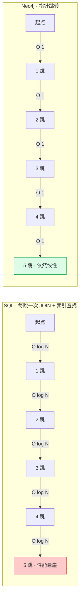
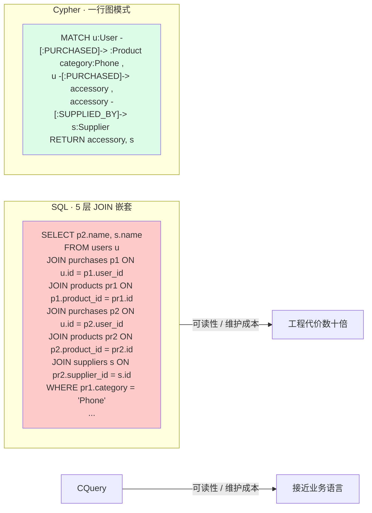
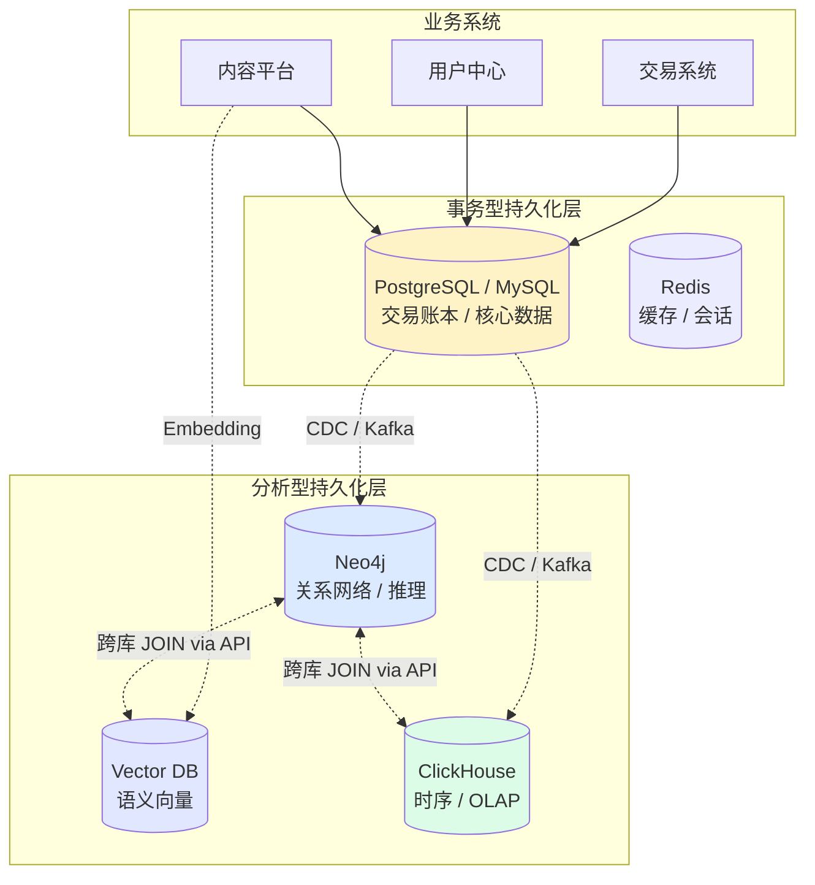
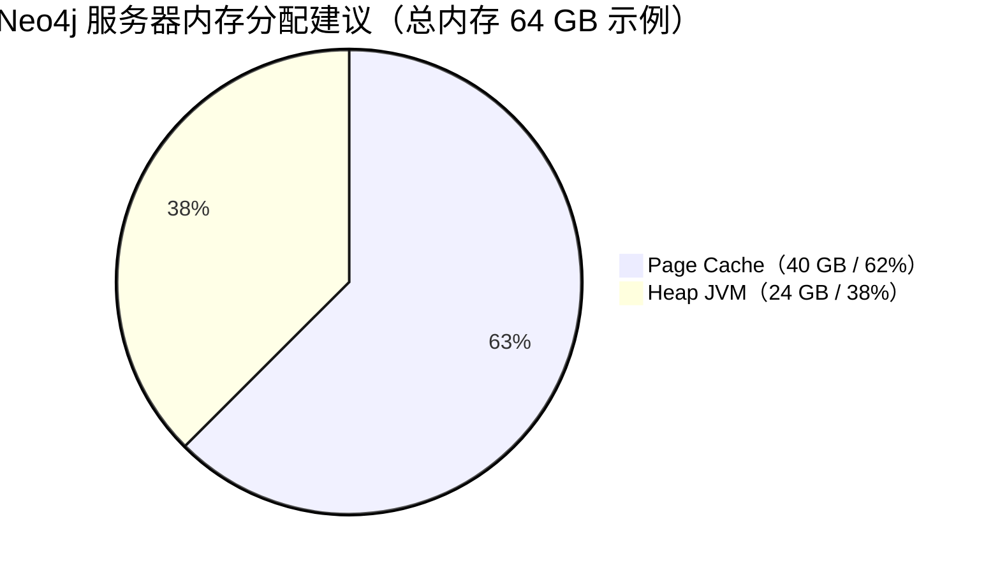

# 第四章 · 原生图数据库 Neo4j 的技术剖析与 Cypher 工程优化准则

> 本章聚焦底层存储引擎：为什么在高跳数关联查询中 Neo4j 对 SQL 具有碾压性的性能优势？Cypher 与 SQL 在表达力上差异何在？资深工程师应如何优化 Cypher 查询、调优 Page Cache、配置 HNSW 向量索引？
>
> **前置阅读**：[`03_多模态知识图谱结构设计.md`](./03_多模态知识图谱结构设计.md)

---

## 4.1 为何底层存储引擎是 GraphRAG 的生命线

在将知识图谱从理论模型转化为可支撑亿级实体的生产系统时，底层存储引擎的选择至关重要。作为目前全球生态最繁荣的原生图数据库，Neo4j 与传统的基于 SQL 语系的关系型数据库（RDBMS，如 MySQL、Oracle）在底层存储理念、查询架构以及工程性能调优上存在着本质的代差。理解这一代差，是决策图数据库选型与 GraphRAG 上线稳定性的前提。

---

## 4.2 Neo4j 的核心技术特性与 SQL 架构的深度对比

### 4.2.1 底层存储机制：免索引邻接（Index-Free Adjacency）

在传统的关系型数据库中，数据分布在互相隔离的二维表中。当需要查询复杂关系（例如：找出所有买过手机的用户，他们还购买了哪些关联配件，并且这些配件由哪个供应商生产）时，SQL 必须通过外键进行昂贵的 `JOIN` 操作。这要求数据库在执行时，反复通过庞大的全局 B+ 树索引去定位匹配的行，其时间复杂度往往在 $O(N \log N)$ 级别。随着关系跳数（Multi-hop）的增加，SQL 数据库的内存消耗和响应时间会呈爆炸式的指数级恶化，最终导致查询超时甚至系统崩溃。

相比之下，Neo4j 在物理硬盘和内存中直接将节点与节点之间的连接关系，以真实物理内存地址（Pointers）的形式进行硬绑定。这就意味着，在 Neo4j 中从一个节点遍历到其邻居节点，完全不需要进行全局的索引查找，而是直接执行一次 $O(1)$ 常数级别的内存指针跳跃。在处理高度互联的深度图谱遍历和路径分析任务时，Neo4j 展现出了对关系型数据库碾压式的绝对性能优势。

### 可视化 · 多跳遍历的性能代差



### 深化 · 基准测试量化对比（典型反欺诈场景 · 百万节点）

| 查询深度 | MySQL 响应时间 | Neo4j 响应时间 | 加速比 |
|---------|---------------|---------------|--------|
| 1 跳（邻居查询） | ~50 ms | ~10 ms | 5× |
| 2 跳（朋友的朋友） | ~400 ms | ~30 ms | 13× |
| 3 跳（关联团伙） | ~4 秒 | ~60 ms | 67× |
| 4 跳 | ~30+ 秒 | ~120 ms | 250× |
| 5 跳 | 通常超时 | ~200 ms | > 1000× |

（注：数据级别依硬件配置与索引策略而异，但**代差结构稳定**。）

### 4.2.2 查询语言哲学：Cypher vs SQL 的表现力

SQL 的设计初衷是处理表格代数，而 Cypher（Neo4j 的查询语言，现已成为 ISO/IEC 39075:2024 GQL 国际标准的基础）则是专为表达复杂图模式而生的声明式语言。Cypher 的独特之处在于它采用了直观的 ASCII Art 艺术字风格来描绘数据结构。例如，使用 `()` 代表节点，使用 `-->` 代表关系的流向。

前面提到的那个复杂的购买推荐场景，在 Cypher 中只需要极其直观且符合人类思维的一行代码：

```cypher
MATCH (u:User)-[:PURCHASED]->(:Product {category:"Phone"}),
      (u)-[:PURCHASED]->(accessory:Product),
      (accessory)-[:SUPPLIED_BY]->(s:Supplier)
RETURN accessory, s
```

同样的逻辑在 SQL 中往往需要数十行代码，嵌套多个 `INNER JOIN` 和复杂的子查询，不仅可读性极差，后期的维护成本也极其高昂。

### 可视化 · Cypher 与 SQL 的表达风格对比



### 4.2.3 应用边界与权衡：选对工具而非迷信工具

客观而言，Neo4j 并非在所有场景下都能取代 SQL。当业务需求涉及大规模的全表扫描、无关联的单表批量更新（简单的 CRUD），或者需要进行全维度的复杂数学聚合运算（如统计全国所有用户的年平均消费额）时，经过数十年极度优化的关系型数据库（特别是采用列式存储或底层 C++ 编写的引擎如 MariaDB、ClickHouse）依然具备显著的速度优势。

因此，成熟的工业级架构大多采用**多语种持久化（Polyglot Persistence）策略**：将结构化的交易流水和核心账本保存在 SQL 数据库中，而将复杂的社交网络、推荐关系和 AI 知识层存储在 Neo4j 中，两者通过微服务或流式架构实现数据的双向同步与互补。

### 可视化 · Polyglot Persistence 架构



---

## 4.3 Cypher 语句的资深工程优化实践

为了充分释放 Neo4j 的极致性能，资深工程师在编写 Cypher 查询时必须摒弃 SQL 时代遗留的定式思维，严格遵循一系列针对图引擎内部特性的性能调优（Performance Tuning）准则。

### 4.3.1 必须实施严格的参数化查询（Parameterization）

Neo4j 的查询计划器（Query Planner）在接收到一条新的 Cypher 语句时，会消耗大量的 CPU 资源去解析语法、评估统计数据并生成最优的执行树。为了避免这种昂贵的开销，Neo4j 内部实现了**两级查询缓存池（Query Cache）**，可以复用最近的执行计划：

1. **String Cache**：基于原始 Cypher 文本的哈希。同一文本直接命中。
2. **AST Cache**：基于抽象语法树的归一化哈希。从 Neo4j 5 开始，即使开发者未显式参数化，引擎也会自动尝试把字面量提取为参数，从而让 `WHERE n.id = 123` 与 `WHERE n.id = 456` 命中同一计划。

但这种自动参数化并非万能——如果开发者在代码中通过简单的字符串拼接将具体数值（如 `WHERE n.name = "Alice"`）硬编码到查询中，且混入了不规则空格、大小写混用、注释等干扰，String Cache 极易失效。正确的工程做法是始终使用 Cypher 变量参数（如 `WHERE n.name = $userName`），配合应用程序传递参数字典，从而保证执行计划的完美复用，大幅降低系统延迟。

```cypher
// ✗ 反例：字符串拼接，每次都重新规划
"MATCH (u:User {name: '" + name + "'}) RETURN u"

// ✓ 正例：参数化，命中 String Cache
"MATCH (u:User {name: $name}) RETURN u"  // + params = {name: "Alice"}
```

### 4.3.2 彻底转变对索引（Indexing）的认知

在关系型数据库中，索引是加速表连接的必需品；而在 Neo4j 中，索引的唯一核心使命仅仅是**定位图遍历的起始锚点（Starting Points）**。一旦系统通过索引迅速锁定了起点节点，后续在图谱中成千上万次的关联匹配，全权依赖于原生关系指针的瞬间跳转。

因此，绝不要为关系属性或作为遍历中转站的内部节点盲目建立冗余索引，这只会徒增内存消耗和写入时的更新成本。在实际配置中，应该针对查询入口的高频属性（如实体的 ID、名称）建立 **B-Tree 或 Range 索引**、**全文索引（Full-text Index）**。对于当下的生成式 AI 场景，Neo4j 特别引入了原生**向量索引（Vector Index）**，极大加速了基于大模型生成的稠密语义向量的高效相似度匹配。

### 深化 · Neo4j 向量索引（HNSW）调优参数

Neo4j 的向量索引底层采用 **HNSW（Hierarchical Navigable Small World）**算法。关键参数如下：

| 参数 | 含义 | 推荐值 | 权衡 |
|------|------|--------|------|
| `vector.dimensions` | 向量维度 | 匹配模型（如 OpenAI text-embedding-3-small = 1536） | 需与 Embedding 模型严格一致 |
| `vector.similarity_function` | 相似度函数 | `cosine`（文本）/ `euclidean`（图像） | 与 Embedding 训练目标对齐 |
| `M` | HNSW 每个节点的邻居数 | 16（默认）/ 32（高精度） | 增大 → 精度↑ 内存↑ 构建慢 |
| `efConstruction` | 构建期搜索深度 | 100（默认）/ 200（高精度） | 增大 → 构建慢 召回↑ |
| `ef` | 查询期搜索深度 | 40-100 | 增大 → 查询慢 召回↑ |

创建向量索引的典型语句（Cypher 25）：

```cypher
CREATE VECTOR INDEX entity_embedding IF NOT EXISTS
FOR (e:Entity)
ON e.embedding
OPTIONS { indexConfig: {
    `vector.dimensions`: 1536,
    `vector.similarity_function`: 'cosine'
}}
```

### 4.3.3 对图遍历模式实施强约束，严防"结果爆炸"

知识图谱的数据连通性极高，一条无约束的查询可能在几毫秒内发散出数百万条路径，瞬间榨干服务器内存。开发者在编写路径匹配时，必须明确规定关系的方向与特定类型。绝不能写出类似 `MATCH (n)-[*1..5]->(m)` 这种盲目扫图的灾难性语句——**因为它未指定节点标签、未指定关系类型、未指定方向边界，在大图上会产生笛卡尔式爆炸遍历**。

反之，应使用极其精准的描述：

```cypher
// ✗ 反例：笛卡尔爆炸
MATCH (n)-[*1..5]->(m) RETURN n, m LIMIT 10

// ✓ 正例：标签 + 关系类型 + 方向 + 深度约束
MATCH (c:Customer)-[:PURCHASED*1..3]->(p:Product)
WHERE c.region = $region
RETURN c, p LIMIT 100
```

同时，践行**"尽早过滤（Filter Early）"**原则，在遍历的初期就利用 `WHERE` 子句剔除无效的分支路径，对于不需要深究全貌的探索性查询，必须附带 `LIMIT` 语句强行截断返回规模。

### 4.3.4 深度掌握 `PROFILE` 与 `EXPLAIN` 工具

在将任何复杂的 Cypher 语句推向生产环境之前，资深工程师都会在查询前加上 `PROFILE` 关键字。这一指令不仅会返回数据，还会绘制出底层的真实执行拓扑图，展示每一步操作所消耗的**"数据库命中数"（DB Hits，指代存储引擎进行内存和磁盘查找的抽象工作单元量）**。优化的终极奥义，就是在不改变最终输出结果的前提下，重构查询逻辑（例如优化 `MATCH` 顺序或利用 `CALL` 子查询），系统性地削减整体的 DB Hits 总量。

```cypher
PROFILE
MATCH (u:User {name: $name})-[:FOLLOWS]->(f:User)
RETURN f.name
```

执行后将输出类似：

```
+-----------------------+-------+-------+----------+
| Operator              | Rows  | DB Hits| Time(ms)|
+-----------------------+-------+-------+----------+
| NodeIndexSeek         |     1 |     2 |    0.12  |
| Expand(All)           |   142 |   143 |    0.44  |
| Filter                |   142 |   142 |    0.15  |
+-----------------------+-------+-------+----------+
```

`EXPLAIN` 则仅返回执行计划而不真正运行，适合在无风险的情况下预估成本。

---

## 4.4 深化：Page Cache 与 JVM 调优

监控底层系统的**页面缓存（Page Cache）**配置，确保高频访问的"热数据"能够完全驻留在内存中（保持 95% 以上的命中率），是保障 Neo4j 在生产环境中实现亚毫秒级响应的物理前提。

### 资源分配黄金比例

Neo4j 实例的内存资源应按如下层次合理切分：



**经验规则**：

| 资源项 | 建议比例 | 说明 |
|--------|---------|------|
| **Page Cache** | 占总内存 50%–70% | 存储节点、关系、属性的物理页；应 ≥ 数据集大小的 70% 以保持热命中 |
| **Heap Size** | 占总内存 25%–40% | JVM 对象分配、查询计划、事务缓冲；一般 8 GB–31 GB（超过 32 GB 失去压缩指针优化） |
| **OS / 其他** | 剩余 5%–10% | 操作系统缓存、网络缓冲 |

### GC 参数建议

```bash
# neo4j.conf 片段
server.memory.heap.initial_size=24g
server.memory.heap.max_size=24g
server.memory.pagecache.size=40g

# JVM 参数（G1GC 推荐）
server.jvm.additional=-XX:+UseG1GC
server.jvm.additional=-XX:MaxGCPauseMillis=200
server.jvm.additional=-XX:+ParallelRefProcEnabled
server.jvm.additional=-XX:+UnlockExperimentalVMOptions
server.jvm.additional=-XX:+DisableExplicitGC
```

**关键点**：
- `Xms == Xmx`：避免运行时扩容抖动；
- 堆不要超过 31 GB（压缩 Oops 边界），否则对象指针膨胀；
- 启用 G1GC 并设置 GC 暂停目标 200 ms；
- 冷启动后用常见查询**预热 Page Cache**（Neo4j 提供 `db.prefetch()` 过程）。

---

## 4.5 深化：Cypher 25 与 AI 原生命名空间

值得一提的是，在二零二五年的最新版本中，Neo4j 引入了 `CYPHER 25` 标准以及强大的 **AI 原生命名空间**——全新的 `ai.*` 顶级命名空间将向量生成、文本生成等能力一体化地整合进 Cypher 引擎。

| 新函数 / 过程 | 作用 | 替代的老函数 |
|--------------|------|--------------|
| `ai.text.embed()` | 文本生成向量 Embedding | `genai.vector.encode()`（已废弃） |
| `ai.text.embedBatch()` | 批量向量生成 | `genai.vector.encodeBatch()`（已废弃） |
| `ai.text.completion()` | LLM 文本补全 | — |

一个 GraphRAG 管线现在可以完全在 Cypher 层闭环：

```cypher
// 一条 Cypher 完成：文本 → 向量 → 检索 → 合成
WITH $question AS q
CALL {
  WITH q
  WITH q, ai.text.embed(q, "OpenAI", { token: $token, model: 'text-embedding-3-small' }) AS emb
  CALL db.index.vector.queryNodes('entity_embedding', 5, emb) YIELD node, score
  RETURN collect({text: node.name, score: score}) AS ctx
}
RETURN ai.text.completion(
    "Question: " + q + "\nContext: " + toString(ctx),
    "OpenAI",
    { token: $token, model: 'gpt-4o' }
) AS answer
```

这使得开发者可以**直接在 Cypher 引擎内部一体化地调用大模型接口并生成向量**，避免了以往在业务代码和数据库之间反复搬运数据的沉重网络开销，标志着 Cypher 语言向 **AI 原生计算引擎**的重大跨越。

---

## 4.6 Cypher 优化工程 Checklist

资深工程师在 Code Review 中应对每一条 Cypher 查询逐项核对：

| # | 检查项 | 正例 | 反例 |
|---|--------|------|------|
| ① | **参数化** | `WHERE n.id = $id` | 字符串拼接字面量 |
| ② | **标签收敛起点** | `MATCH (u:User {id:$id})` | `MATCH (u {id:$id})` |
| ③ | **关系类型显式** | `-[:FOLLOWS]->` | `-->` |
| ④ | **方向明确** | `(a)-[:R]->(b)` | `(a)-[:R]-(b)`（双向代价 2×） |
| ⑤ | **跳数上界** | `-[:R*1..3]->` | `-[:R*]->`（无界） |
| ⑥ | **Filter Early** | 在第一个 `MATCH` 就加 `WHERE` | 查询末尾才过滤 |
| ⑦ | **`LIMIT` 保护** | 探索性查询末尾加 `LIMIT 100` | 裸返回 |
| ⑧ | **PROFILE 审计** | 交付前 `PROFILE` 一次，关注 DB Hits | 盲目上线 |
| ⑨ | **避免 `OPTIONAL MATCH` 滥用** | 仅在真正可选的分支使用 | 与普通 `MATCH` 混用 |
| ⑩ | **聚合前投影** | `WITH a, count(b) AS cnt` | 聚合整个 `a` 对象 |

---

## 4.7 本章小结

Neo4j 凭借**免索引邻接、O(1) 指针跳转、Cypher 声明式图模式**三大基石，在多跳遍历场景对 SQL 形成代差级优势；但这并不意味着它能取代 SQL——**Polyglot Persistence** 才是工业级架构的正解。在工程落地上，资深开发者必须熟练掌握**参数化、索引锚点、遍历约束、PROFILE 调优、Page Cache 配置、HNSW 向量索引**六大核心技能。二零二五年 `CYPHER 25` 与 `ai.*` 命名空间的推出，更让 Cypher 一跃成为 **AI 原生的查询计算引擎**，为下一代 GraphRAG 系统提供了前所未有的一体化底座。

下一章，我们将攀登到技术栈的最上层：**如何让大模型智能体与知识图谱深度融合**，剖析 `langchain_neo4j` 框架、LangGraph 状态机工作流与 MCP 协议安全围栏。

---

**上一章**：[`03_多模态知识图谱结构设计.md`](./03_多模态知识图谱结构设计.md)
**下一章**：[`05_Agent与知识图谱深度融合.md`](./05_Agent与知识图谱深度融合.md) · Agent 与知识图谱的深度融合：LangChain 架构与 GraphRAG 核心技术解析
