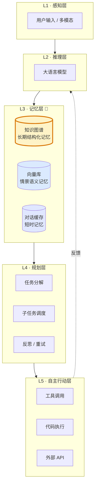
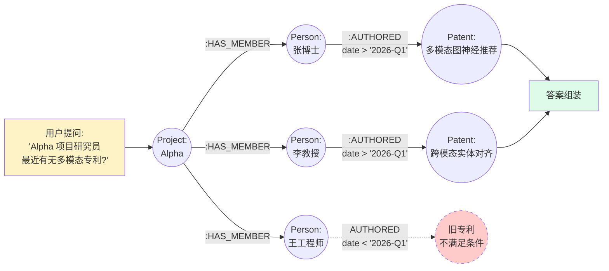
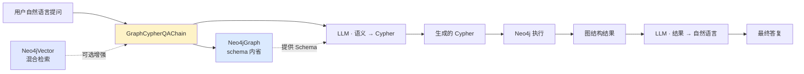
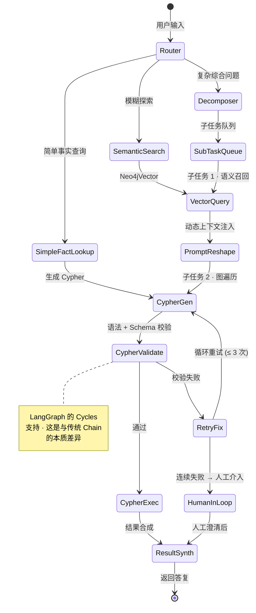
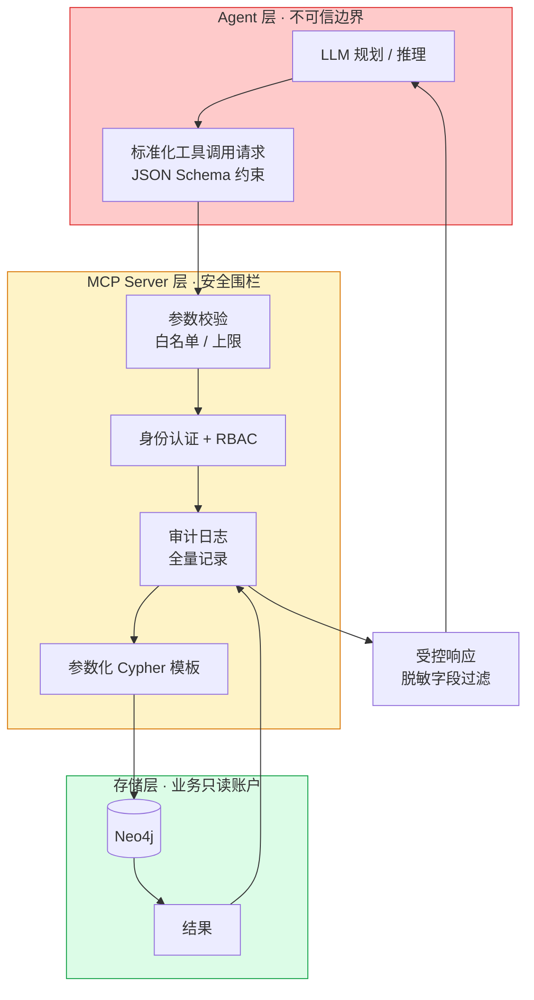

# 第五章 · Agent 与知识图谱的深度融合：LangChain 架构与 GraphRAG 核心技术解析

> 本章是全系列的汇聚点：将前四章的概念、生态、结构、存储能力统一到**智能体（Agent）时代**的完整落地范式中，剖析 `langchain_neo4j` 框架、LangGraph 状态机工作流，以及 MCP 安全围栏的工程实现。
>
> **前置阅读**：[`04_Neo4j技术剖析与Cypher优化.md`](./04_Neo4j技术剖析与Cypher优化.md)

---

## 5.1 为什么 Agent 必须依靠知识图谱

随着大模型技术跨越了简单的对话式回答阶段，迈入能够自主进行长程规划、自主决策并调用外部工具的**智能体（Agentic AI）**时代，业界发现，缺乏长期一致性记忆和深层逻辑架构的 Agent 极其容易陷入执行死循环或产生严重的逻辑幻觉。在二零二五年及之后的工业界，将高维的知识图谱作为 Agent 的核心"记忆皮层"和逻辑推理依托，已经成为构建可靠企业级智能体的绝对架构标准。这种结合了图结构检索的生成范式，被统称为 **GraphRAG** 或基于图引擎的 Agent。

### 可视化 · Agent 能力分层与 KG 定位



**关键洞察**：KG 位于 **L3 记忆层**，为 L4 规划层与 L2 推理层提供"**确定性事实 + 可推理关系图**"，这是 Agent 跨越"玩具"走向"生产系统"的分水岭。

---

## 5.2 Agent 结合知识图谱的应用逻辑与代差优势

传统的向量 RAG 架构将文档切割为碎片，Agent 在检索时只能根据词汇的字面语义去召回零散的文本块，这对于直接的事实查询（如"公司的报销政策是什么"）尚可胜任，但一旦面对需要跨域综合分析的复杂业务质询便束手无策。

引入知识图谱后，Agent 获得了无可比拟的**"结构化长效记忆"与"多跳推理（Multi-hop Reasoning）"**能力。举例来说，当企业高管询问 Agent：**"上个季度协助了 Alpha 项目的核心研究员，最近有没有主导新的多模态推荐算法专利？"**此时，向量检索注定失败，因为所需信息分散在员工库、项目工单系统和专利文档库等截然不同的模态中。而赋能了知识图谱的 Agent 则会展现出人类级别的规划能力：它首先识别出需要利用图谱在员工节点中查找到"参与 Alpha 项目的特定人员"，随后顺着人际关系边和 `WORKED_ON` 边，在图谱拓扑中跨越式地遍历到该群体"最新提交的专利节点"，最终结合这些精确关联的上下文，生成一篇逻辑链条毫无破绽的专业解答。

### 可视化 · Agent 复杂查询的多跳推理路径



图谱天然支持**"从项目→成员→专利→时间过滤"**这样的四跳路径，纯向量 RAG 则无法跨越如此多的语义类型边界。

---

## 5.3 `langchain_neo4j` 框架及 Agent 工作流的深度实现细节

在具体的工程落地层面，全球最主流的大模型编排框架 LangChain 敏锐地捕捉到了这一趋势，并联合 Neo4j 官方推出了专门的集成扩展包 **`langchain_neo4j`**。该生态包将底层的复杂图操作完全标准化，极大地降低了开发者构建图驱动 Agent 的技术壁垒。

### 5.3.1 核心交互组件的底层机制

在框架内部，`langchain_neo4j` 提供了几个不可或缺的底层连接核心：

#### `Neo4jGraph` — 图的运行时抽象

这是整个框架的基石。它不仅封装了 Python 原生驱动的连接池管理，更重要的是，它具备**动态拉取图谱结构（Schema）的内省能力**。Agent 可以通过该接口实时感知数据库中有哪些节点标签和关系流向，并据此在自定义的工具（Tools）中直接下发 Cypher 探测指令。

```python
from langchain_neo4j import Neo4jGraph

graph = Neo4jGraph(
    url="bolt://localhost:7687",
    username="neo4j",
    password="***",
    enhanced_schema=True  # 自动抽取并缓存 schema
)
schema_text = graph.schema  # 注入 LLM Prompt
```

#### `Neo4jVector` — 图 + 向量混合检索

这一组件将大模型的向量计算域与图数据库深度融合。它允许 Agent 执行**高级的混合检索（Hybrid Search）**，即在一次原子查询请求中，同时结合稠密向量的高维语义相似度匹配、传统的 BM25 全文检索过滤，以及 Cypher 结构化约束，确保找出的知识既具备语义相关性，又符合严苛的业务逻辑。

```python
from langchain_neo4j import Neo4jVector

store = Neo4jVector.from_existing_index(
    embedding=embedding_model,
    url=URL, username=USER, password=PWD,
    index_name="entity_embedding",
    search_type="hybrid"   # 混合稠密 + 稀疏
)
docs = store.similarity_search(query, k=5)
```

#### `GraphCypherQAChain` — 自然语言到 Cypher 的端到端问答链

这是一个高度封装的智能推理链。它接收用户的自然语言质询，自动结合 `Neo4jGraph` 获取的实时图谱结构信息，将复杂的业务问题无缝且精确地翻译为原生的 Cypher 数据库查询语句。随后在库中自动执行验证，并由大模型基于返回的精确图形数据组装出最终的人类自然语言回复。

### 5.3.2 三组件协同关系



---

## 5.4 基于 LangGraph 的多智能体编排与 GraphRAG 动态工作流

在对确定性和复杂容错要求极高的企业级场景下，早期 LangChain 中**无状态线性链（Chain）**的架构已经难以胜任——它既不能回溯失败的分支，也无法在循环中反复重试。大模型在零样本直接生成长串复杂 Cypher 时，极易产生不存在的关系标签等幻觉错误。

为此，业界进化出了以 **LangGraph** 为核心的进阶编排架构。与早期 Chain 不同，LangGraph 本质上是**"有状态的有向图"，支持 Cycles（循环）、Branches（分支）、Checkpoints（快照）、Human-in-the-loop（人工介入）**四大关键能力，由此构筑的 GraphRAG 工作流代表了当前工程界的最优解。

### 5.4.1 工作流核心节点

- **全局状态机管理 (GraphState)**：在整个智能流转过程中，系统会维护一个贯穿始终的全局状态对象。该对象负责持久化沉淀历史对话轮次上下文、上一步从图谱中抽取出来的实体信息，以及大模型试错过程中临时生成的 Cypher 语句草稿。这种带有状态的记忆机制，使得上下文不会在多轮推演中丢失。

- **智能意图路由中心 (Router Agent Node)**：当用户的输入进入工作流时，首先由一个充当门面的路由 Agent 节点进行研判。如果它判定用户只是在做单一实体的精确查询（例如"查询员工 A 的入职时间"），则直接引导任务进入基于图结构的严谨 Cypher 匹配路线（Graph QA）；如果用户的问题偏向于模糊的知识探索，则切入向量语义搜索轨道；而当面对高度复杂的综合性发问时，流量将被精准导入"深度查询分解（Decomposer）"核心节点。

- **查询分解与动态上下文重塑 (Decomposer & Contextual Prompting)**：在 Decomposer 节点内，LLM 将一个复杂宏大的任务精准解构为一系列独立的原子子任务。例如，针对上文提到的专利查询问题，大模型会生成：子任务一"进行向量搜索锁定氧化应激相关的专利定义"，以及子任务二"生成 Cypher 穿越科研网络找出关联人"。随后，系统先利用 `Neo4jVector` 执行子任务一拉取必要的背景语义素材，并将这些珍贵的检索结果强力注入到随后的提示词模板中（即动态 Contextual Prompting）。这一神来之笔使得随后生成的 Cypher 语句不再是无源之水，其查询的实体名称和关系属性完全贴合数据库中的真实存在，从根本上阻断了语法编造与逻辑幻觉。

### 可视化 · LangGraph GraphRAG 状态机工作流



### 5.4.2 LangGraph 的 Checkpoint + Human-in-the-loop

LangGraph 的另一项关键能力是 **Checkpoint 持久化**：每一次状态变迁都可被写入持久化后端（PostgreSQL / Redis / 内存），因此：

1. **断点续跑**：Agent 崩溃后可从最近 Checkpoint 恢复，不必从头开始消耗 Token；
2. **时间旅行调试**：可回放任意历史状态，定位推理失败的具体节点；
3. **人工介入（Human-in-the-Loop）**：关键节点（如危险操作、合规审查、低置信度答案）可暂停等待人工确认后再推进。

```python
from langgraph.checkpoint.postgres import PostgresSaver
from langgraph.graph import StateGraph, END

graph = StateGraph(AgentState)
# ... 定义节点与边
checkpointer = PostgresSaver.from_conn_string(DB_URL)
app = graph.compile(checkpointer=checkpointer, interrupt_before=["HumanInLoop"])
```

---

## 5.5 结合 MCP 协议的安全围栏建设

在最新的二零二五年工程演进中，直接允许 Agent 凭借自身意志拼接并下发 Cypher 到生产数据库被认为存在潜在的安全操作风险与逻辑漏洞——模型可能生成 `DETACH DELETE` 级别的破坏性语句，或泄漏未脱敏的敏感字段。因此，企业架构中开始大范围集成 **模型上下文协议（Model Context Protocol, MCP）**。

通过 MCP 架构，图数据库端暴露出经过**严格封装、测试且限定了只读或特定权限的标准化 API 服务**（例如专门的"提取一跳邻居子图"工具）。Agent 不再直接裸写 Cypher，而是仅负责宏观业务逻辑的规划并精准提取所需参数，随后以规范化的契约向 MCP Server 发起工具调用请求。

### 5.5.1 MCP 工具封装示例

```python
# MCP Server 端暴露的受控工具
@mcp_tool
def get_one_hop_neighbors(entity_id: str, relation_types: list[str] = None, limit: int = 50) -> dict:
    """
    安全获取指定实体的一跳邻居子图。
    - 仅允许只读访问
    - limit 强制上限 200
    - relation_types 白名单过滤
    """
    assert limit <= 200
    ALLOWED = {"FOLLOWS", "PURCHASED", "WORKED_ON", "MENTIONS"}
    if relation_types:
        assert set(relation_types).issubset(ALLOWED)
    # 内部调用参数化 Cypher（开发者可审计）
    return neo4j.run("""
        MATCH (e {id: $id})-[r]->(n)
        WHERE type(r) IN $types OR $types IS NULL
        RETURN n, r LIMIT $limit
    """, id=entity_id, types=relation_types, limit=limit)
```

**Agent 侧的调用**完全不接触 Cypher：

```python
# Agent 侧：声明式调用，无法注入
result = mcp.call("get_one_hop_neighbors", {
    "entity_id": "emp_12345",
    "relation_types": ["WORKED_ON"],
    "limit": 20
})
```

### 5.5.2 MCP 分层架构



这种设计彻底隔离了大型语言模型生成不可控指令的危险，为基于图谱的企业级超级智能体赋予了**极强的安全护栏与可审计能力**。具体收益：

| 风险 | 裸 Cypher 时 | MCP 封装后 |
|------|-------------|-----------|
| **破坏性操作**（`DELETE`、`REMOVE`） | 可能发生 | 白名单拒绝 |
| **SQL/Cypher 注入** | 存在 | 参数化消除 |
| **敏感字段泄漏** | 全字段返回 | 工具层脱敏 |
| **超大结果集** | 可能 OOM | 强制 `limit` |
| **审计追溯** | 难 | 每次工具调用全量日志 |
| **权限绕过** | LLM 可绕过 | RBAC + Token 多层验证 |

---

## 5.6 端到端完整架构图

将本章所有要点整合，一个**企业级 GraphRAG Agent 的完整生产架构**如下：

```mermaid
flowchart TB
    User[用户]
    User --> UI[交互界面]

    subgraph OrchestrationLayer [LangGraph 编排层]
        UI --> Router{Router Agent}
        Router --> Simple[简单事实路径]
        Router --> Vec[向量语义路径]
        Router --> Decomp[深度分解路径]

        Decomp --> SubQueue[子任务队列]
        SubQueue --> VecExec[向量执行]
        VecExec --> CtxInject[上下文注入]
        CtxInject --> CypherPlan[Cypher 规划]

        Simple --> CypherPlan
        Vec --> VecExec
    end

    subgraph SecurityLayer [MCP 安全围栏]
        CypherPlan --> MCPCall[MCP Tool Call]
        MCPCall --> Validate[参数校验]
        Validate --> RBAC[权限鉴权]
        RBAC --> Template[参数化模板]
    end

    subgraph DataLayer [数据层]
        Template --> Neo4j[(Neo4j<br/>Cypher 25 引擎)]
        VecExec --> VectorIdx[(HNSW 向量索引)]
        Neo4j -.ai.text.embed.-> VectorIdx
    end

    Neo4j --> Synth[结果合成 LLM]
    VectorIdx --> Synth
    Synth --> Checkpoint[(LangGraph<br/>Checkpointer)]
    Checkpoint --> UI

    Synth -.低置信度.-> Human[Human-in-the-Loop]
    Human --> Synth

    style OrchestrationLayer fill:#dbeafe
    style SecurityLayer fill:#fef3c7
    style DataLayer fill:#dcfce7
```

---

## 5.7 全系列总结

**纵向看**，知识图谱从 1950 年代的语义网络走到 2026 年的 MCP + LangGraph GraphRAG，完成了**"符号 → 语义 → 嵌入 → 神经符号 → 大模型智能体"**的完整进化弧线。**横向看**，国内外产品路线虽有差异，但**GraphRAG 作为大模型幻觉治理与企业级知识库的终极范式**这一判断已在全球工业界达成共识。**工程层面**，多模态混合图结构、增量 Upsert、防御性删除、Cypher 25 与 AI 原生命名空间、LangGraph 状态机编排、MCP 安全围栏——这些工程范式共同构成了下一代可靠 AI 系统的地基。

大型语言模型与知识图谱的全面技术融合，不仅在底层数据治理的精准度上互补了彼此的短板，更在多模态资源的高阶聚合、增量知识的动态代谢以及多智能体复杂推理架构的构建上，展现出了决定性的生产力重塑潜能。随着存储引擎底层执行效率的不断优化、多模态融合管道的持续进化以及以 LangGraph 等为代表的工程规范体系的全面沉淀，**结构化的知识图谱系统已经毋庸置疑地成为了支撑下一代企业级认知人工智能不可或缺的核心基石底座**。

---

## 5.8 后续阅读建议

- **动手实践**：`github.com/neo4j-labs/llm-graph-builder`（官方 GraphRAG 端到端示例）
- **论文追踪**：Microsoft GraphRAG、Amazon COSMO（SIGMOD 2024）、MMGraphRAG（arXiv:2507.20804）
- **协议标准**：Anthropic MCP 官方规范、W3C LDES 规范、ISO/IEC 39075 GQL
- **工程社区**：Neo4j Community、LangChain Discord、OpenKG.cn

---

**上一章**：[`04_Neo4j技术剖析与Cypher优化.md`](./04_Neo4j技术剖析与Cypher优化.md)
**返回总览**：[`00_总览.md`](./00_总览.md)
