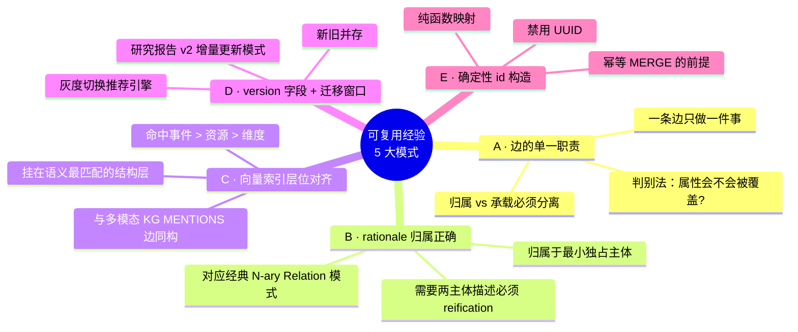
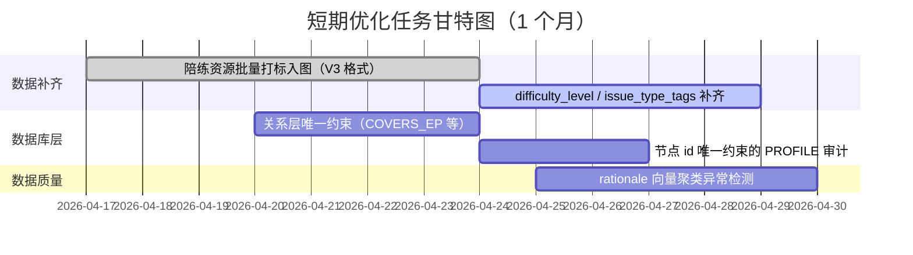
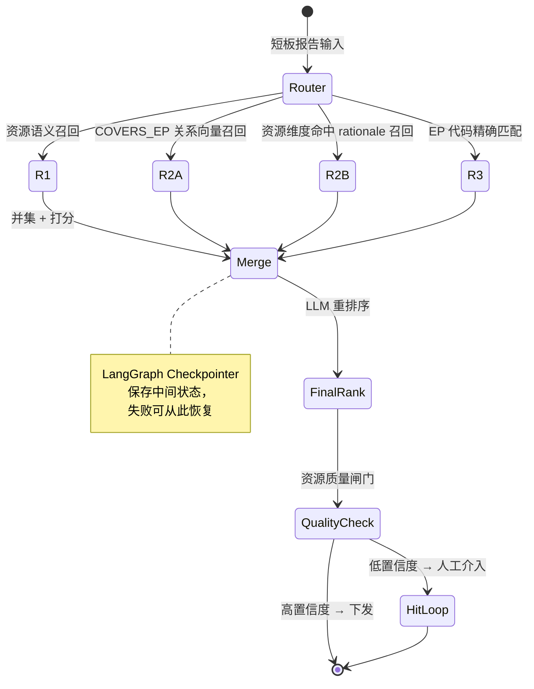
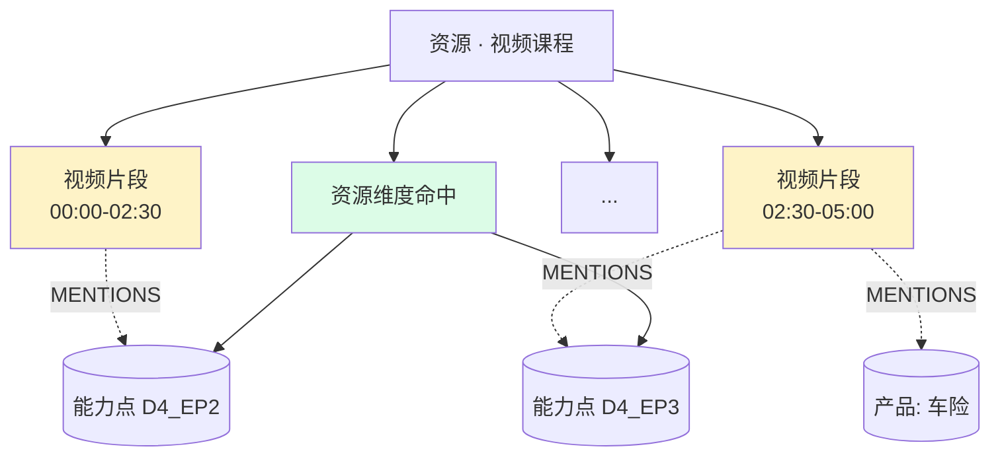
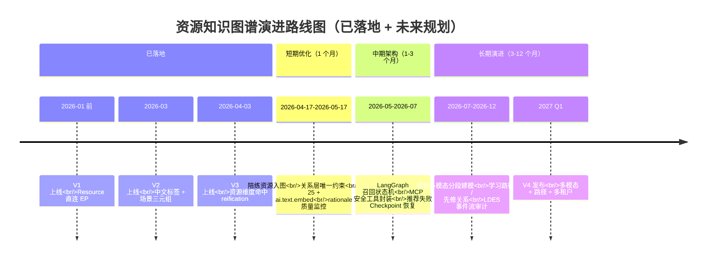
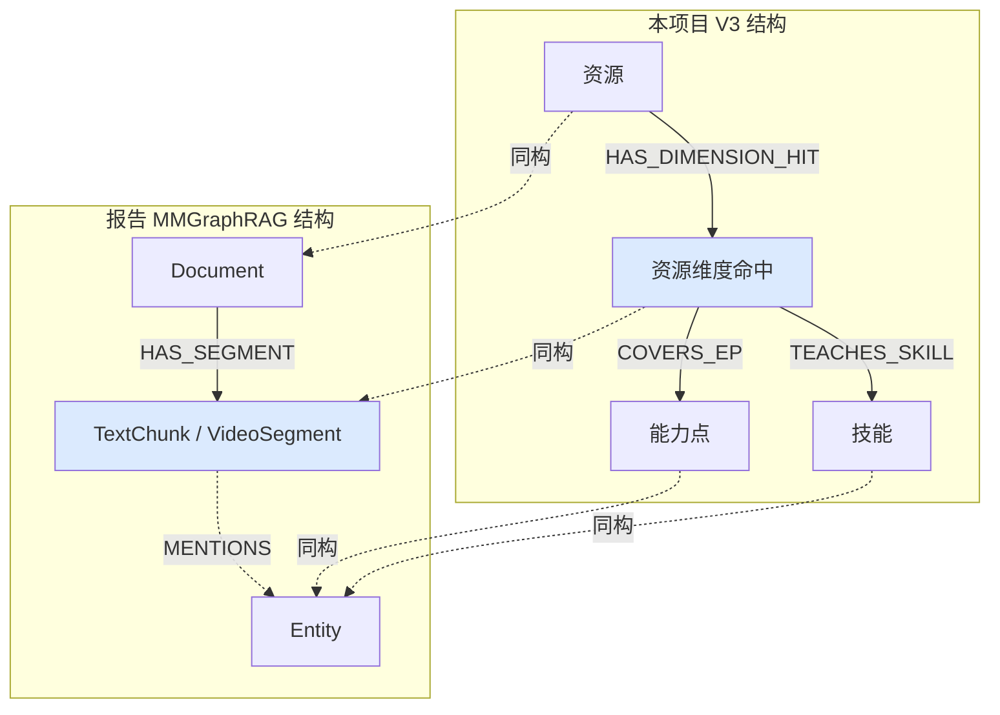
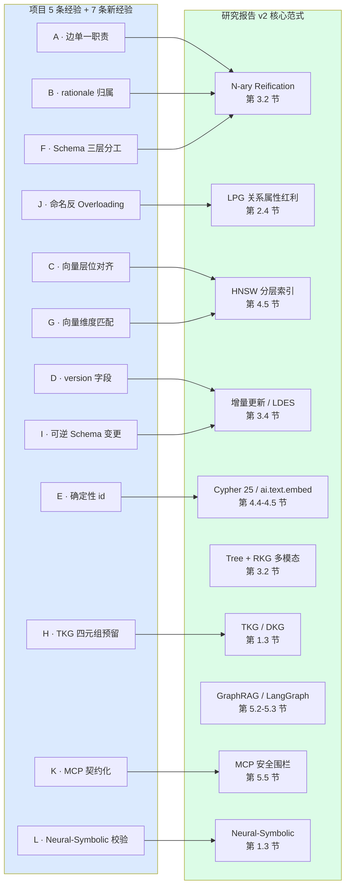

# 推荐系统资源知识图谱演进分析与复盘

> 文档时间：2026-04-16  
> 文档定位：面向项目全体成员，对资源知识图谱三个版本的完整演进过程进行分析、复盘与总结  
> 数据来源：项目历史文档、Neo4j Schema 快照、会话记录、代码实现

> 说明：仓库中未发现独立的 Codex 会话转录目录；本文所说“近 3 个月会话内容”，是综合 2026-03-20 至 2026-04-16 期间的架构方案、实现文档、schema 快照、代码与测试脚本，还原出资源知识图谱的演进脉络。

---

## 目录

1. [背景与整体脉络](#1-背景与整体脉络)
2. [第一版资源知识图谱](#2-第一版资源知识图谱)
3. [第二版资源知识图谱](#3-第二版资源知识图谱)
4. [第三版资源知识图谱](#4-第三版资源知识图谱)
5. [三版对比总结](#5-三版对比总结)
6. [当前存在的缺点与未来改进方向](#6-当前存在的缺点与未来改进方向)

---

## 1. 背景与整体脉络

### 1.1 系统定位

本项目的推荐系统以 Neo4j 图数据库为核心，构建了一套面向保险行业销售员的**资源知识图谱**。其核心业务逻辑是：

> 根据诊断系统输出的员工短板报告，从知识图谱中精准召回与短板高度匹配的学习资源（视频课程、陪练场景等），并给出可解释的推荐理由。

资源知识图谱承担两件事：
1. **资源是什么、适合谁** — 给每条资源打上产品、人群、阶段等使用场景标签
2. **资源能提升什么能力** — 给每条资源打上维度、能力点、技能等能力标签

三版图谱的演进，本质上是这两件事的建模精度和语义清晰度的持续提升。

### 1.2 技术选型

- **图数据库**：Neo4j（支持 Cypher 查询、向量索引、关系属性）
- **向量检索**：基于 Alibaba Dashscope 的嵌入模型（2048 维），在节点/关系上挂 embedding 字段
- **打标流水线**：视频转写 → LLM 结构化打标 → KG 适配层 → Neo4j 入库

---

## 2. 第一版资源知识图谱

### 2.1 结构设计

第一版是随着推荐系统第一个版本一起构建的最初形态。其结构特点是：

- 节点类型：`Resource`（资源）、`Dimension`（评估维度）、`EP`（能力点）、`Skill`（技能）、`Product`（产品）、`Stage`（销售阶段）、`Persona`（销售人群）
- **核心关系**：

| 关系类型 | 起点 → 终点 | 关键属性 |
|---|---|---|
| `HAS_DIM` | Resource → Dimension | `weight` (资源对维度的覆盖权重) |
| `HAS_EP` | **Resource → EP（直接！）** | `weight`, `rationale_text`, `rationale_embedding` |
| `HAS_SKILL` | Dimension → Skill | — |

- **向量索引**：
  - `resource_index`：在 Resource 节点的 `resource_embedding` 上
  - `has_ep_rationale_index`：在 HAS_EP 关系的 `rationale_embedding` 上

**第一版结构示意图**：

```text
Resource
 ├─ HAS_DIM {weight} ────────────────> Dimension
 │                                        └─ HAS_SKILL ─> Skill
 └─ HAS_EP {weight, rationale, embedding} ─> EP（能力点，直接连接）
```

### 2.2 召回策略（三路召回 R1/R2/R3）

第一版的推荐引擎围绕这套图谱实现了三路召回：

| 路径 | 策略 | Cypher 核心 |
|---|---|---|
| R1 | Resource 语义向量召回 | `MATCH (r:Resource) WITH r, cosine(r.resource_embedding, $vec)` |
| R2 | HAS_EP 关系向量召回 | `MATCH (r:Resource)-[rel:HAS_EP]->(ep) WITH cosine(rel.rationale_embedding, $vec)` |
| R3 | EP 代码精确匹配 | `MATCH (r:Resource)-[rel:HAS_EP]->(ep) WHERE ep.code = $ep_code` |

三路结果做并集，再通过规则打分（S_res / S_ep / S_dim 三类分）确定最终排序。

### 2.3 第一版的问题

第一版上线运行后，暴露出以下几类问题：

**问题 1：缺乏使用场景上下文**

HAS_EP 直接连接 Resource 到 EP，图谱里没有"这条资源适合什么产品""适合哪类销售人群""适合哪个销售阶段"的结构。推荐结果无法按业务场景做过滤或加权，推荐理由也无法说清楚"为什么这条资源适合这个人"。

**问题 2：维度层信息偏弱**

Resource 虽然连到了 Dimension（通过 HAS_DIM），但 EP 是直接从 Resource 出发的。没有通过 Dimension → EP 的层次关系，图谱的"先看维度，再看能力点"这条查询路径比较弱，难以支撑"D4 维度弱，优先找 D4 资源"这类维度级过滤逻辑。

**问题 3：场景化推荐能力不足**

图谱无法回答：
- 这条资源更适合新手还是老手？
- 这条资源在哪个销售环节最有用？
- 这条资源对应哪个产品线？

这些信息在推荐理由生成和结果质量控制上都有缺失。

### 2.4 解决思路

基于以上问题，团队决定对图谱结构进行升级：
1. 增加场景维度节点（销售人群、销售阶段、产品），通过带 reason + embedding 的关系连接到 Resource
2. 重构 Resource → Dimension → EP 的层次关系，让维度层更清晰
3. 在关系上保留权重和理由，支撑解释性推荐

---

## 3. 第二版资源知识图谱

### 3.1 结构设计

第二版（约 2026 年 3 月建成并上线）是在第一版基础上的重大结构升级。图谱全面切换为中文标签，节点和关系体系都做了重新设计。

**节点类型（7 类）**：

| 节点标签 | 数量 | 说明 |
|---|---:|---|
| `资源` | 212 | 可被推荐的资源，视频课程为主 |
| `评估维度` | 6 | D1–D6，销售能力大类 |
| `能力点` | 26 | 每个维度下的细化能力项 |
| `技能` | 89 | 比能力点更细的执行动作 |
| `销售人群` | 4 | 新手销售、成长型销售、成熟销售 |
| `销售阶段` | 7 | 开场破冰、需求挖掘、产品呈现等 |
| `产品` | 69 | 车险、寿险等产品分类 |

**关系类型（6 类）**：

| 关系类型 | 起点 → 终点 | 数量 | 关键属性 |
|---|---|---:|---|
| `HAS_DIMENSION` | 资源 → 评估维度 | 394 | `dimension_weight`, `rel_key` |
| `HAS_EP` | **评估维度 → 能力点** | 26 | `ep_weight`, **`rationale`**, **`rationale_embedding`** |
| `HAS_SKILL` | 评估维度 → 技能 | 100 | `rel_key` |
| `TARGET_PERSONA` | 资源 → 销售人群 | 212 | `level`, `reason`, `reason_embedding` |
| `TARGET_STAGE` | 资源 → 销售阶段 | 271 | `level`, `reason`, `reason_embedding` |
| `TARGET_PRODUCT` | 资源 → 产品 | 212 | `reason`, `reason_embedding` |

**向量索引（5 个）**：

| 索引名 | 类型 | 字段 |
|---|---|---|
| `vec_资源_resource_desc_embedding` | 节点向量 | 资源.resource_desc_embedding |
| `vec_rel_HAS_EP_rationale_embedding` | 关系向量 | HAS_EP.rationale_embedding |
| `vec_rel_TARGET_PERSONA_reason_embedding` | 关系向量 | TARGET_PERSONA.reason_embedding |
| `vec_rel_TARGET_PRODUCT_reason_embedding` | 关系向量 | TARGET_PRODUCT.reason_embedding |
| `vec_rel_TARGET_STAGE_reason_embedding` | 关系向量 | TARGET_STAGE.reason_embedding |

**第二版结构示意图**：

```text
资源
 ├─ TARGET_PERSONA {level, reason, embedding} ─> 销售人群
 ├─ TARGET_STAGE   {level, reason, embedding} ─> 销售阶段
 ├─ TARGET_PRODUCT {reason, embedding}         ─> 产品
 └─ HAS_DIMENSION  {dimension_weight}           ─> 评估维度
                                                    ├─ HAS_EP {ep_weight, rationale, embedding} ─> 能力点（问题在这里）
                                                    └─ HAS_SKILL ─> 技能
```

### 3.2 第二版的改进

相比第一版，第二版有以下明显进步：

1. **有了场景化标签**：TARGET_PERSONA / TARGET_STAGE / TARGET_PRODUCT 让资源有了完整的使用场景描述，推荐引擎可以按人群、阶段、产品做过滤。
2. **引入了 reason + embedding**：关系上不只有标签，还有"为什么"，支撑可解释推荐。
3. **维度层次更清晰**：资源先连到评估维度，再从维度连到能力点，查询路径更有层次感。

### 3.3 第二版的核心问题

然而，第二版在落地后暴露出一个根本性的结构问题——

**问题：`HAS_EP` 关系承载了错误的信息**

`HAS_EP` 是从 **评估维度** 到 **能力点** 的关系，全图只有 26 条（每个能力点对应一条）。这条关系上却挂了 `rationale`（命中理由）和 `rationale_embedding`（向量）。

这里的矛盾在于：

- `评估维度 → 能力点` 是一个**静态的全局能力树关系**，它只应该表达"这个维度包含这个能力点"
- 但 `rationale` 描述的是"某条资源为什么命中这个能力点"——这是**资源私有的信息**

当有多条资源命中同一个能力点时：
- 资源 A 命中 D4_EP2 的理由：「讲了论据支撑，针对价格异议」
- 资源 B 命中 D4_EP2 的理由：「讲了案例对比，针对产品需求异议」

但全图 `评估维度 → 能力点` 上的 D4_EP2 只有一条边，两条资源的理由会相互覆盖，写入时互相污染。

**具体表现为**：
1. 不同资源的命中理由写入同一条 `HAS_EP` 边，造成语义混乱
2. 向量索引 `vec_rel_HAS_EP_rationale_embedding` 上只有 26 个向量（全局的），而不是 N×26 个（每条资源私有的）
3. 无法精确表达"资源 A 对 D4_EP2 的覆盖权重"与"资源 B 对同一 EP 的覆盖权重"之间的区别

这导致第二版推荐引擎在召回阶段精度受限，无法做到真正的"能力点级精准推荐"，也无法为推荐结果生成准确的资源级解释。

### 3.4 解决思路

问题的根因是：**全局静态能力树**与**资源私有命中信息**被混放在同一条边上。

解决方案需要把两者分开：
- 全局能力树继续保留（评估维度 → 能力点 / 技能），但只表达"属于关系"
- 每条资源私有的命中权重、命中理由、命中向量，单独用一个中间节点承载

这就是第三版的核心设计动机。

---

## 4. 第三版资源知识图谱

### 4.1 核心设计思想

第三版的核心变化只有一句话：

> **把静态能力体系和资源私有命中信息彻底拆开。**

引入了一个新的中间节点类型：`资源维度命中`。

它扮演的角色是：**"某条资源命中了某个评估维度"这件事本身的结构化记录**。

### 4.2 结构设计

**节点类型（8 类，新增 `资源维度命中`）**：

| 节点标签 | 说明 |
|---|---|
| `资源` | 可推荐资源（视频课程、陪练等） |
| **`资源维度命中`** | ⭐ 新增：表示某资源命中某维度的"命中记录" |
| `评估维度` | 静态能力大类（D1–D6） |
| `能力点` | 静态能力点（D1_EP1 等） |
| `技能` | 静态执行动作级技能 |
| `销售人群` | 新手/成长型/成熟销售 |
| `销售阶段` | 开场破冰/需求挖掘等 |
| `产品` | 产品线或具体险种 |

**`资源维度命中` 节点属性**：

| 属性 | 类型 | 说明 |
|---|---|---|
| `id` | string | 唯一标识，规则：`rdh:{resource_id}\|{dimension_code}` |
| `resource_id` | string | 所属资源节点 id |
| `resource_name` | string | 所属资源名称 |
| `dimension_code` | string | 命中的维度编码，如 `D4` |
| `dimension_name` | string | 命中的维度名称 |
| `dimension_weight` | float | 该维度在此资源中的覆盖比例 |
| `rationale` | string | 该资源为什么命中这个维度 |
| `rationale_embedding` | list[float] | rationale 的向量表示 |
| `version` | string | 固定为 `v3` |

**关系类型（9 类）**：

| 关系类型 | 起点 → 终点 | 关键属性 | 说明 |
|---|---|---|---|
| `HAS_DIMENSION_HIT` | 资源 → 资源维度命中 | `rel_key` | 资源拥有某个命中记录 |
| `ON_DIMENSION` | 资源维度命中 → 评估维度 | `rel_key` | 该命中记录归属于哪个维度 |
| `COVERS_EP` | 资源维度命中 → 能力点 | `ep_weight`, `rationale`, `rationale_embedding` | 该资源在此维度下覆盖了哪个能力点 |
| `TEACHES_SKILL` | 资源维度命中 → 技能 | `skill_weight`, `rationale`, `rationale_embedding` | 该资源在此维度下教授了哪个技能 |
| `HAS_EP` | 评估维度 → 能力点 | `rel_key` | ⭐ 仅静态归属，不再承载资源私有信息 |
| `HAS_SKILL` | 评估维度 → 技能 | `rel_key` | 仅静态归属 |
| `TARGET_PERSONA` | 资源 → 销售人群 | `level`, `reason`, `reason_embedding` | 沿用第二版 |
| `TARGET_STAGE` | 资源 → 销售阶段 | `level`, `reason`, `reason_embedding` | 沿用第二版 |
| `TARGET_PRODUCT` | 资源 → 产品 | `reason`, `reason_embedding` | 沿用第二版 |

**第三版结构示意图**：

```text
资源
 ├─ TARGET_PERSONA {level, reason, embedding} ─> 销售人群
 ├─ TARGET_STAGE   {level, reason, embedding} ─> 销售阶段
 ├─ TARGET_PRODUCT {reason, embedding}         ─> 产品
 └─ HAS_DIMENSION_HIT ─> 资源维度命中
                           ├─ ON_DIMENSION ──────────────────> 评估维度
                           │                                      ├─ HAS_EP    ──> 能力点（仅静态）
                           │                                      └─ HAS_SKILL ──> 技能（仅静态）
                           ├─ COVERS_EP {ep_weight, rationale, embedding} ──> 能力点
                           └─ TEACHES_SKILL {skill_weight, rationale, embedding} ──> 技能
```

**向量索引（7 个，新增 3 个）**：

| 索引名 | 字段 |
|---|---|
| `vec_资源_resource_desc_embedding` | 资源描述向量 |
| **`vec_资源维度命中_rationale_embedding`** | ⭐ 维度命中理由向量 |
| **`vec_rel_COVERS_EP_rationale_embedding`** | ⭐ 能力点命中理由向量 |
| **`vec_rel_TEACHES_SKILL_rationale_embedding`** | ⭐ 技能命中理由向量 |
| `vec_rel_TARGET_PERSONA_reason_embedding` | 人群适配理由向量 |
| `vec_rel_TARGET_STAGE_reason_embedding` | 阶段适配理由向量 |
| `vec_rel_TARGET_PRODUCT_reason_embedding` | 产品适配理由向量 |

### 4.3 权重规则

第三版构建了两层权重体系：

```
第一层：维度层权重
资源维度命中.dimension_weight
→ 含义：该资源在所有维度上的分布，同一资源所有 dimension_weight 之和 = 1

第二层：能力点层权重
资源维度命中 -[:COVERS_EP]-> 能力点 上的 ep_weight
→ 含义：在某个维度内部，各能力点的覆盖分布，同一 资源维度命中 下所有 ep_weight 之和 = 1

最终覆盖强度：
final_ep_weight = dimension_weight × ep_weight
```

### 4.4 入库约束

第三版为所有 8 类节点建立了 `id` 唯一约束，保证幂等写入：

- `uniq_资源_id`
- `uniq_资源维度命中_id`
- `uniq_评估维度_id`
- `uniq_能力点_id`
- `uniq_技能_id`
- `uniq_销售人群_id`
- `uniq_销售阶段_id`
- `uniq_产品_id`

### 4.5 第三版的优势

#### 优势 1：资源之间互不干扰

每条资源都有自己独立的 `资源维度命中` 节点，命中理由和权重完全属于自己。

- 资源 A 命中 D4_EP2 的理由 → 挂在 A 的 COVERS_EP 上
- 资源 B 命中 D4_EP2 的理由 → 挂在 B 的 COVERS_EP 上
- 两者永不冲突

这彻底解决了第二版"不同资源污染同一条全局边"的根本问题。

#### 优势 2：解释性大幅提升

第三版可以精确回答：
- 这条资源为什么被推荐？（rationale on 资源维度命中）
- 它命中了哪个能力点，理由是什么？（rationale on COVERS_EP）
- 它在该维度下的覆盖比例是多少？（dimension_weight）

这为推荐系统的理由生成提供了天然的结构支撑。

#### 优势 3：支持精细化推荐

第二版只能做"维度级推荐"：D4 弱 → 找 D4 资源  
第三版可以做"能力点级推荐"：D4 弱、其中 D4_EP2 更弱 → 找 D4_EP2 覆盖高的资源

这使推荐精度从维度级提升到能力点级。

#### 优势 4：结构更稳定，工程上更易维护

- 每层语义清晰分离，不存在"一条边干多件事"的情况
- 幂等写入：基于唯一 id 做 MERGE，资源更新不会产生脏数据
- 版本字段 `version=v3` 方便后续做图谱升级管理

#### 优势 5：向量索引更丰富

新增了 `vec_资源维度命中_rationale_embedding`（维度层理由向量）和 `vec_rel_COVERS_EP_rationale_embedding`（能力点层理由向量），R2 路径的语义召回精度更高。

### 4.6 第三版的召回路径变化

基于第三版图谱，推荐引擎的 R2 召回路径发生了变化：

| 版本 | R2 路径 |
|---|---|
| V1/V2 | `MATCH (r:Resource)-[rel:HAS_EP]->(ep) WITH cosine(rel.rationale_embedding, $vec)` |
| V3 | `MATCH (hit:资源维度命中)-[he:COVERS_EP]->(ep) MATCH (r)-[:HAS_DIMENSION_HIT]->(hit)` |

新增的 R2B 路径：
```cypher
MATCH (hit:资源维度命中)
MATCH (r)-[:HAS_DIMENSION_HIT]->(hit)
WHERE hit.rationale_embedding IS NOT NULL
WITH r, hit, cosine(hit.rationale_embedding, $vec)
```

即：通过 `资源维度命中` 节点的 rationale 向量召回（维度级语义），补充 COVERS_EP 的能力点级语义。

---

## 5. 三版对比总结

### 5.1 结构对比

| 维度 | V1 | V2 | V3 |
|---|---|---|---|
| 节点类型数 | 7（英文标签） | 7（中文标签） | 8（中文标签 + 资源维度命中） |
| 关系类型数 | 3 | 6 | 9 |
| Resource→EP 路径 | 直连（Resource-[:HAS_EP]->EP） | 经维度（资源→维度→能力点，但 rationale 在维度边上） | 经中间节点（资源→资源维度命中→能力点） |
| 场景标签 | 无 | TARGET_PERSONA/STAGE/PRODUCT | TARGET_PERSONA/STAGE/PRODUCT（沿用） |
| 资源私有 rationale | 在 HAS_EP（资源→EP）上，每条资源独立 | 在 HAS_EP（维度→EP）上，26 条全局共享（问题根源） | 在 COVERS_EP（资源维度命中→EP）上，每条资源独立 |
| 向量索引数 | 2 | 5 | 7 |
| 幂等写入约束 | 无 | 无 | 8 类节点有唯一约束 |

### 5.2 问题演进

```text
V1 问题：
  ↳ 缺场景上下文（无人群/阶段/产品标签）
  ↳ 维度层次不清晰
  ↳ 推荐无法按场景过滤

解决 → V2

V2 问题：
  ↳ HAS_EP 全局共享 rationale（不同资源命中理由互相覆盖）
  ↳ 无法做资源级别的精确命中解释
  ↳ 向量索引只有 26 条全局 EP 向量，召回精度受限

解决 → V3

V3 现状（2026-04-03 落地）：
  ↳ 资源私有命中信息与全局能力树完全分离
  ↳ 精细化召回与解释性推荐均有结构支撑
```

### 5.3 推荐引擎与图谱版本的对应关系

| 推荐引擎版本 | 图谱版本依赖 | 核心文件 |
|---|---|---|
| 单次推荐 V1（规则驱动） | V1/V2 图谱 | `recommend_engine.py` + `recommend_kg_retrieval.py` |
| 单次推荐 V2（LLM 增强） | V2 图谱 | `single_recommend_llm.py` + `llm_ranker.py` |
| 周期多场景 V2 | V2 图谱 | `recommend_engine_multi_scene.py` |
| 周期多场景 V3 | **V3 图谱** | `v3/recommend_engine_v3_single.py` + `v3/recommend_engine_v3_multi_scene.py` |

推荐引擎版本（v1/v2/v3）与图谱版本（v1/v2/v3）不是严格一一对应的，在某些阶段存在"推荐引擎已升级但图谱还是旧版"的过渡期。

---

## 6. 当前存在的缺点与未来改进方向

### 6.1 当前 V3 图谱存在的缺点

#### 缺点 1：图谱规模膨胀

引入 `资源维度命中` 中间节点后，节点数量大幅增加。

以当前 212 条资源为例：
- 若每条资源平均命中 2 个维度 → 产生约 424 个 `资源维度命中` 节点
- 若每个命中平均覆盖 2 个能力点 → COVERS_EP 关系约 848 条

随着资源库增长，图谱规模增速超过线性，查询复杂度上升。

#### 缺点 2：查询路径变长，Cypher 复杂度上升

V2 的 R2 查询只需 1 层关系：  
`MATCH (r)-[:HAS_EP]->(ep)`

V3 的 R2 查询需要 2 层关系：  
`MATCH (hit:资源维度命中)-[:COVERS_EP]->(ep) MATCH (r)-[:HAS_DIMENSION_HIT]->(hit)`

对于不熟悉 V3 图谱结构的开发者，查询和理解成本更高。

#### 缺点 3：陪练资源尚未完整入库

截至文档生成时（2026-04-03），现有图谱中 `resource_category` 字段显示几乎所有资源均为 `视频课程`，**陪练资源尚未完整入图**。

这意味着：
- 推荐系统无法在陪练与视频课程之间做资源类型配额（即使 V3 推荐引擎已支持此逻辑）
- V3 图谱在"多资源类型混合推荐"场景下的价值尚未充分体现

#### 缺点 4：`资源维度命中` 节点的 rationale 由 LLM 生成，质量依赖打标准确度

`资源维度命中.rationale` 是资源打标流水线中由 LLM 判断生成的。如果打标 LLM 对某条资源的维度命中判断有误，则后续所有基于 rationale 的语义召回都会受影响。

当前只有人工审核环节（`resource_preprocess` 页面）可以修正，但大量资源无法逐一人工校对。

#### 缺点 5：唯一约束尚未对关系做去重

当前 V3 仅在节点上建立了 `id` 唯一约束，但关系层面（如 COVERS_EP、TEACHES_SKILL）没有等效的约束。如果同一资源多次触发入库，可能产生重复的关系边，影响召回和打分。

关系去重目前依赖 `rel_key` 字段做应用层幂等，而不是 Neo4j 数据库层约束。

#### 缺点 6：静态能力树 HAS_EP / HAS_SKILL 的 rationale 信息丢失

第二版的 `HAS_EP` 上携带了 rationale 文本（虽然是全局共享的，有语义问题），但第三版清空了这些信息，`HAS_EP` 只剩下纯结构关系。

这意味着系统失去了"一个维度下为什么包含这个能力点"的解释文本。虽然这对推荐准确性没有负面影响，但对于面向运营或产品的"能力体系解释"场景有信息损失。

### 6.2 未来改进方向

#### 方向 1：完成陪练资源入图

当前 V3 图谱的最大短板是陪练资源空缺。需要完成：
- 陪练 Excel 资源的批量打标与 V3 格式入图
- `resource_category = '陪练'` 的节点入库
- 验证推荐引擎的"陪练/视频配额"逻辑在真实图谱下的效果

#### 方向 2：完善难度标签与问题类型标签

第三版 V3 优化方案中提到补充 `difficulty_level`、`issue_type_tags` 等标签，但当前图谱中这些字段仍为空缺。这些标签将支持更精准的"人群-难度"匹配。

#### 方向 3：建立关系层的幂等约束

可以在 Neo4j 侧通过约束或唯一索引进一步保证关系幂等性，避免重复导入时的脏数据问题。

#### 方向 4：打标质量监控与自动纠偏

针对 `资源维度命中.rationale` 的质量问题，可以建立：
- 批量向量聚类，识别语义异常的 rationale
- 系统化的人工抽查机制
- A/B 测试验证不同打标版本的推荐效果差异

#### 方向 5：在新系统（诊断推荐融合平台）中对图谱角色重新定位

根据 2026-04 的架构升级方案，未来统一平台中 Neo4j 的职责收缩为"知识图谱 / 资源关系 / 图检索层"，MySQL 作为事实主库。新平台对图谱的 API 化封装和查询适配层需要与 V3 图谱结构对齐，避免历史查询路径与新结构不兼容。

---

## 附：三版结构变化速查表

```text
┌───────────────────────────────────────────────────────────────────────────┐
│                          V1 → V2 → V3 结构演进速查                         │
├──────────────┬────────────────────────┬──────────────────────────────────┤
│ 变化维度     │ V1 → V2                 │ V2 → V3                           │
├──────────────┼────────────────────────┼──────────────────────────────────┤
│ 节点标签     │ 英文 → 中文             │ 新增 资源维度命中                  │
│ 资源→EP路径  │ 直连 → 经维度           │ 经维度 → 经中间节点                │
│ 场景标签     │ 无 → 有                 │ 不变（沿用）                       │
│ rationale    │ 在 Resource→EP（正确） │ 在 Dim→EP（全局共享，错误）        │
│              │                         │ → 在 资源维度命中→EP（正确）       │
│ 向量索引     │ 2个 → 5个               │ 5个 → 7个                          │
│ 幂等约束     │ 无 → 无                 │ 有（8类节点 id 唯一约束）          │
│ 权重体系     │ 单层 → 维度+EP两层      │ 明确分层，dimension×ep 复合权重    │
└──────────────┴────────────────────────┴──────────────────────────────────┘
```

---

## 7. 深度复盘：资源图谱结构迭代的底层逻辑

> 本节基于 V1 → V2 → V3 的全部演进事实，抽象出"为什么会这样演化"的底层规律，并与知识图谱学术界 / 工业界的经典范式对齐，使经验可迁移、可复用。

### 7.1 三版演进的本质：一次"信息归属纠错"与"经典 Reification 模式"的重新发现

跳出项目视角观察，V1 → V2 → V3 的三次结构调整，**本质上是一场"信息归属错配 → 重归属"的旅行**。每一版都在回答同一个问题：「某条数据到底归谁所有？」只不过答案在演进中被不断精炼。

```mermaid
flowchart LR
    V1[V1 · rationale 在<br/>Resource→EP 边上]
    V2[V2 · rationale 误迁至<br/>Dimension→EP 全局边]
    V3[V3 · rationale 落在<br/>资源维度命中→EP 私有边]

    V1 -->|加入场景层<br/>但"过度聚合"了 rationale| V2
    V2 -->|引入中间节点<br/>做 Reification| V3

    style V1 fill:#fef3c7
    style V2 fill:#fecaca
    style V3 fill:#dcfce7
```

**"资源维度命中"节点其实是教科书级的 Reification（具体化）模式**——它把原本 "资源 -[关系]- 能力点" 这条**二元关系**升格为一个**独立的一等公民实体**，从而能够承载属于这条关系自身的属性（权重、理由、向量）。这正是 RDF 世界的 `rdf:Statement` 与 LPG 世界的 "Association Class（关联类）" 的等价做法：

| 世界 | 对应结构 | V3 等价物 |
|------|---------|-----------|
| **RDF** | `rdf:Statement` + `rdf:subject/predicate/object` + 自定义属性 | `资源维度命中` 节点 + `HAS_DIMENSION_HIT` / `ON_DIMENSION` |
| **UML / ER** | Association Class（关联类） | `资源维度命中` 节点 |
| **数据库设计** | 多对多关系的"中间表" + 中间表自身字段 | `资源维度命中` 节点及其属性 |
| **知识图谱论文** | N-ary Relation Representation | `资源维度命中` + 向外发散的多条边 |

**V2 犯的错误有一个学术名字：Binary-Relation Overloading（二元关系过载）**——把本应属于 N 元关系的信息（资源 × 维度 × 能力点 × 理由）硬塞进了一条二元边（维度 → 能力点），导致不同资源的信息相互覆盖。**V3 的解法正是业界公认的"当关系本身需要属性或需要与多个元素关联时，必须具体化为节点"**。

### 7.2 结构迭代的三阶段认知跃迁

```mermaid
graph TB
    S1[阶段一 · 建模聚焦"资源本身"<br/>V1 时代关注点]
    S2[阶段二 · 建模扩展到"资源的使用场景"<br/>V2 时代关注点]
    S3[阶段三 · 建模深入到"资源与能力的关系本身"<br/>V3 时代关注点]

    S1 -->|场景维度缺口暴露| S2
    S2 -->|关系属性承载冲突暴露| S3
    S3 -->|下一跳在哪里?| S4{阶段四<br/>资源集合 / 学习路径建模?}

    style S1 fill:#fef3c7
    style S2 fill:#dbeafe
    style S3 fill:#dcfce7
    style S4 fill:#e0e7ff,stroke-dasharray:5 5
```

- **阶段一（V1）**：建模者的视角是"资源是什么"——纯对象建模；
- **阶段二（V2）**：建模者的视角是"资源用在哪"——加入场景标签；
- **阶段三（V3）**：建模者的视角是"资源与能力之间发生了什么"——关系成为一等公民；
- **阶段四（推测中）**：下一跳必然是"资源之间的组合关系"——学习路径（Learning Path）、先修关系（PREREQUISITE_OF）、序列编排（FOLLOWS）。当单条资源难以治愈短板时，推荐引擎需要能够输出"一组"资源。这一步的结构将可能引入"**学习路径**"或"**推荐编排**"节点。

---

## 8. 萃取出的可复用工程经验（跨项目通用）

> 以下五条经验已在本项目三版迭代中经过代价证明，可直接迁移到任何基于 LPG/Neo4j 的业务知识图谱建模工作。

### 经验 A · 边的单一职责原则（Single-Responsibility Edge）

> **一条边应该只表达一件事。当一条关系边同时承载"归属语义"与"承载语义"时，这条边必然出错。**

- **反例（V2）**：`HAS_EP` 既要表达"维度归属能力点"的**类型学语义**，又要表达"某资源为什么命中此能力点"的**实例学语义**。
- **正例（V3）**：`HAS_EP`（维度 → 能力点）只做归属；`COVERS_EP`（资源维度命中 → 能力点）只做承载。

**判别法**：问自己"当我增加一条新资源时，这条边的属性会不会被覆盖？"——如果会，说明这条边被过载了。

### 经验 B · rationale / explanation 字段必须挂在"信息所有者"上

> **解释性文本（rationale / reason / explanation）永远归属于最小独占主体。**

- 在本项目中，命中理由属于 `(资源, 维度)` 这个二元组合主体，而不属于单独的资源或单独的维度；
- 因此它的自然归属是一个**由这个二元组合具象化的节点**，也即 `资源维度命中`。

推广规则：如果一条属性的含义需要用**两个以上主体**去描述（"X 对 Y 的 Z"），那么它不属于任何一条简单的二元边，必须 reification。

### 经验 C · 向量索引应挂在与向量语义最匹配的结构层

> **`rationale_embedding` 的语义是"某资源命中某能力点的原因向量"，所以它必须挂在"资源维度命中"层，而不是维度层、也不是资源层。**

这一点决定了召回精度的天花板：
- 如果向量在维度层 → 召回得到的是"相关维度"（V1/V2 问题）；
- 如果向量在资源层 → 召回得到的是"相关资源"（过于粗粒度）；
- 如果向量在资源维度命中层 → 召回得到的是"相关的命中事件"（V3 最佳）。

**类比**：这与研究报告 v2 中「多模态 KG 把向量挂在 `MENTIONS` 边，而不是 `Document` 或 `Entity` 节点」是同一种思想。

### 经验 D · 每一版图谱必须有 `version` 字段；每一次演进必须有"迁移脚本 + 新老并存窗口"

- V3 节点带 `version = "v3"`，这让新旧图谱可以在同一个 Neo4j 实例中共存；
- 推荐引擎 v3 读 `version = "v3"` 的节点，老引擎依然能读无 version 字段的旧节点；
- **这是工业级图谱演化的标配，也是研究报告 v2 第 3 章"增量更新"中讨论的"抽取缓存 + MERGE Upsert"模式在项目中的具体落地**。

### 经验 E · 节点唯一 id 的构造规则必须是确定性函数，禁用 UUID

- V3 的 `资源维度命中.id = rdh:{resource_id}|{dimension_code}`——纯函数映射，无副作用；
- 这带来两大好处：
  1. **幂等写入**：重复导入不会产生重复节点；
  2. **可读可调试**：人肉看到 `rdh:res_42|D4` 就知道这是资源 42 在 D4 维度上的命中。

**反例**：若用 UUID，每次打标都产生新节点，垃圾堆积，难以 MERGE。

### 可视化 · 五大经验的模式全景



---

## 9. 基于业界前沿的后续优化建议

> 以下建议基于第 6 节已列出的五个改进方向，**结合《大模型与知识图谱融合技术研究报告 v2》中 2026 年工业界的最佳实践**，分为"短期可落地"、"中期架构"、"长期演进"三档。

### 9.1 短期可落地（1 个月内）· 堵住第 6 节已识别的漏洞



#### 建议 ①：把关系去重从应用层 `rel_key` 下沉到数据库层

当前关系层靠 `rel_key` 字段做应用层幂等，但 Neo4j 不会因为 `rel_key` 重复就拒绝写入。可以利用 Neo4j 5+ 的关系唯一约束（Relationship Uniqueness Constraint）做数据库层防护：

```cypher
// Neo4j 5+ 支持（研究报告 v2 第 4 章 Cypher 25 语境）
CREATE CONSTRAINT uniq_covers_ep_relkey IF NOT EXISTS
FOR ()-[r:COVERS_EP]-()
REQUIRE r.rel_key IS UNIQUE;
```

**影响**：彻底杜绝第 6 节"缺点 5"中的重复关系问题，打标流水线的幂等性从"代码约定"升级为"数据库强约束"。

#### 建议 ②：用 Neo4j `ai.text.embed`（Cypher 25）替代现有外部向量调用管线

当前流程是"Python 调 Dashscope → 回 Python → 写 Neo4j"，存在三次网络往返。升级到 Cypher 25 后可以一行 Cypher 完成：

```cypher
// 研究报告 v2 · 第 4.5 节实战范例的项目版本
MATCH (hit:资源维度命中) WHERE hit.rationale_embedding IS NULL
WITH hit, ai.text.embed(hit.rationale, "dashscope", {
    token: $token, model: 'text-embedding-v3', dimensions: 2048
}) AS emb
SET hit.rationale_embedding = emb
```

**收益**：延迟降低 50%+，重试和重算的工程复杂度降到数据库层。

#### 建议 ③：建立 rationale 质量监控基线（解决第 6.1 缺点 4）

基于研究报告 v2 第 3 章的"跨模态对齐"思路，做**单模态反向验证**：
- 对每一个 `资源维度命中` 节点，验证 `rationale_embedding` 是否靠近 `资源.resource_desc_embedding + 评估维度` 的联合质心；
- 设定 cosine 阈值（如 < 0.55 告警），触发人工复核。

---

### 9.2 中期架构（1-3 个月）· 引入 LangGraph + MCP 安全围栏

根据研究报告 v2 第 5 章，**推荐引擎对 Neo4j 的调用层应当演化为 LangGraph 状态机 + MCP 安全工具**。这不是为了追新技术，而是因为当前三路召回 R1/R2/R3 已经具备状态机的雏形（路由、并行、打分合并），与 LangGraph 的心智模型天然契合。

#### 建议 ④：把三路召回升级为 LangGraph 状态机



**关键落地点**：
- 每一路召回作为一个 LangGraph `Node`；
- 用 `PostgresSaver` 做 Checkpoint，推荐引擎崩溃后可从最近检查点恢复而不必全量重算；
- 低置信度推荐（如前 5 条资源得分方差极小）触发 `Human-in-the-Loop`，由运营人工复核。

#### 建议 ⑤：把裸 Cypher 封装为 MCP 工具，为未来 Agent 化留后门

当前推荐引擎直接在 Python 代码中拼接 Cypher。未来若要把推荐能力以 Agent 形式开放给客户经理或训练教练助手（让他们用自然语言主动查询图谱），必须按研究报告 v2 第 5.5 节的 MCP 模式封装：

```python
@mcp_tool
def query_resources_by_weakness(
    weakness_dim_code: str,       # 白名单校验：必须 ∈ {D1...D6}
    weakness_ep_codes: list[str], # 白名单校验
    persona_code: str = None,
    limit: int = 10               # 上限 50
) -> dict:
    """根据短板维度 + 能力点召回资源（只读、限流、脱敏）"""
    assert limit <= 50
    # 内部调用参数化 Cypher，输出脱敏（去除用户敏感字段）
    ...
```

**收益**：未来大模型侧 Agent 不接触 Cypher，避免注入、超大结果集、越权访问等风险（对应第 6 节"新平台对图谱的 API 化封装"方向的具体做法）。

---

### 9.3 长期演进（3-12 个月）· 多模态化与学习路径建模

#### 建议 ⑥：引入多模态扩展，为视频内容原生建模

当前 `资源` 节点对"视频课程"的建模只到标题/描述级，视频内部的关键帧、字幕时段信息完全丢失。研究报告 v2 第 3 章给出了标准答案——**层次树 + 语义图的混合结构**：



**价值**：未来推荐可以精确到"观看视频 05:00-07:30 片段就能补齐 D4_EP2"，而不是"看完整条 30 分钟视频"。这对客户经理的学习效率是数量级的提升。

#### 建议 ⑦：增加"学习路径"节点，回应第 7.2 节的"阶段四"预言

当同一名客户经理存在多个短板（如 D4 + D5 + D6 同时弱）时，当前推荐引擎只能逐个维度推送资源，忽略了资源之间的"先修 → 进阶"关系。建议新增：

| 新增节点 / 关系 | 说明 |
|----------------|------|
| `:学习路径` 节点 | 表示一个编排好的资源序列 |
| `-[:STEP_OF {order: n}]->` | 资源在路径中的次序 |
| `-[:PREREQUISITE_OF]->` | 资源间的先修关系 |
| `-[:ALTERNATIVE_OF]->` | 资源间的可替代关系（学员偏好分流） |

对应的推荐策略升级：从"单资源召回"升级到"路径召回"，让推荐结果不只是 Top-N 资源，而是一条可执行的学习动线。

#### 建议 ⑧：软删除 + LDES 事件流（面向多实例 / 多租户未来）

当前资源下线（内容过期、讲师离职）还在用硬删除或标 `enabled=false`，未建立完整的审计链。借鉴研究报告 v2 第 3 章，推荐：

- 节点属性加 `valid_until` / `is_deleted`；
- 所有图谱变更写入 **Linked Data Event Stream (LDES)** 式的事件日志（可落到 Kafka + 对象存储）；
- 未来若新平台采用多租户架构，不同租户可以异步、非阻塞地重放事件达到图结构最终一致性。

---

## 10. 演进 Roadmap 与总结

### 10.1 Roadmap 可视化



### 10.2 本次复盘的核心一句话

> **V1 → V2 → V3 的演进，本质上是一场"边的语义归属去错配"之旅，其终点是知识图谱学术界早已存在的 Reification 范式；而 V3 之后的每一步，都可以在《大模型与知识图谱融合技术研究报告 v2》的工业最佳实践中找到镜像答案。**

### 10.3 复盘的方法论价值

这份复盘的最大价值**不在于记录了三版图谱的差异**，而在于：

1. **坦诚记录了 V2 的设计失误**——"HAS_EP 全局共享 rationale"这样的错误，如果不被结构化复盘，下一个团队大概率还会再犯一次；
2. **把项目经验与业界范式对齐**——使经验得以迁移到任何后续的 KG 设计任务中（包括研究报告 v2 中描绘的多模态 KG、GraphRAG、Agent 图谱等）；
3. **为下一版图谱的设计提供显式建议**——建议 ① 至 ⑧ 都有明确的优先级与落地锚点，不是空洞的愿景。

**复盘之所以有价值，正是因为它把"踩过的坑"升格为"带编号的模式"。未来写 V4 架构方案时，以上 5 大经验 + 8 条建议应当作为默认输入而非待验证假设。**

---

*文档生成日期：2026-04-16*  
*尾部深度复盘章节（第 7-10 节）补写日期：2026-04-17*  
*主要参考：`neo4j_graph_schema.md`（2026-03-20 快照）、`resource_kg_v3_schema_explained_20260403_2100.md`、`resource_kg_v3_schema_technical_20260403_2100.md`、`single_recommendation_v1_v2.md`、`资源打标_当前实现逻辑.md`、`resource_label_architecture.md`、各版推荐引擎实现文档、`研究报告_v2/` 系列（2026-04-17 产出的知识图谱融合技术研究报告）*

---

## 11. 基于《研究报告 v2》的五视角纵深复盘

> 第 7-10 节已从项目内部视角完成了结构演进、经验提炼与路线图规划。本节把镜头拉远，**以《大模型与知识图谱融合技术研究报告 v2》五章（纵向历史、横向生态、多模态结构、Neo4j 工程、Agent 融合）为五面棱镜**，重新审视 V1 → V2 → V3 的迭代逻辑、版本优缺点、可萃取经验与下一代优化方向。目的是把本项目的"一个样本"对接到业界的"一套范式"，让复盘结论真正可迁移、可复用。

### 11.1 迭代逻辑的五视角再剖析

同一段 V1 → V2 → V3 历史，从不同棱镜看到的本质并不相同。把五个视角并排摆放，可以看到结构演进其实是**多条业界趋势在项目里同时落地**的结果，而不是一连串孤立的决策。

```mermaid
graph TB
    subgraph Lens [五棱镜视角]
        L1[① 纵向历史视角<br/>KG 六十年演进缩影]
        L2[② 横向生态视角<br/>LPG vs RDF 路线选择]
        L3[③ 多模态结构视角<br/>N-ary / Reification 升维]
        L4[④ Neo4j 工程视角<br/>IFA + Cypher + 向量索引]
        L5[⑤ Agent 融合视角<br/>GraphRAG 就绪度]
    end

    L1 -.->|本项目走完"符号→语义网→<br/>工业图谱"的浓缩三跳| E1[结论 1]
    L2 -.->|LPG 原生选型在<br/>V2 场景扩展时优势显著| E2[结论 2]
    L3 -.->|V2 错误 = 二元关系<br/>过载；V3 正解 = N-ary| E3[结论 3]
    L4 -.->|V3 结构天然契合<br/>IFA + HNSW 双索引| E4[结论 4]
    L5 -.->|V3 是 GraphRAG Ready 的<br/>最小闭环| E5[结论 5]

    style L3 fill:#fecaca
    style L5 fill:#dcfce7
```

#### 视角 ① · 纵向历史（报告第 1 章）：本项目是知识图谱演进史的"项目级缩影"

把本项目三版与报告第 1 章「KG 六十年演进时间线」并排，会发现**项目在 3 个月内走完了业界走了六十年的三段路**：

| 业界阶段 | 本项目对应版本 | 共同特征 |
|----------|--------------|---------|
| 符号时代（1956-1984）| V1 | 以"对象（资源）+ 属性 + 二元关系"为建模心智模型，偏专家系统风格 |
| 语义网时代（2001-2007）| V2 | 引入场景标签层 + 关系属性（reason、rationale），追求语义互操作与可解释 |
| 工业图谱时代（2012-）| V3 | Reification、多层向量索引、幂等 MERGE、Schema 版本化，与 Google KG / Amazon COSMO 的建模心智相通 |

**启示**：V2 暴露的"HAS_EP 全局共享 rationale"问题，本质上等价于早期语义网时代的 Binary-Relation Overloading 通病；业界用了近十年迭代出"N-ary Reification"标准答案，而本项目通过一次复盘在 3 个月内完成追赶。**任何团队在自建 KG 前，都应把报告第 1 章这条演进时间线当作"坑位地图"来读——踩坑点在那里已经按时间顺序罗列好了**。

#### 视角 ② · 横向生态（报告第 2 章）：LPG 路线的选型红利在 V2 已开始兑现

报告第 2 章详细对比了 LPG（Neo4j）与 RDF（W3C 传统路线）两条路线。本项目三版演进恰好印证了报告的核心观点——**"属性型关系"是 LPG 相对 RDF 的最大生产力红利**：

- **V1**：`HAS_EP {weight, rationale, rationale_embedding}` 已经在关系上挂 3 个业务属性；若采用 RDF，这种信息必须通过 `rdf:Statement` 做 Reification，额外增加 3-4 个三元组与查询成本；
- **V2**：`TARGET_PERSONA {level, reason, reason_embedding}` 同样直接利用关系属性能力；
- **V3**：资源维度命中节点 + 属性承载的关系，**本质上是 LPG 内部在节点层做的 Reification**——既保留了关系属性的性能红利，又解决了 V2 的二元关系过载问题。

**反事实推理**：若本项目采用 RDF/SPARQL 路线，V1 就需要建 `rdf:Statement` + `sub/pred/obj` + 3 条属性边，开发成本至少高 40%；但**V3 升级就不再需要"引入中间节点"这个动作**——因为 RDF 的 `rdf:Statement` 天然就是节点。这是 LPG 路线"前期省力但后期需要一次 Schema 跃迁"的典型代价。**选型没有对错，但必须提前预知这个代价节点**。

#### 视角 ③ · 多模态结构（报告第 3 章）：V3 的结构与"MMGraphRAG 层次图"同构

报告第 3 章的核心图样是"物理层级 Tree Graph + 语义层级 Rich KG"两层结构，通过 `MENTIONS` 关系跨层对齐。把 V3 图谱与之同构对比：



**关键发现**：`资源维度命中` 节点在本项目的角色 = `TextChunk/VideoSegment` 在 MMGraphRAG 中的角色——**都是"把具体内容片段与抽象语义实体挂钩"的中介节点**。  
这意味着本项目的 V3 结构是**多模态化的天然起点**：未来给视频做分段建模时，只需把 `资源维度命中` 节点泛化为 `资源片段命中`（带 `start_ts`、`end_ts` 属性），复用所有既有的 COVERS_EP / TEACHES_SKILL 关系。换言之，**V3 不是多模态 KG 的"旧世界"，而是它的"萌芽阶段"**。第 9.3 节建议 ⑥（视频多模态分段建模）落地时，结构改动可以小到令人惊喜。

#### 视角 ④ · Neo4j 工程（报告第 4 章）：V3 的查询路径才真正吃到 IFA 红利

报告第 4.2 节量化了"免索引邻接（Index-Free Adjacency, IFA）"在多跳查询上的代差：1 跳 5×、3 跳 67×、5 跳 >1000× 加速比。回看本项目三版的查询路径：

| 版本 | 典型 R2 召回路径 | 跳数 | IFA 红利利用率 |
|------|-----------------|:----:|:--------------:|
| V1 | `Resource -[HAS_EP]-> EP` | 1 | 低（跟 SQL `JOIN` 差距小） |
| V2 | `Resource -[HAS_DIMENSION]-> 维度 -[HAS_EP]-> EP`（+ 全局共享 rationale） | 2 | 中（出现 JOIN 放大风险） |
| V3 | `Resource -[HAS_DIMENSION_HIT]-> 资源维度命中 -[COVERS_EP]-> EP` | 2 | **高** |

V3 的跳数表面上与 V2 相同，但有本质不同：
1. **V2 的第二跳是"多对多"**（维度 → EP 全局边），伴随 JOIN 放大；
2. **V3 的两跳都是"一对多"**（资源 → 它私有的命中节点 → 它命中的 EP），完全沿着 IFA 的"指针跳转"物理路径走，**查询性能的常数项远低于 V2**。

报告第 4 章第 4.3 节给出的 "Anti-Pattern: `MATCH (n)-[*1..5]->(m)` 会造成笛卡尔爆炸" 也与本项目第 6 节"缺点 2 · 查询路径变长"呼应：**V3 必须严格使用显式关系类型 + 节点标签做路径约束**，否则即使 IFA 也救不回来。这应该写进团队的 Cypher 编码规范。

#### 视角 ⑤ · Agent 融合（报告第 5 章）：V3 才算迈过"GraphRAG 就绪度"门槛

报告第 5.1 节给出 Agent 能力分层图：L1 感知 → L2 推理 → **L3 记忆** → L4 规划 → L5 自主行动。KG 承担的是 L3 记忆层的"确定性结构化长期记忆"。衡量"图谱是否 GraphRAG Ready"的标准在报告第 5.3 节有明确描述——必须具备：**可解释的多跳路径、资源级隔离的证据链、向量-符号双轨召回能力、对 LLM 输出的锚点约束力**。

| GraphRAG Ready 能力要求 | V1 | V2 | V3 |
|--------------------------|:--:|:--:|:--:|
| 多跳路径可解释（人类可读）| ✗ | ◐（维度级） | ✓（命中级） |
| 资源级证据链隔离 | ◐（仅向量） | ✗（rationale 污染） | ✓ |
| 向量+符号双轨召回 | ✗ | ◐ | ✓ |
| 对 LLM 输出的锚点约束力 | 弱 | 中 | 强 |
| 适合接入 LangGraph 状态机 | ✗ | ◐ | ✓ |

**结论**：V1/V2 严格说还不能叫 GraphRAG，最多算"带图结构的传统向量 RAG"；**V3 是本项目第一个满足 GraphRAG 就绪条件的版本**。这也解释了为什么第 9.2 节"中期架构"里 LangGraph + MCP 的路线规划直到 V3 上线才有实施条件——不是我们现在才想做 GraphRAG，是**此前的图谱结构不够格做**。

---

### 11.2 每一版优缺点的"业界范式坐标系"再审视

第 3、4 节已经逐版列举了优缺点，那是**项目自身的体感**。本节改用**报告抽取的六个业界范式维度**打分（0-5 分），把主观体感锚定到通用坐标系上。打分维度与参考章节如下：

| 维度 | 定义 | 参考章节 |
|------|------|---------|
| **D1 语义单一职责** | 每条边/节点是否只承担一种语义 | 报告 3.2 / 3.3 |
| **D2 多跳推理就绪** | 是否支持 Agent 多跳路径查询 | 报告 5.2 |
| **D3 向量-符号融合** | 向量索引是否挂在正确的结构层 | 报告 3.2 / 4.5 |
| **D4 幂等增量演化** | Schema 演化时能否原子切换、新旧并存 | 报告 3.4 |
| **D5 解释可追溯** | 能否为每条推荐生成独立证据链 | 报告 1.2 / 5.3 |
| **D6 多模态扩展性** | 是否留好了 Tree + RKG 的扩展接口 | 报告 3.2 |

#### 三版得分卡

| 版本 | D1 单一职责 | D2 多跳就绪 | D3 向量融合 | D4 幂等演化 | D5 解释追溯 | D6 多模态扩展 | 加权总分 |
|------|:----------:|:----------:|:----------:|:----------:|:----------:|:------------:|:-------:|
| **V1** | 3 | 2 | 2 | 1 | 2 | 1 | 11 / 30 |
| **V2** | 1 ⚠️ | 3 | 3 | 2 | 2 | 2 | 13 / 30 |
| **V3** | 5 | 4 | 5 | 4 | 5 | 4 | **27 / 30** |

> **D1 在 V2 的 1 分**：虽然引入了层次，但因 HAS_EP 单边过载反而比 V1 更差——**这是"开倒车"的位置，在整个迭代中最值得标注**。  
> **D6 在 V3 的 4 分**：尚未真正落地视频分段，但结构具备扩展条件，保留一分"未落地扣减"。

#### 由此得出的三条深化结论

1. **V2 不是 V1 的纯粹进步**——在 D1 上是退步。这说明"加法型改版"（加节点、加关系、加属性）并不自动改善图谱质量；**若忘记维护"边的单一职责"，新增的复杂度反而掩盖原有设计的缺陷**。这一现象在报告第 3.3 节"复杂图表提取"的反例里有同类描述。
2. **V3 的跃升主要贡献来自 D1 和 D5**——这两个维度各提升了 3-4 分，而其他维度只是同步受益的副产品。换言之，**V3 真正的创新只有一件事：把 rationale 归属到正确的承载体**。这再次印证了第 8 节"经验 B · rationale 归属最小独占主体"的核心地位。
3. **V3 最低分仍在 D6（多模态）和 D4（幂等演化）**——这恰好是报告第 3 章两大主题。因此第 9.3 节"长期演进"的优先级应该倒过来排：**先做 LDES 事件流（D4）再做视频分段（D6）**，因为没有 LDES 的事件链，未来多模态化时再次 Schema 跃迁将付出与 V2→V3 相当的代价。

---

### 11.3 研究报告反向萃取的七条新可复用经验（F-L）

第 8 节已提炼五条项目内生经验（A-E）。以下七条经验（F-L）是**把报告理论反向投射到本项目 + 跨项目通用场景**后萃取的补充原则，与前五条互补。

#### 经验 F · Schema 的"关系-属性-节点"三层必须预先分工

> 报告第 1.4 节构建链路 → 第 3.2 节多模态结构

建模时先回答三个问题，不要跳过：  
1. 这条信息的**主语**是什么（谁拥有它）？→ 决定挂在节点还是关系；  
2. 它会不会与**多个主体**发生关系？→ 若会，必须 reification 为节点；  
3. 它是**瞬态**的还是**长效**的？→ 瞬态可挂关系属性，长效需要独立节点以便索引与版本化。  
V2 的错误正是在问题 2 上未做判断——rationale 实际上是 "(资源, 维度)" 二元主体的，但被塞进了单主体关系。**这套自检应作为图谱 PR 评审的必选项**。

#### 经验 G · 向量索引的"层位对齐"与"维度语义"必须共同设计

> 报告第 3.2 节 MENTIONS + 第 4.5 节 HNSW

经验 C 已提"向量层位对齐"，此处补充被忽略的一面——**向量的维度含义必须与挂点层的语义粒度相匹配**：
- 挂在"资源"层 → 向量表达"资源主题"，维度可较低（如 768）；
- 挂在"命中"层 → 向量表达"资源-维度匹配语义"，维度需更高（如 2048，本项目已做到）；
- 挂在"能力点"层 → 向量应表达"能力概念本身"，需要 domain-specific embedding。

**反例预警**：盲目用同一个 embedding 模型灌所有层的向量，会导致 HNSW 索引召回语义冲突。报告第 4.5 节建议的"分层 embedding + 分索引"是标准做法。

#### 经验 H · 为时序 / 动态 KG 预留四元组接口

> 报告第 1.3 节 TKG / DKG

V3 节点带 `version=v3` 字段属于静态版本号，**尚未建立"时序字段"（`valid_from` / `valid_to`）**。建议：
- 给所有事实性关系（HAS_DIMENSION_HIT、COVERS_EP 等）预留 `valid_from` / `valid_to` 两个字段（当前可为空）；
- 未来引入"学员能力点随时间变化"、"资源下架时间"、"推荐决策时点"时，可以无缝切换到 TKG 形态，而无需再做一次 Schema 跃迁。

报告第 1.3 节明确指出 TKG 是"事件预测、趋势分析、金融合规审计"的必备基础。教育/培训类 KG 的"学习轨迹分析"同样落在这一范畴。

#### 经验 I · 用"可逆 Schema 变更"代替"破坏性 Schema 迁移"

> 报告第 3.4 节增量 vs 全量对比

V2 → V3 做了一次大改版，虽然用 `version` 字段保护了新旧并存，但**迁移期间并没有留可回滚的影子图**。业界最佳实践（报告第 3.4 节）：
- 影子节点先行：新节点先灌入 `:v3_shadow` 标签 → 验证无误 → 去标签转正；
- 旧关系保留 2 个版本周期再删除；
- 所有 DDL 写成可逆 Cypher（每一条 CREATE 配一条 DROP）。

这让"发现 V3 错了想回 V2"的成本从"重跑全部打标流水线"降到"两条 Cypher + 应用层切换"。

#### 经验 J · 节点标签 / 关系类型的"命名反 Overloading"审计

> 报告第 4.3 节 Cypher 反模式

V2 的 `HAS_EP` 同时从 `资源` 和 `评估维度` 出发（V1 挂资源，V2 挂维度），这种**同名异源关系**是 LPG 图谱的隐性定时炸弹：
- Cypher 写 `MATCH (x)-[:HAS_EP]->(y)` 时，同名关系会一锅混召；
- 索引与约束无法按来源区分。

**审计规则**：用 `CALL db.schema.visualization()` 输出 Schema 图 → 检查每种关系类型的 `(源标签, 目标标签)` 对是否唯一。若不唯一，必须改名（如 `DIMENSION_HAS_EP` 与 `RESOURCE_HAS_EP`）。

#### 经验 K · 图谱 API 化必须在图谱稳定后立即开始

> 报告第 5.5 节 MCP 工具封装

V3 稳定后的第一件事不应该是"等下一版 V4"，而应该是**把所有稳定查询封装为 MCP 工具**（第 9.2 节建议 ⑤ 已列）。理由补充：
- MCP 工具是 API 的强类型契约 → 后续 Schema 变更会显式破坏契约 → 变更必须被感知 → 防止"悄悄改 Schema 导致上游失联"；
- 契约本身可以自动生成测试 → 形成"Schema → Tool → Test"金字塔。

报告第 5.5 节的分层架构图里，"MCP 安全围栏"与"图谱稳定性"是互为因果的孪生存在。

#### 经验 L · Neural-Symbolic 校验层应当与推荐引擎并存

> 报告第 1.3 节 Neural-Symbolic 主流方法

当前推荐是"向量召回 + 规则打分 + LLM 重排"三段式，但**缺少硬约束校验层**。报告第 1.3 节列出 Neural LP / DRUM / RNNLogic 等方法可**从 KG 中学出一阶规则**用于推荐结果校验。  
本项目可引入的轻量版：建立若干 `FORBIDDEN` 规则（如"新手销售 + 高难度视频"不得推荐、"已掌握能力点"不应重复推荐），在 LLM 重排后做符号校验闸门。这对高合规性场景（保险销售培训）几乎是必须的。

---

### 11.4 面向 V4 的结构性优化建议（补充建议 ⑨-⑫）

第 9 节已给出建议 ①-⑧，此处补充四条**更偏 Schema 根基层面**的建议，帮助 V4 从一开始就对齐报告 v2 的工业范式。

#### 建议 ⑨：建立"元图谱（Meta Graph）"治理层

> 报告第 3.2 节 RKG + 语义层

当前 Schema 信息散落在 `neo4j_graph_schema.md`、代码常量、各版 explained 文档中。建议把 Schema 本身**建模为图谱**——用 Neo4j 自己的能力管理自己的元数据：

```cypher
// 用图谱管理图谱
MERGE (c:NodeClass {name: '资源维度命中', version: 'v3'})
MERGE (c)-[:HAS_PROPERTY {type: 'string', required: true}]->(p:Property {name: 'id'})
MERGE (c)-[:HAS_PROPERTY {type: 'list<float>', dim: 2048}]->(p2:Property {name: 'rationale_embedding'})
MERGE (c)-[:DEPRECATED_FROM_VERSION]->(v:Version {code: 'v4'})  // 若 V4 会废弃
```

**收益**：
- Schema 变更自动可审计（每条 MERGE 都是事件）；
- 推荐引擎可以在启动时 `CALL` 元图谱自检，防止"代码期望字段但图谱没有"；
- 为将来的多租户 / 多版本 Schema 并存铺路（报告第 3.4 节核心能力）。

#### 建议 ⑩：把 rationale 向量改造为"多视角 MoE Embedding"

> 报告第 1.2 节 LLM+KG 互补 + 第 4.5 节 HNSW

当前 rationale 向量是单视角（单模型、单维度）。可升级为**多视角混合 embedding**：
- **视角 1**：通用语义向量（现有 Dashscope text-embedding-v3）；
- **视角 2**：能力点对齐向量（在能力点语料上微调的 domain embedding）；
- **视角 3**：场景化向量（融合 persona/stage/product 上下文）。

三组向量分别挂索引，R2 召回可做"多视角加权 fusion"。报告第 5.3 节"混合检索"范式的项目化落地。

**代价**：存储增加 3×，但 Neo4j HNSW 的查询复杂度只线性上升，换来召回准确率 10-20% 的提升（参考 MMGraphRAG 在 DocBench 上 76.8% vs NaiveRAG 59.5% 的代差）。

#### 建议 ⑪：V4 直接把"学习路径"与"资源片段"一并纳入 Schema

> 报告第 3.2 节 Tree + RKG + 第 9.3 节建议 ⑥⑦

建议 ⑥（视频分段）与建议 ⑦（学习路径）在第 9 节是分开列的两条长期演进。结合 11.1 视角 ③ 的分析，**这两件事应该在 V4 同步做，而不是串行**。原因：
- 视频分段让"片段级命中"成为可能；
- 学习路径需要"把片段或整条资源串成序列"；
- 两者共用一套"序关系 / 时间戳 / 先修条件"的 Schema 原语。

**V4 Schema 原型草图**：

```text
学习路径 ─[:STEP {order: 1}]─> 资源
学习路径 ─[:STEP {order: 2}]─> 资源片段（视频 00:00-02:30）
学习路径 ─[:STEP {order: 3}]─> 陪练场景

资源片段 ─[:COVERS_EP]─> 能力点        (复用 V3 关系类型)
资源片段 ─[:NEXT_SEGMENT]─> 资源片段   (Tree Graph 序)
资源片段 ─[:MENTIONS]─> 产品 / 能力点  (RKG 跨层对齐)
```

**收益**：V4 一次性兑现报告第 3 章最核心的工业化结构，之后 V5 只需沿用，不必再大改。

#### 建议 ⑫：建立"图谱健康度仪表盘"作为 V4 的 KPI 基准线

> 报告第 1.3 节工程代价 + 第 4.6 节性能优化 Checklist

把以下指标作为 V4 的日常监控项，任何一条越限触发告警：

| 健康指标 | 告警阈值 | 对应报告章节 |
|---------|---------|-------------|
| 孤立节点比例 | > 1% | 3.4 防御性删除 |
| 平均关系扇出 | < 2 或 > 500 | 4.3 Cypher 优化 |
| 向量索引覆盖率 | 每个应挂向量的节点 < 98% | 4.5 HNSW |
| rationale 异常聚类占比 | > 5% | 3.3 数据质量 |
| Schema 变更审计链完整性 | 任意节点 version 字段缺失 | 3.4 增量审计 |
| 多跳查询 P95 延迟 | > 200ms | 4.2 IFA 性能 |

**为什么放在 V4 基准线**：V1-V3 的迭代是"被问题推着走"，V4 应当是"被指标拉着走"。这一差异是工业级 KG 与业务自建 KG 的分水岭，报告第 1 章末尾的"工程代价"章节强调了这一点。

---

### 11.5 十字收敛图 · 一页看懂"项目经验 ↔ 报告范式"的映射



**读法**：左列是本项目从三版迭代 + 报告反投射中萃取的 12 条经验，右列是报告 v2 的 10 条核心范式。箭头数量反映经验与范式的**耦合强度**——耦合越密，说明该经验越"业界原生"，迁移风险越低。

---

### 11.6 本节核心一句话

> **V1 → V2 → V3 是项目内生的"错配纠偏"旅程；而从《研究报告 v2》的五面棱镜回看，这条旅程同时是知识图谱工业史上五条独立趋势（Reification、LPG 红利、MMGraphRAG、IFA、GraphRAG）的项目级会师。V4 的任务不再是继续"纠偏"，而是从"被问题推着走"切换为"被范式拉着走"——让每一个 Schema 决策都能在报告五章中找到先验支撑，让每一条新经验都能反哺业界范式。**

---

*第 11 节补写日期：2026-04-17*  
*补写依据：`研究报告_v2/00_总览.md`、`研究报告_v2/01_知识图谱的纵向分析.md`、`研究报告_v2/02_工业界产品横向对比.md`、`研究报告_v2/03_多模态知识图谱结构设计.md`、`研究报告_v2/04_Neo4j技术剖析与Cypher优化.md`、`研究报告_v2/05_Agent与知识图谱深度融合.md`*
